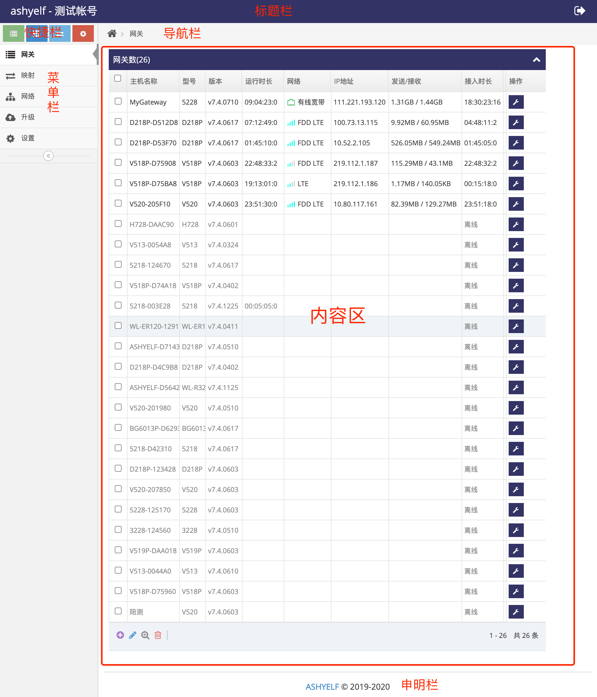

# 网关管理平台使用说明   

- 网关管理平台能实现对网关的管理   
- 网关管理平台能实现收集网关上连接的传感器信息, 并调整传感器的设置    
- 内网穿透实现直接与网关或网关下的设备交互   
- 自组网实现将多个网关及网关下的设备自由组网   

## 网关管理平台安装   

- **[网关管理平台安装与运行](./install_cn.md)** 介绍使用在Ubuntu服务器上安装 **网关管理平台** 

## 网关管理平台用户界面使用  

### 用户界面介绍   

管理界面分为六个区域, 管理界面的菜单分为十几个大类   

   

### 菜单简介   

**网关**: 当前帐号下所有的网关    
**映射**: 当前帐号下网关所有的内网穿透   
**网络**: 当前帐号所有的自组网     
**升级**: 固件升级   
**设置**: 帐号设置    

## 常用的功能使用说明   

### 管理接入的网关   

- ***[添加网关到管理帐号](./wifi/ssid_cn.md)**(编写中)*    
- ***[实时管理网关配置](./wifi/ssid_cn.md)**(编写中)*    
- ***[实时操作网关的上的IO口](./wifi/ssid_cn.md)**(编写中)*   
- ***[获取网关上传感器的数据](./wifi/ssid_cn.md)**(编写中)*    
- ***[获取网关串口数据](./wifi/ssid_cn.md)**(编写中)*   
- ***[获取网关定位数据](./wifi/ssid_cn.md)**(编写中)*   
- ***[远程打开网关的网页管理界面](./wifi/ssid_cn.md)**(编写中)*    
- ***[远程打开网关的终端命令行](./wifi/ssid_cn.md)**(编写中)*    
- ***[远程打开网关下设备的网页](./wifi/ssid_cn.md)**(编写中)*    
- ***[远程打开网关下设备的Telnet服务](./wifi/ssid_cn.md)**(编写中)*    
- ***[远程打开网关下设备的SSH服务](./wifi/ssid_cn.md)**(编写中)*    

### 网关内网穿透配置    
- ***[设置内网穿透](./wifi/ssid_cn.md)**(编写中)*    

### 网关自组网配置    
- ***[设置自组网](./wifi/ssid_cn.md)**(编写中)*    

### 升级网关   
- ***[上传固件升级网关](./wifi/ssid_cn.md)**(编写中)*    

**(编写中)的功能都已实现, 使用文档暂未上传, 如有需要可资询技术人员上传**