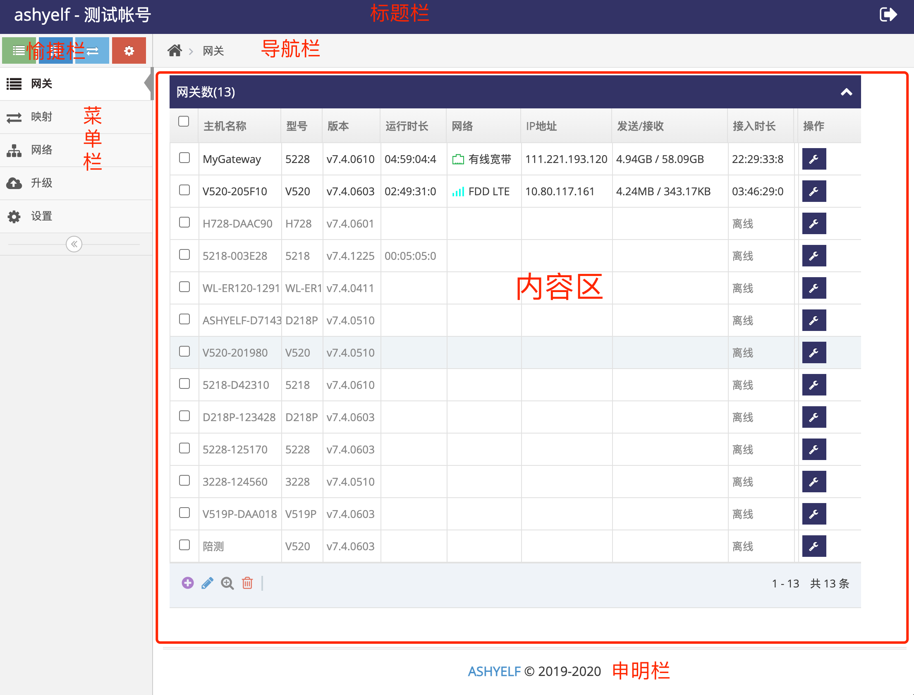

# 云管理使用说明   
SkinOS云管理用于安装在Ubuntu等Linux发行版中, 所有的SkinOS系统的网关都可以接入到此云管理中   

## 云管理安装   
- **[云管理安装与运行](./cloud/install_cn.md)** 介绍使用在Ubuntu服务器上安装 **云管理**    
- **[用户帐号的添加](./cloud/add_user_cn.md)** 介绍在使用 **管理员帐号** 在 **云管理** 上添加用于管理网关的 **用户帐号**    
- **[添加网关到用户帐号](./cloud/add_gateway_cn.md)** 介绍将网关添加到 **云管理** 上对应的 **用户帐号** 中   

## 云管理上用户网页界面的使用  
### 用户网页界面介绍   
界面分为六个区域, 界面的菜单分为十几个大类   
   

### 菜单简介   
**网关**: 当前帐号下所有的网关    
**映射**: 当前帐号下网关所有的内网穿透   
**网络**: 当前帐号所有的自组网     
**升级**: 固件升级   
**设置**: 帐号设置    

## 常用的功能使用说明   
### 管理接入的网关   
- **[修改云管理上网关的名称](./cloud/gateway_name_cn.md)**   
- **[实时管理网关配置](./cloud/gateway_config_manage_cn.md)**   
- **[重启网关](./cloud/gateway_reboot_cn.md)**   
- **[远程访问网关的网页管理界面](./cloud/gateway_config_ui_cn.md)**   
- **[远程访问网关的终端命令行](./cloud/gateway_config_cmd_cn.md)**   
- **[远程访问网关下设备的网页](./cloud/gateway_device_ui_cn.md)**   
    通过此操作可以直接访问网关下如摄象头或是PLC等各种设备的管理界面等   
- **[远程访问网关下设备的Telnet服务](./cloud/gateway_device_telnet_cn.md)**   
    通过此操作可以直接访问网关下如摄象头或是PLC等各种设备的Telnet服务, 实现远程命令行管理网关下的设备   
- **[远程访问网关下设备的SSH服务](./cloud/gateway_device_ssh_cn.md)**   
    通过此操作可以直接访问网关下如摄象头或是PLC等各种设备的SSH服务, 实现远程命令行管理网关下的设备   
- ***[实时操作网关的上的IO口](./wifi/ssid_cn.md)**(编写中)*   
- ***[获取网关上传感器的数据](./wifi/ssid_cn.md)**(编写中)*   
- ***[获取网关串口数据](./wifi/ssid_cn.md)**(编写中)*   
- ***[获取网关定位数据](./wifi/ssid_cn.md)**(编写中)*   

### 升级网关   
- **[上传固件升级网关](./cloud/gateway_update_cn.md)**    

### 网关内网穿透配置    
内网穿透用于将网关下设备的端口映射到网关管理平台上的指定的端口, 从而实现将没有公网地址的网关下的设备向外网提供服务   
- **[TCP端口内网穿透](./cloud/add_tcpmap_cn.md)**    

### 网关自组网配置    
#### 自组网用于将接入平台的网关组成一个私网, 使得网关间或其下的设备直接互通   
- **[创建一个自组网](./cloud/add_network_cn.md)**    

#### 将接入的网关组成一个局域网   
- **[将有公网地址的网关添加到指定的自组网](./cloud/network_add_branch_cn.md)**   
    每一个自组网都需要至少一个公网地址的网关加入, 此网关用作 **主干(Branch)**, 它与其它所有网关为点对点通信     
- **[将无公网地址的网关添加到指定的自组网](./cloud/network_add_leaf_cn.md)**    

#### 将接入的网关及其下的局域网组成一个广域网   
- **[将有公网地址的网关及之下的局域网添加到指定的自组网](./cloud/network_add_netbranch_cn.md)**   
    每一个自组网都需要至少一个公网地址的网关加入, 此网关用作 **主干(Branch)**, 它与其它所有网关为点对点通信     
- **[将无公网地址的网关及之下的局域网添加到指定的自组网](./cloud/network_add_netleaf_cn.md)**    

#### 管理自组网   
- **[查看自组网的状态](./cloud/network_status_cn.md)**    

**(编写中)的功能都已实现, 使用文档暂未上传, 如有需要可资询技术人员上传**