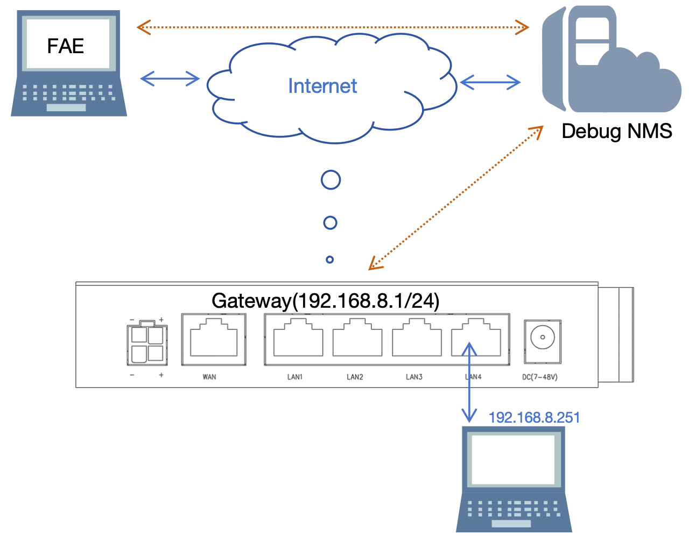
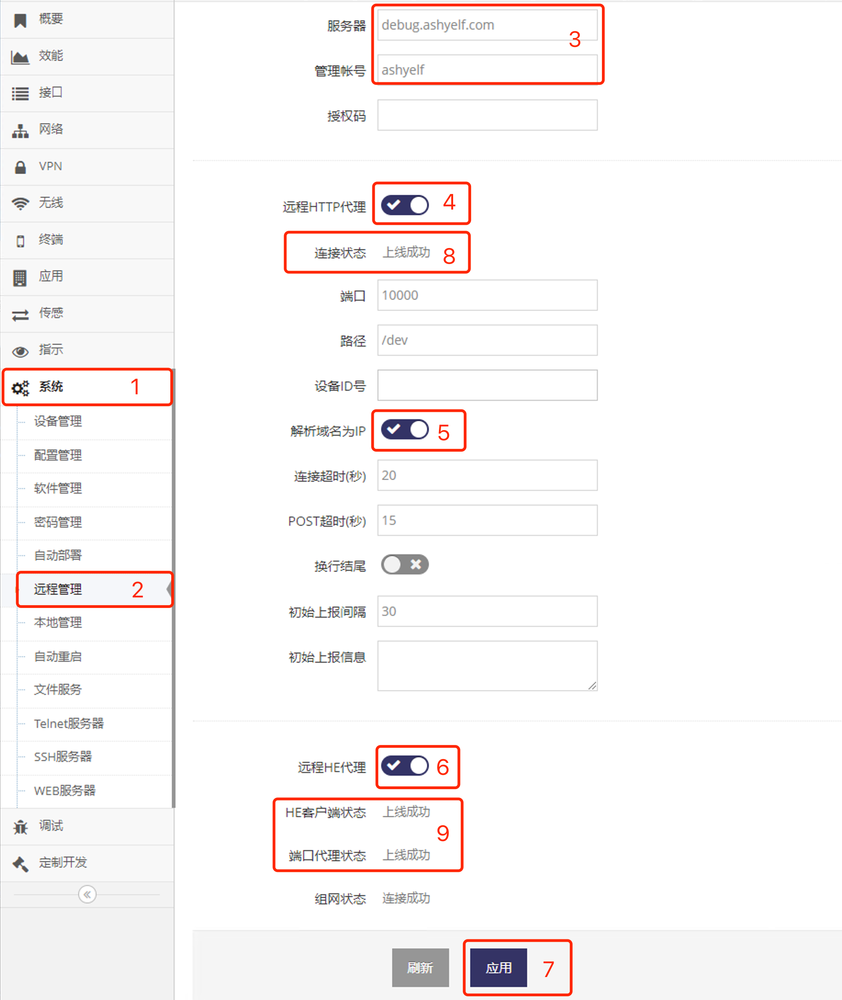

***

## 接入调试云平台实现远程协助

在网关可接入互联网时, 可直接设置网关接入调试云平台后, 技术人员通过调试云平台即可远程调试网关

 

#### 设置网关接入调试平台云

- 点击 **红框1** **系统** 菜单下的 **红框2** **远程管理** 进入 **远程管理界面**

 

- 在 **红框3** 的 **服务器** 输入 **debug.ashyelf.com**
- 在 **红框3** 的 **管理帐号** 输入 **ashyelf**
- 点击 **红框4** 启用 **远程HTTP代理**
- 点击 **红框5** 启用 **解析域名为IP**
- 点击 **红框6** 启用 **远程HE代理**   
- 之后点击 **红框7** 应用即可, 等待连接成功后在 **红框8** 的 **连接状态** 及 **红框9** 的 **HE客户端状态** 及 **端口代理状态** 都会显示 **上线成功**

连接成功后即可将网关的MAC地址上报给技术人员, 等待技术人员调试即可

