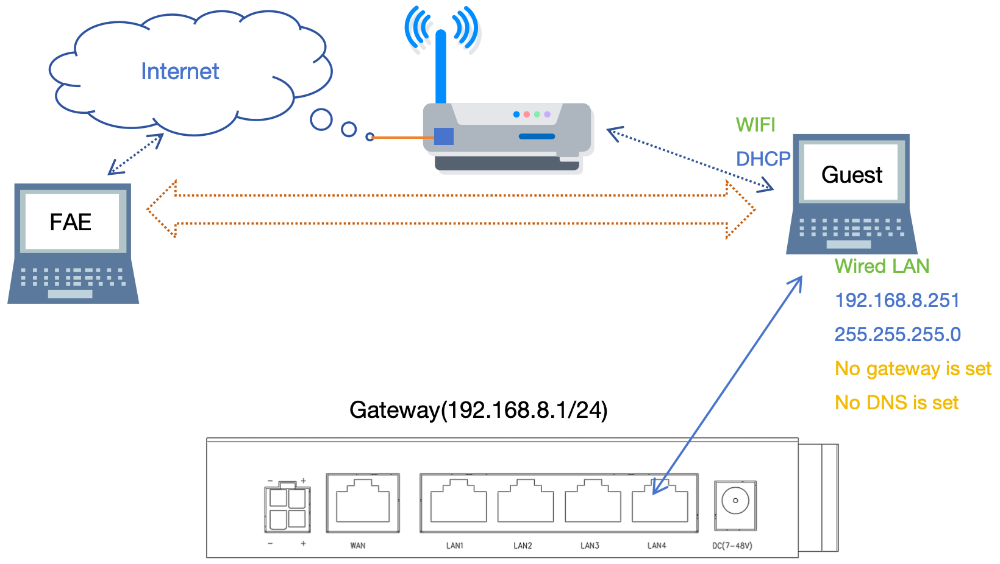
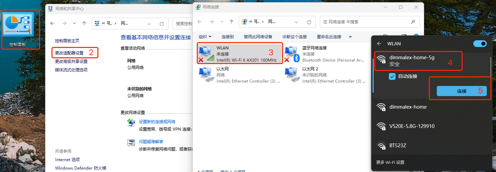

***

## 无互联网的远程协助

在网关无法接入互联网时, 技术人员需要通过远程工具连接客户电脑后对网关做调试   

 

#### 1. 客户电脑的配置    

- 配置电脑的无线连接公司WIFI接入互联网   

 

- 设置电脑的有线网卡地址, 注意不要设置 **默认网关** 及 **DNS服务器**  
 

- 将电脑通过有线与网关的LAN口相连   

#### 2. 打开远程协助工具

- 打开 **向日葵** 或 **Teamviewer** 或 **ToDesk** 或 **AnyDesk** 软件, 向技术人员提供接入码

- 之后等待技术人员连入即可

