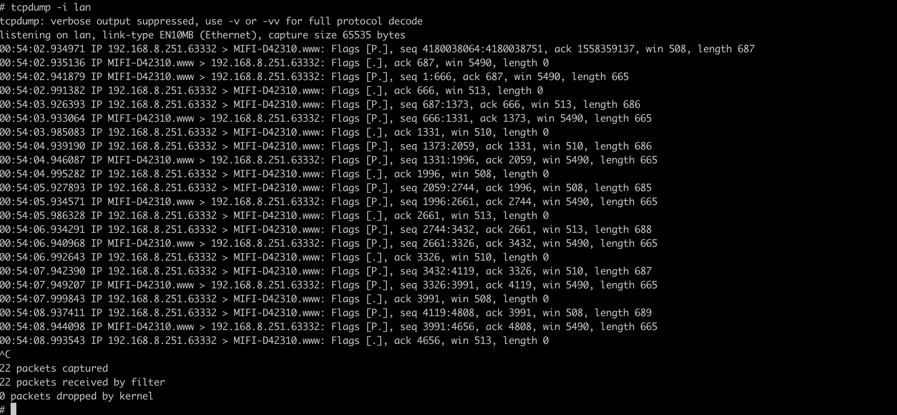
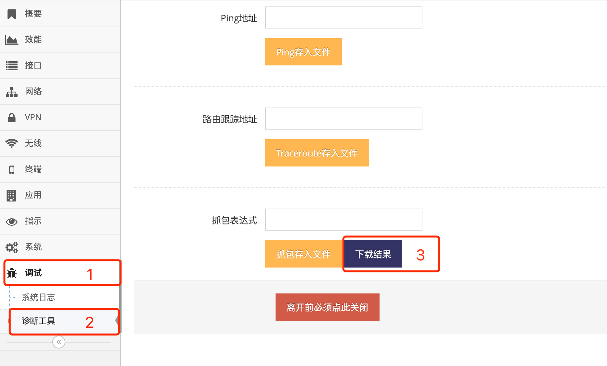

***

## 在网关中抓包

#### 1. 通过Telnet工具或命令连接网关

- **红框1** **telnet 192.168.8.1**    
- **红框2** 输入用户名: **admin**   
- **红框3** 输入密码: **admin**   
- **红框4** 看到HE终端命令介绍表示登录成功

 

**用户名密码与网页管理用户名及密码一致**

#### 2. 进入Shell

- **红框1** 输入 **elf** 回车   
- **红框4** 看到Shell终端命令介绍表示登录成功   

 

#### 3. 进入抓包目录

输入 **cd /var/wui** 回车   
 

#### 抓本地网络(LAN)接口上的包

1. 获取 **本地网络(LAN)** 的接口

    输入 **he ifname@lan.netdev** 回车显示本地网络(LAN)接口, 以下显示为 **lan**

     

2. 使用tcpdump指定 **本地网络(LAN)** 接口抓包

    输入 **tcpdump -i lan** 回车将开始抓包

     

    **Ctrl+c** 中断抓包

3. 使用tcpdump指定 **本地网络(LAN)** 接口抓包并保存成可下载

    输入 **tcpdump -i lan -w tcpdump.cap** 回车将开始抓包, 并且抓包数据保存到可下载的文件中

     

    **Ctrl+c** 中断抓包

4. 下载保存的抓包文件

    进入管理网页, 点击 **红框1** **调试** 菜单下的 **红框2** **诊断工具** 进入 **诊断工具界面**     

     

    点击 **红框3** 下载结果 即可下载到抓包文件

#### 抓4G(LTE)网络接口上的包

1. 获取 **4G(LTE)网络** 的接口

    输入 **he ifname@lte.netdev** 回车显示4G(LTE)网络接口, 以下显示为 **usb0**

     

    *注意, 如4G(LTE)网络未连接成功则无法正确显示, 需要等待4G(LTE)网络上线后才可抓包*

2. 使用tcpdump指定 **4G(LTE)网络** 接口抓包

    输入 **tcpdump -i usb0** 回车将开始抓包

    **Ctrl+c** 中断抓包

3. 使用tcpdump指定 **4G(LTE)网络** 接口抓包并保存成可下载

    输入 **tcpdump -i usb -w tcpdump.cap** 回车将开始抓包, 并且抓包数据保存到可下载的文件中

    **Ctrl+c** 中断抓包

4. 下载保存的抓包文件

    进入管理网页, 点击 **红框1** **调试** 菜单下的 **红框2** **诊断工具** 进入 **诊断工具界面**     

     

    点击 **红框3** 下载结果 即可下载到抓包文件

#### 抓其它网络接口上的包

- 抓取其它网络接口的方式跟以上 **抓4G(LTE)网络接口上的包**, 区别就是获取的网络接口的区别   
- 以下只给出获取其它网络接口的指令, 跟据指令的返回来输入tcpdump -i后的参数抓包即可   
    - 获取 **4G/5G(LTE/NR)** 网络接口的指令为 he ifname@lte2.netdev   
    - 获取 **有线宽带** 网络接口的指令为 he ifname@wan.netdev   
    - 获取 **2.4G无线连网** 网络接口的指令为 he ifname@wisp.netdev   
    - 获取 **5.8G无线连网** 网络接口的指令为 he ifname@wisp2.netdev   

