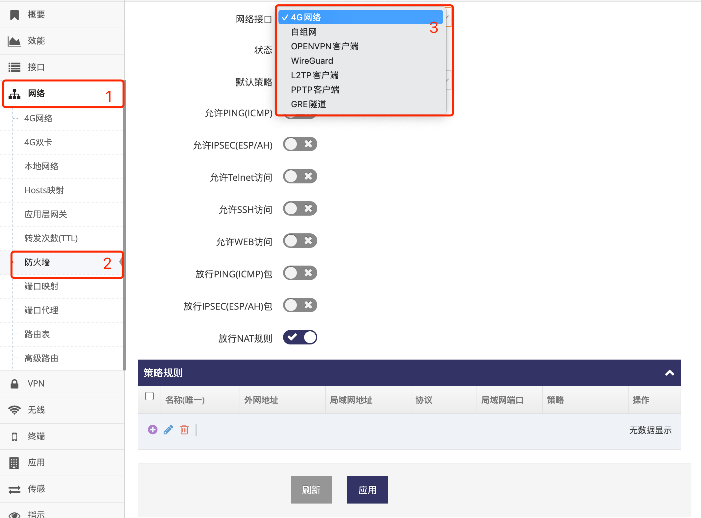
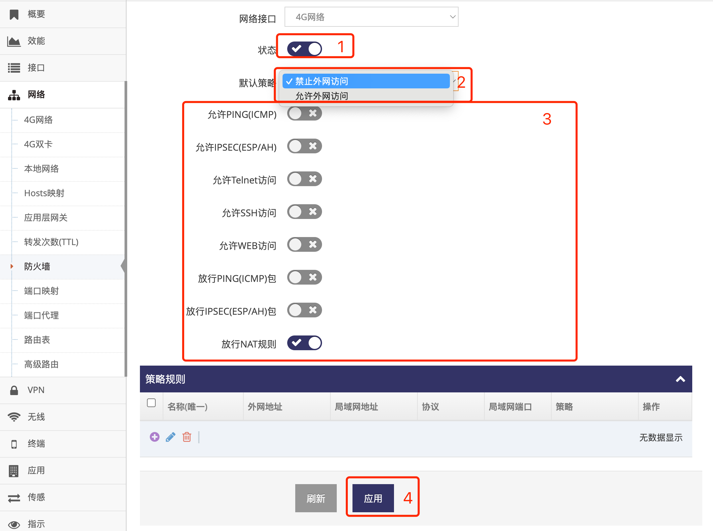
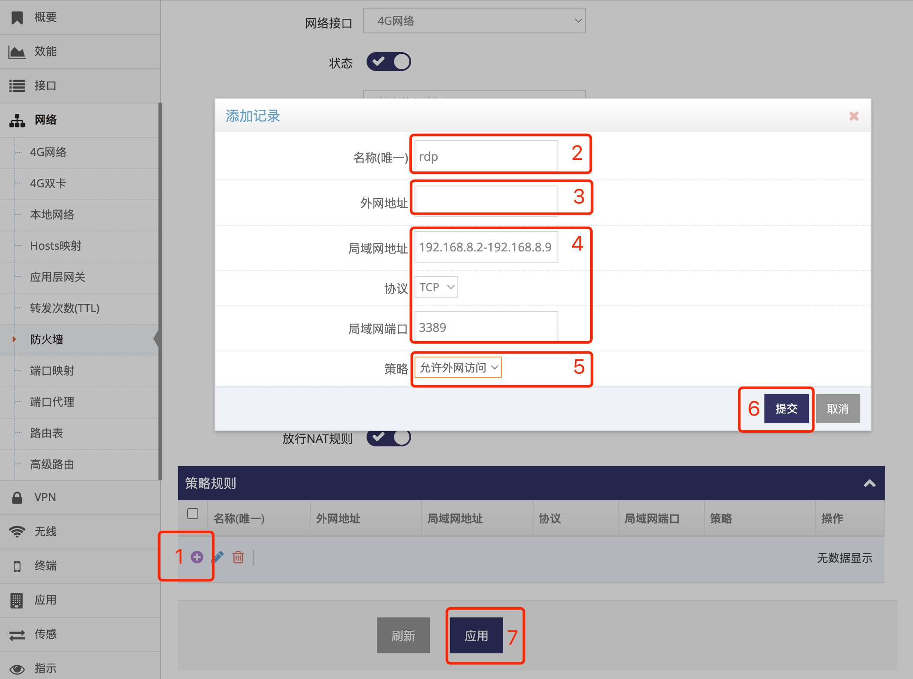

***

## 允许外网访问路由器指定的服务   

### 进入防火墙设置界面指定接口   
- 点击 **红框1** **网络** 下的 **红框2** **防火墙** 进入 **防火墙设置界面**   
    
- 针对 **外网接口** 及 **VPN接口** 可单独指定不同的防火墙规则, **红框3** 用于选择配置哪个接口上的防火墙   

### 常用的防火墙选项   
    
- **红框1** 状态用于 **启用** 或是 **禁用** 防火墙, 禁用防火墙将导致所有的外网访问数据都可以进入网关  
- **红框2** 用于选择防火墙默认的行为
    - **禁止外网访问** 表示丢弃所有外网访问网关的数据
    - **允许外网访问** 表示允许所有外网访问网关   
- **红框3** **允许PING(ICMP)** 开启则允许外网通过PING(ICMP)访问网关   
- **红框3** **允许IPSEC(ESP/AH)** 开启则允许外网IPSEC(ESP/AH)协议数据访问网关   
- **红框3** **允许Telnet访问** 开启则允许外网通过Telnet访问网关   
- **红框3** **允许SSH访问** 开启则允许外网通过SSH访问网关    
- **红框3** **允许WEB访问** 开启则允许外网通过WEB访问网关    
- **红框3** **放行PING(ICMP)包** 开启则允行外网通过PING(ICMP)访问网关上局域网的设备   
- **红框3** **放行IPSEC(ESP/AH)包** 开启则允行外网通过IPSEC(ESP/AH)访问网关上局域网的设备   
- **红框3** **放行NAT规则** 开启则允行在 **[端口映射使用说明](./portmap/portmap_cn.md)** 中设置的NAT规则访问   
- 点选后点击 **红框4** 应用即可

### 自定义防火墙放行或禁止规则   
如防火墙选项未给出合适的操作也可以通过自行添加规则来实现   
    
- 点击 **红框1** 弹出添加规则对话框   
- 在 **红框2** 中可以自定义规则的名称, 可以字母数字等   
- 在 **红框3** 可指定外网地址, 空表示所有的外网地址   
    - 多个IP地址以 **,号** 分隔   
    - 也支持指定一个IP段, 起始地址与结束地址间用 **-号** 隔开即可   
- 在 **红框4** **局域网地址** 中指定终端地址, 空表示网关本身   
    - 多台终端IP地址以 **,号** 分隔   
    - 也支持指定一个IP段, 起始地址与结束地址间用 **-号** 隔开即可   
    - 也可以填写终端的MAC地址, MAC地址格式如 **00:03:7E:56:21:31**, 一个输入框中MAC地址不支持填写多个   
- 在 **红框4** **协议** 中可指定协议   
    - **TCP**, **UDP** 则可指定端口号   
    - **所有** 表示所有的协议   
- 在 **红框5** 选择策略, 可选 **允许外网访问** 或 **禁止外网访问**   
- 填写好后点击 **红框6** 提交即完成添加
- 添加好所有的规则后点击 **红框7** 的应用即可立即应用   

