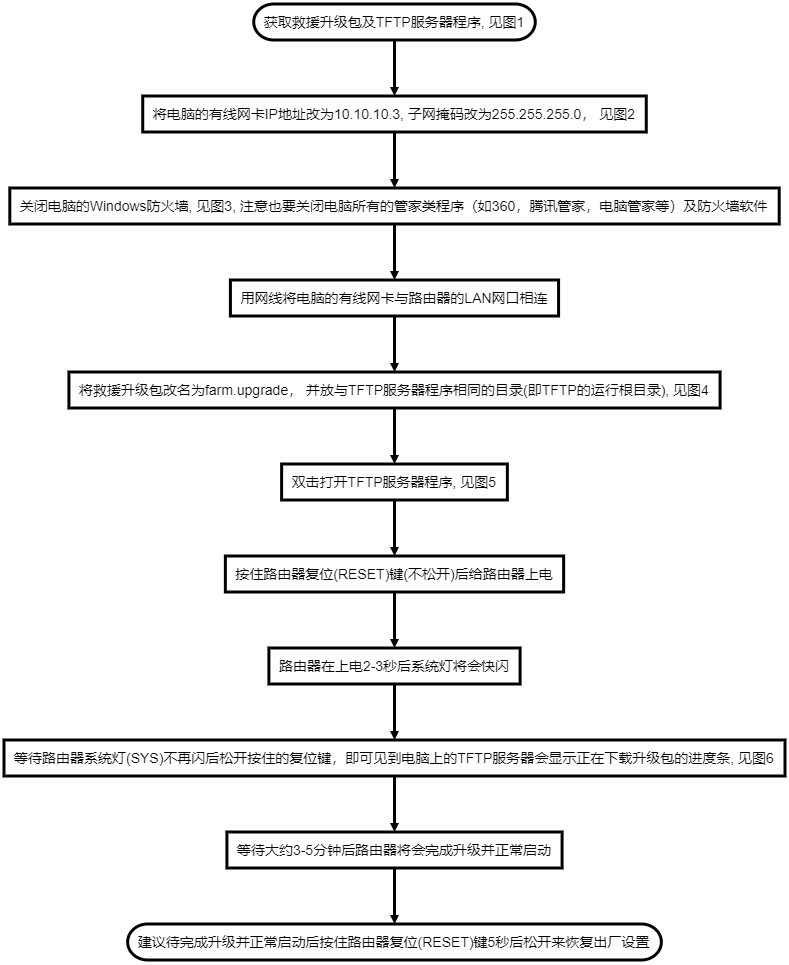

***
## 救援升级指导
用于在升级过程中升错固件或是升级失败而导致系统无法启动时使用的升级方式， 是否可以使用此升级方式取决于路由器的BOOT是否还在正常工作, 如果BOOT工作不正常将无法使用此方式升级

#### **如何判断路由器是否支持救援升级**
```flow
push=>start: 按住路由器复位（RESET）键（不松开）
power=>operation: 给路由器上电
flash=>condition: 路由器上电2-3秒后系统灯(SYS)是否快闪3-5秒
ok=>end: 支持救援升级
no=>end: 不支持救援升级
push->power->flash
flash(yes,right)->ok
flash(no)->no
```


#### **救援升级步骤**


```flow
getfile=>start: 获取救援升级包及TFTP服务器程序, 见图1
modifyip=>operation: 将电脑的有线网卡IP地址改为10.10.10.3, 子网掩码改为255.255.255.0， 见图2
shutfirewall=>operation: 关闭电脑的Windows防火墙, 见图3, 注意也要关闭电脑所有的管家类程序（如360，腾讯管家，电脑管家等）及防火墙软件
connect=>operation: 用网线将电脑的有线网卡与路由器的LAN网口相连
rename=>operation: 将救援升级包改名为farm.upgrade， 并放与TFTP服务器程序相同的目录(即TFTP的运行根目录), 见图4
runserver=>operation: 双击打开TFTP服务器程序, 见图5
push=>operation: 按住路由器复位(RESET)键(不松开)后给路由器上电
waitled=>operation: 路由器在上电2-3秒后系统灯将会快闪
free=>operation: 等待路由器系统灯(SYS)不再闪后松开按住的复位键，即可见到电脑上的TFTP服务器会显示正在下载升级包的进度条, 见图6
waitupgrade=>operation: 等待大约3-5分钟后路由器将会完成升级并正常启动
default=>end: 建议待完成升级并正常启动后按住路由器复位(RESET)键5秒后松开来恢复出厂设置
getfile->modifyip->shutfirewall->connect->rename->runserver->push->waitled->free->waitupgrade->default
```



#### **附图**
- 图1


1. **救援升级包** 的获到可以通过 **普通升级包** 解压后得到, 具体操作方式见 [固件升级包命名规则](./firmware_named_rule.md), 在这份说明中有介绍如何通过普通的升级包得到救援升级包
2. **TFTP服务器程序** 下载 [TFTP服务器程序](./tftpd32.exe) 得到


- 图2


- 图3


- 图4


- 图5


- 图6


