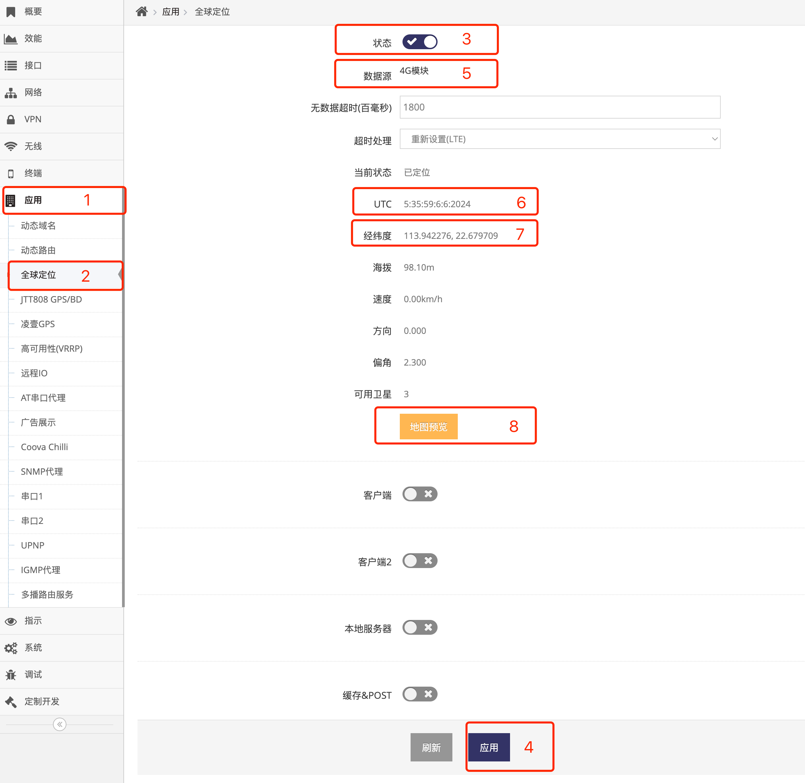
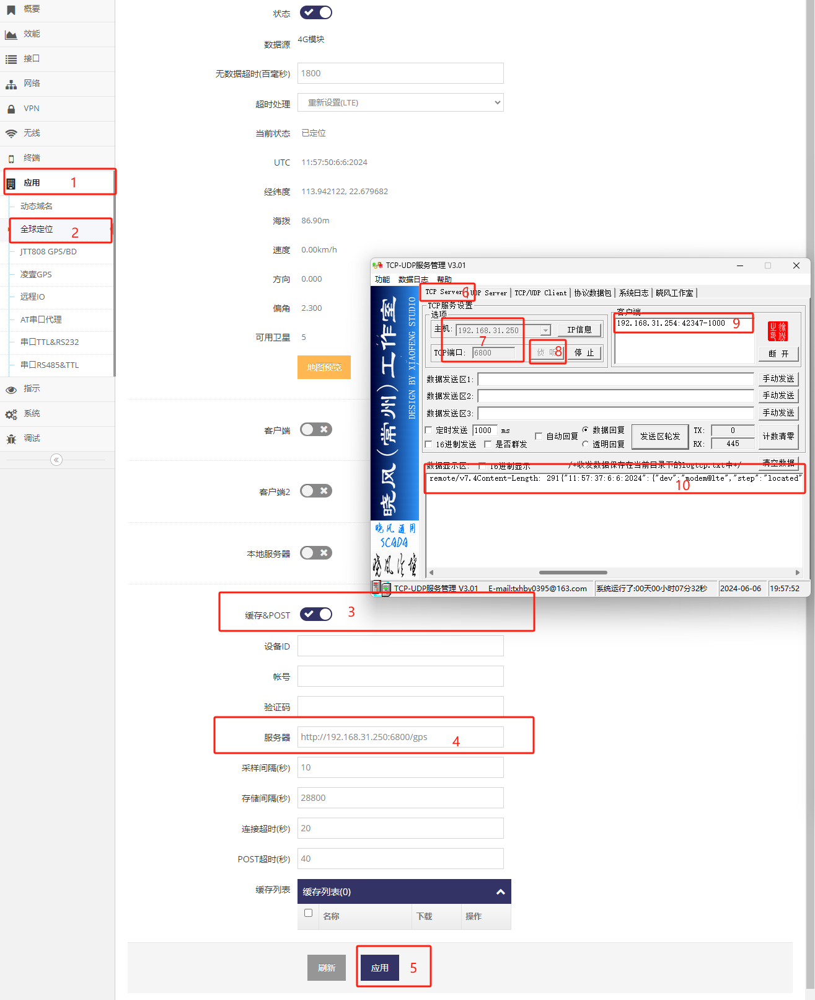

## 定位功能信号源的设置  

### 定位信号源分类   
网关可以支持两种GPS/北斗的信号源, 跟据网关产品的型号不同有不同的信号源方式, 具体可以询问售前工程师, 以下是两种信号源的介绍   
1. 通过自带GPS/北斗功能的 **LTE/NR模组** 来获取定位信号源
2. 通过串口上外接 **GPS/北斗功能模块** 来获取定位信号源   

**注意: *通过自带GPS/北斗功能的LTE/NR模组来获取定位信号源* 及 *通过串口上外接GPS/北斗功能模块来获取定位信号源* 只能二选一进行设置, 不能两个都设置**   

### 通过自带GPS/北斗功能的LTE/NR模组来获取定位信号源的设置   
一些LTE/NR的4G/5G模组会带有定位功能, 可以向网关吐出定位信号源, 因此当网关产品对应的型号使用了这种模组即可通过它来获得定位信号源   
当确认网关产品对应的模组带有定位功能后通过网关的 **网页管理界面** 设置如下即可打开定位功能   
   
- 通过依次点击 **红框1**, **红框2** 进入 **4G网络设置界面**   
    注意有的网关产品有多个LTE/NR的4G/5G模组, 请确认设置的是对应的4G/5G模组, 示例中设置的是第一个4G(LTE)模组   
- 点击 **红框3** 打开模组的 **定位功能**   
- 点击 **红框4** 应用即可   

### 通过串口上外接GPS/北斗功能模块来获取定位信号源的设置   
网关产品支持串口(TTL)时, 也可通过在串口上外接定位模块来获取定位信号源, 使用网关产品的串口连接好对应的定位模块后即可通过以下设置来打开定位功能   
***关于如何将定位模块连接网关产品的串口可询问售前工程师***   
   
- 通过依次点击 **红框1**, **红框2** 进入指定的 **串口设置界面**  
    注意网关产品通常会有多个串口, 请确认设置的是定位模块所连接的那个串口, 示例中定位模块是接在第一个串口   
- 点击 **红框3** 打开串口功能   
- 点击 **红框4** 选择串口的模式为GPS定位   
- 点击 **红框5** 选择定位模块的波特率, 大部分定位模块的默认波特率为9600   
- 点击 **红框6** 应用即可  

**注意: *通过自带GPS/北斗功能的LTE/NR模组来获取定位信号源* 及 *通通过串口上外接GPS/北斗功能模块来获取定位信号源* 只能二选一设置, 不能两个都设置**

### 确认是否已定位   
基于以上 **通过自带GPS/北斗功能的LTE/NR模组来获取定位信号源** 或 **通过串口上外接GPS/北斗功能模块来获取定位信号源** 的设置后, 打开以下界面即可查看到定位信息   
   
- 通过依次点击 **红框1**, **红框2** 进入指定的 **全球定位设置界面**   
- 点击 **红框3** 打开全球定位功能   
- 点击 **红框4** 应用后等待一到两分钟后即可   
- 当网关识别到定位模块后会在 **红框6** 的UTC后看到 **UTC时间**   
- 当定位模块定位后会在 **红框7** 中看到定位的 **经纬度**, 此时点击 **红框8** 的 **地图预览** 即可在地图上查看定位的位置   
- **红框5** 会显示当前的定位信号源   

#### 常见故障:   
1. **红框5** 显示 **无** 定位信号源, 这种情况通常是没有 *通过自带GPS/北斗功能的LTE/NR模组来获取定位信号源* 或 *通过串口上外接GPS/北斗功能模块来获取定位信号源* 来设置定位信号源
2. **红框6** 无显示, 这种情况通常是网关与定位模组的连接有问题, 网关无法正常获取到定位模组的定位信号源
3. **红框5** 正确显示定位信号源并且 **红框6** 显示有日期(日期可能不正确但有显示日期)但无正确的经纬度 都表示网关可以正常获取到定位模块的数据, 只是定位模块无法定位, 此时应检查定位模块的天线是否直对天空或更换可定位的定位模块

## 通过HTTP协议向HTTP服务器定时POST JSON格式的定位信息   
    
- 首先在电脑上模拟设备相似的HTTP服务, 打开 **TCP/UDP服务器** 工具, **红框6** 设为TCP服务器模式, **红框7** 填写对应的服务端口, 然后点击 **红框8** 打开TCP服务器   
- 然后依次点击网关管理界面 **红框1**, **红框2** 进入指定的 **全球定位设置界面** 设置让网关向电脑(模拟设备)指定的服务端口POST定位信息   
- 点击 **红框3** 打开POST功能   
- 在 **红框4** 中输入要POST的HTTP服务器及端口及网页位置   
- 点击 **红框5** 应用即可看到 **红框9** 电脑上 **TCP/UDP服务器** 中有连接连入, 并在 **红框10** 中可以看到以HTTP协议POST一个JSON的定位信息, 此数据为一个JSON格式的数据, 属性介绍如下   
```json
{
    "step":"step of location",                  // [ "setup", "search", "located" ]
    "utc":"UTC date",                           // [ string ], format is hour:minute:second:month:day:year
    "lon":"longitude",                          // [ float ], nmea format
    "lat":"latitude",                           // [ float ], nmea format
    "longitude":"longitude",                    // [ float ]
    "latitude":"latitude",                      // [ float ]
    "speed":"speed",                            // [ float ]
    "direction":"direction",
    "declination":"declination",
    "elv":"Either altitude height",             // [ float ], the unit is meter
    "inview":"Number of visible satellites",    // [ number ]
    "inuse":"Number of satellites in use"       // [ nubmer ]     
}
```   
*进一步的信息可见 [GNSS NEMA Protocol Management](../../com/gnss/nmea.md) 有关info接口的返回的介绍*   
**只有在设备定位后才会POST定位信息到HTTP服务器**   
**此POST功能支持在无网络的情况下缓存定位信息的JSON, 等到设备上线后再一个一个POST到服务器上, 但如果有此需求请在售后工程师的指导下操作否则将损坏设备**   

