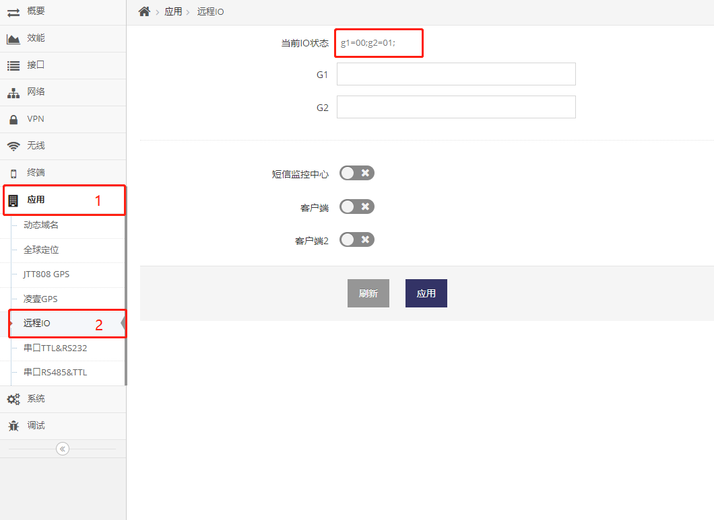
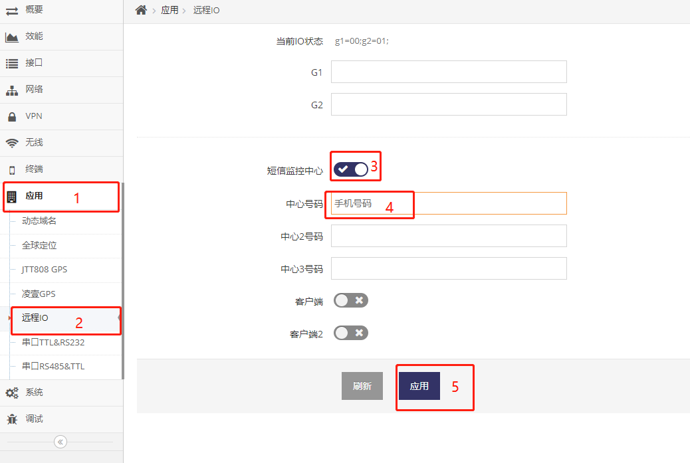
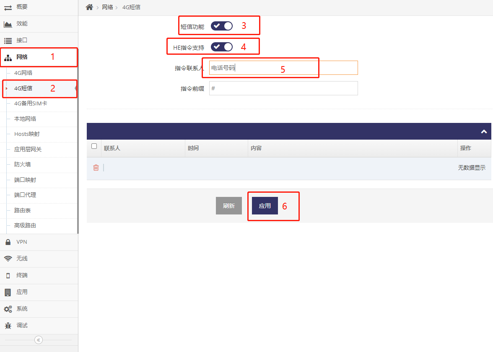
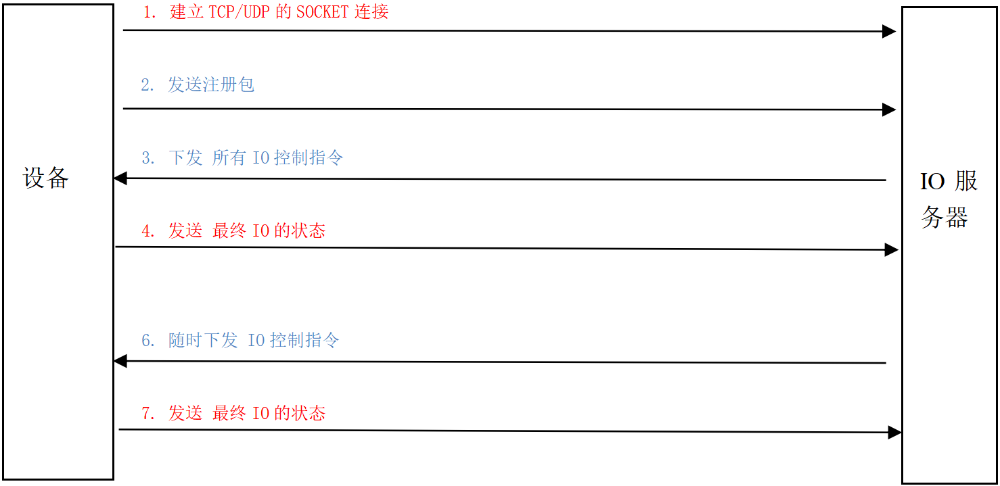
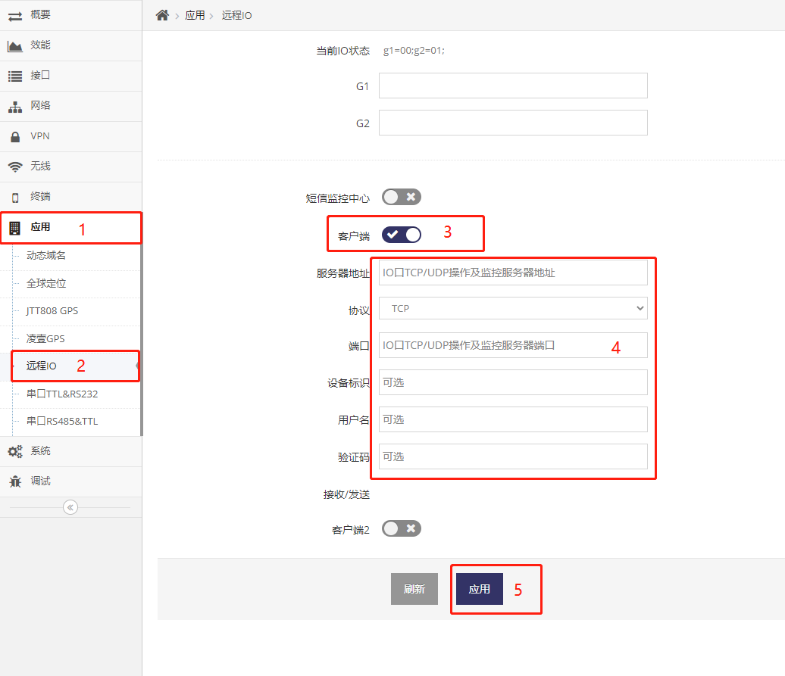
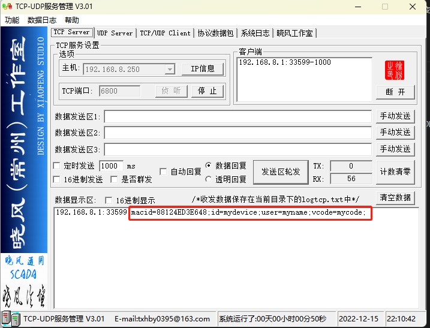
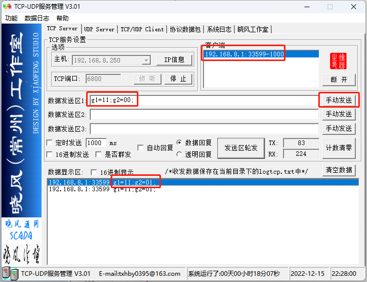

## 远程IO操作

#### 有三种方式实现远程IO操作及监控

- 使用短信远程操作设备IO

- 使用文本式TCP/UDP协议远程操作设备IO

- 使用MQTT协议远程操作设备IO

#### 以下介绍这三种操作方式， 在介绍三种操作之前先说明一下设备中IO状态及指令的描述

所有的IO状态或指令都由以下方式表示， 并以分号(;)结尾
```
IO号=状态;
```
并且多个IO状态可以连接在一起
```
IO号=状态;IO号=状态;IO号=状态;
```
- IO号使用小写， 对应设备的IO号， 比设备的IO口G1在这里就是g1, G2在这里就是g2
- 状态表示当前的状态或在指令中为要求的状态, 通常为两个字符:
    - 第一个字符表示IO的输入输出状态, 1表示输出, 0表示输入
    - 第二个字符表示IO的值, 1表示高电平, 0表示低电平

- 示例
```
    G1为输出高电平时:  g1=11;
    G1为输出低电平时:  g1=10;
    G2为输入低电平时:  g2=00;
    G2为输入高电平时:  g2=01;
```

在远程IO的WEB界面中顶部会以这种方式显示当前所有IO的状态

**以上状态表示IO口G1为输入模式并且电平是低电平， IO口G2也为输入模式并且电平是高电平**
**注意， 当对应的IO口悬空并为输入模式时，电平是不确定的（即可能为高也可能为低)**


## 使用短信远程管理设备IO

#### 打开短信远程管理设备IO的功能

##### Telnet/SSH等终端下打开设备IO状态短信上报功能， 使设备IO口状态变化时发出短信

1. 通过Telnet/SSH客户端使用 用户名及密码 登录后即可进入终端HE指令界面

2. 设置 **远程IO的短信监控中心号码**，IO的状态变化都会向此手机号码发送当前的状态
```shell
# io@agent:sms/contact=手机号码
# ttrue
```

3. 开启远程IO的短信监控中心功能
```shell
# io@agent:sms/status=enable
# ttrue
```
##### Telnet/SSH等终端下打开短信HE指令功能, 允许通过短信下发操作IO口的指令

1. 打开短信功能的HE指令支持
```shell
# modem@lte:sms_cfg/he=enable
# ttrue
```

2. 设置短信指令前缀为#号, 即发送指令必须前缀为#号(也可以设置其它前缀)
```shell
# modem@lte:sms_cfg/he_prefix=#
# ttrue
```

3. 设置 **短信指令的号码**， 设置后只有此号码才可向设备发送HE指令
```shell
# modem@lte:sms_cfg/he_contact=手机号码
# ttrue
```

4. 开启短信指令功能
```shell
# modem@lte:sms=enable
# ttrue
```

##### 通过WEB界面打开设备IO状态短信上报功能， 使设备IO口状态变化时发出短信



##### 通过WEB界面打开短信HE指令功能, 允许通过短信下发操作IO口的指令



- 以上指令联系人为空， 即表示接收所有的联系发送的短信, 也可指定联系人， 有多个联系人时以 **分号;** 隔开即可
- 以上指令前缀为#, 即发送的短信指令必须带有#字符的前缀

**注意： 文档之后的示例都以此设置交互，即短信指令前缀为#**


#### 发送短信控制设备IO

使用以上设置的 **短信指令的号码** 发送短信给设备的SIM卡号码

- 将IO口G1设置为输出高电平
    ```
    #io>agent.modify[g1=11]
    g1=11;g2=01;                             // 返回
    ```
- 将IO口G1设置为输出低电平
    ```
    #io>agent.modify[g1=10]
    g1=10;g2=01;                             // 返回
    ```
- 将IO口G1设置为输入模式, IO在输入模式下如被对端有拉高或拉低都会向 **远程IO的短信监控中心号码** 发送所有IO状态
    ```
    #io>agent.modify[g1=00]
    g1=00;g2=01;                             // 返回
    ```
- 将IO口G2设置为输出高电平
    ```
    #io>agent.modify[g2=11]
    g1=00;g2=11;                             // 返回
    ```
- 将IO口G1设置为输出低电平
    ```
    #io>agent.modify[g2=10]
    g1=00;g2=10;                             // 返回
    ```
- 将IO口G2设置为输入模式, IO在输入模式下如被对端有拉高或拉低都会向 **远程IO的短信监控中心号码** 发送所有IO状态
    ```
    #io>agent.modify[g2=00]
    g1=00;g2=01;                             // 返回
    ```

#### 设备IO变化时收到的所有IO状态的介绍

设备中有IO口为输入模式时，当此IO口发生电平电平变化时 **远程IO的短信监控中心号码** 将收到变化后的所有的IO状态

- 当IO口G1电平低时被拉高后将收到
    ```
    g1=01;g2=01;
    ```
- 当IO口G1电平高时被拉低后将收到
    ```
    g1=00;g2=01;
    ```
- 当IO口G2电平高时被拉低后将收到
    ```
    g1=00;g2=00;
    ```
- 当IO口G2电平低时被拉高后将收到
    ```
    g1=00;g2=01;
    ```


## 使用文本式TCP/UDP协议远程操作设备IO

通过此协议可实现远程实时控制设备IO口的高低电平变化， 也可实时采集输入设备IO口的电平变化
以下是此协议的交互机制介绍：

- 首先由设备主动连接IO服务器
- 连接成功后设备会向IO服务器发送注册包
- 收到注册包后IO服务器可选向设备下发IO指令
    ***设备重启会丢失所有的IO的状态, 所以建议IO服务器在收到注册包后回复IO指令中应包括所有IO的状态***
- 设备收到IO指令会执行变化并发送最终的IO状态
- 通过以上建立IO实时连接并将IO状态同步到最新的状态
- 实时连接建立后，IO服务器可随时下发IO指令给设备
- 设备收到IO指令时会执行对应的操作后会回复所有IO的最终状态



##### 通过WEB界面打开文本式TCP/UDP协议远程操作设备IO


设置后设备将会对IO口TCP/UDP操作及监控服务器发出注册包


监控服务器收到注册包
```
macid=88124ED3E648;id=mydevice;user=myname;vcode=mycode;
```
注册包中有四个段, 每个段都以分号(;)结尾, 按顺序介绍
macid=88124ED3E648; 表示设备的MAC标识为88124ED3E648
id=mydevice; 表示设备的标识为mydevice, 此内容在WEB界面中可配置
user=myname; 表示设备的用户名为myname, 此内容在WEB界面中可配置
vcode=mycode; 表示设备的验证码为mycode, 此内容在WEB界面中可配置

##### 通过监控服务器下发IO操作



监控服务器发送IO操作
```
g1=11;g2=00;
```
发送的IO操作有两个段, 每个段都以分号(;)结尾, 按顺序介绍
g1=11; 表示将G1设置为输出高电平
g2=00; 表示将G2设置为输入模式

##### IO口变化时监控服务器收到所有IO的状态

当设备的IO口在输入模式下电平变化时监控服务器将收到设备所有IO的状态
如当G2被输入低电平时会收到
```
g1=11;g2=00;
```

而当G2被输入高电平时会收到
```
g1=11;g2=01;
```


## 使用MQTT协议远程操作设备IO

编写中