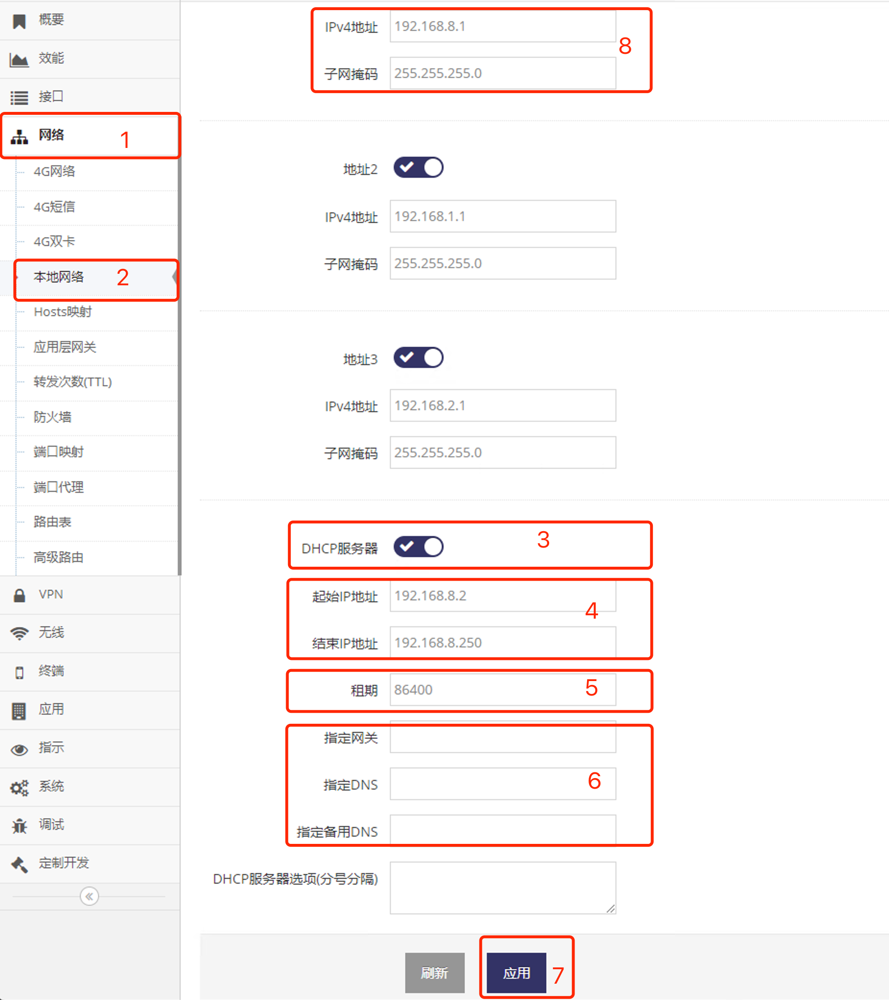

***

## 本地网络分配地址段设置

网关通常会在本地网络开主启DHCP服务, 为连接网关本地网络的设备分配IP地址

- 点击 **红框1** **网络** 菜单下的 **红框2** **本地网络** 进入 **本地网络设置界面**

 

- 点击 **红框3** **DHCP服务器** 可启用或禁用分配IP地址(DHCP服务)的功能

- 启用 **DHCP服务器** 后可在 **红框4** 中配置 **地址池** 的 **起始IP地址** 及 **结束IP地址** 

- 并可在 **红框5** 中设置分配IP地址的使用时长, 即 **租期**, 以 **秒** 为单位

- 在 **红框6** 中可为设备或电脑 **指定网关**, 如果空则默认使用 **红框8** **IPv4地址**(即网关本地网络地址)

- 在 **红框6** 中可为设备或电脑 **指定DNS**, 如果空则默认使用 **红框8** **IPv4地址**(即网关本地网络地址)

- 在 **红框6** 中可为设备或电脑 **指定备用DNS**, 如果空则无

- 之后点击 **红框7** 应用网关将提示重启, 点击确认后等待重启完成后即可以新地址访问网关

***注意, 地址池的 起始IP地址 及 结束IP地址 必须与红框8中的 IPv4地址/子网掩码 在同一个网段***
