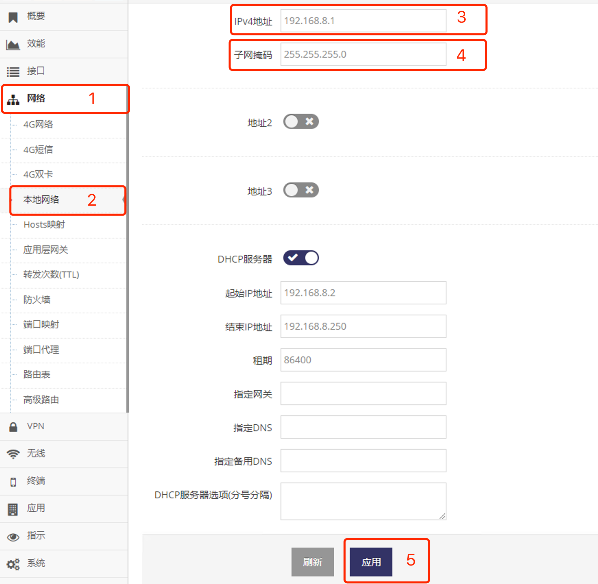

***

## 有本地网络地址设置

网关通常默认地址为 **192.168.8.1**

- 点击 **红框1** **网络** 菜单下的 **红框2** **本地网络** 进入 **本地网络设置界面**

 

- 在 **红框3** 的 **IPv4地址** 填写要给网关设置的IP地址

- 在 **红框4** 的 **子网掩码** 填写要给网关设置的子网掩码

- 之后点击 **红框5** 应用网关将提示重启, 点击确认后等待重启完成后即可以新地址访问网关

***注意: 网关IP地址必须与访问的设备或电脑在同一个网段***
