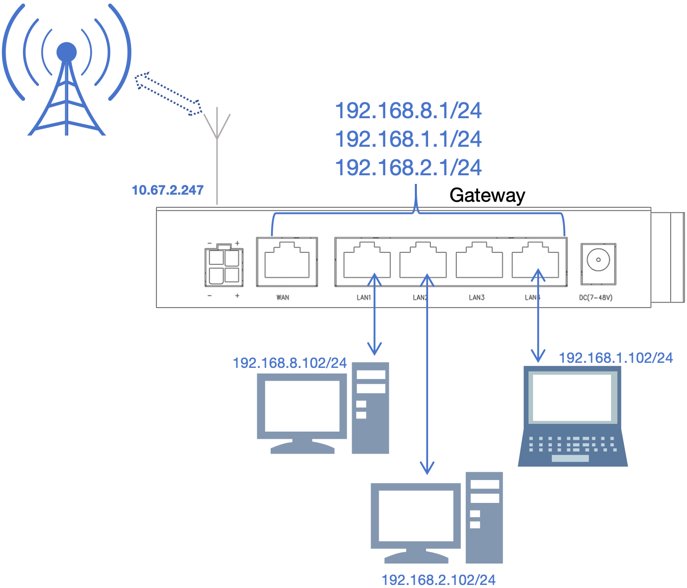
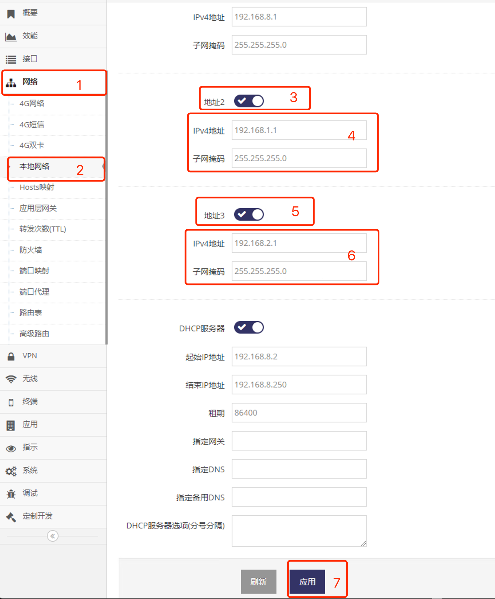

***

## 本地网络设置多个地址

 

网关通常默认只设置一个IP地址, 但也可以为网关的本地网络设置多个地址

- 点击 **红框1** **网络** 菜单下的 **红框2** **本地网络** 进入 **本地网络设置界面**

 

- 在 **红框3** 启用 **地址2**, 即可在 **红框4** 中设置第二个地址 的 **IPv4地址** 及 **子网掩码**

- 在 **红框5** 启用 **地址3**, 即可在 **红框6** 中设置第二个地址 的 **IPv4地址** 及 **子网掩码**

- 之后点击 **红框7** 应用网关将提示重启, 点击确认后等待重启完成后即可以新地址访问网关

***如需设置更多地址请联系技术人员通过指令设置***
