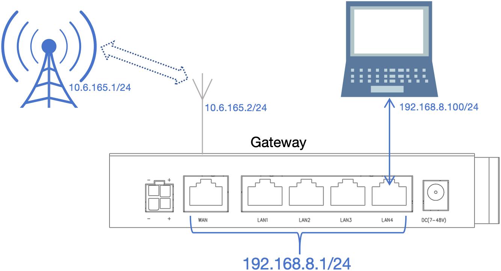

## 使用APN专网SIM卡接入虚拟专用网络(VPDN/APN)   
   

常用的物联网卡或一些运营商APN卡都可用于让网关接入虚拟专用网络(这种SIM卡一般无法上互联网), 这种专用的SIM卡又分为两种   
### 第一种, 通用拨号即可接入虚拟专用网络   
这种情况按产品规格书中的要求插入SIM卡, 接上4G/5G天线后上电网关, 网关就会自动接入到虚拟专用网络   

### 第二种, 需要输入运营商指定的APN号才可接入虚拟专用网络   
- 命令行设置4G网络输入 **set ifname@lte** 回车, 设置4G/5G网络输入 **set ifname@lte2** 回车    
```shell
$ set ifname@lte            # 要求修改4G网络
{ 
    ... # 显示当前4G网络的配置
}
$ ifname@lte:               # 开始修改提示  
$ ifname@lte: mode=ppp                                     # 修改IPv4模式为点对点
$ ifname@lte: profile=enable                               # 修改APN自定义启用
$ ifname@lte: profile_cfg/apn=xxxxxjj.vpdn.xj              # 修改APN为xxxxxjj.vpdn.xj
$ ifname@lte: profile_cfg/user=22323232222@xxxxxjj.vpdn.xj # 修改APN的用户名为22323232222@xxxxxjj.vpdn.xj
$ ifname@lte: profile_cfg/passwd=111111                    # 修改APN的密码为111111
$ ifname@lte: s             # 设置以上所有的修改
ttrue                       # 返回ttrue表示设置成功
$ ifname@lte.status:ip      # 查询LTE上线后的IP地址
10.83.1.27                  # 如果成功上线返回上线后的IP地址
$ 
```   
- 也可使用 **HE指令** 一次完成以上所有设置   
```shell
$ ifname@lte|{"mode":"ppp","profile":"enable","profile_cfg":{"apn":"xxxxxjj.vpdn.xj","user":"22323232222@xxxxxjj.vpdn.xj","passwd":"111111"}}
ttrue
```   
**更多参数说明见 [LTE/NR(4G/5G)网络](../../com/ifname/lte.md)**   


## 4G/5G(LTE/NR)上网的可用性检测介绍(为了LTE/NR网络的可靠性必须阅读)   
- 4G/5G(LTE/NR)网络复杂, 涉及网关与基站的空口, 基站与核心网, 核心网与互联网等多个环节的连接, 任何一个环节出现异常或是与其它环节脱节都可能导致连接不可用   
- 因此当网关成功连接到LTE/NR网络时需要开启可用性检测来保证连接的稳定性, 否则可能会出现网关显示成功在线但无法访问网络的情况   
- 开启了可用性检测后, 网关会探测与运营商的连接是否有效, 当发现连接无效时能及时重新连接, 从而保证网关LTE/NR连接的可靠性   

为了满足各种LTE/NR网络场景, 设计了四种可用性检测机制   
- **ICMP**, 通过发送 **PING包** 到指定的地址, 确认能与 **检测地址** 中配置的任何一个地址通信来判断LTE连接有效, **强烈建议使用**此模式   
- **接收包计数**, 通过间隔指定的时间来统计是否有收到包来判断LTE/NR连接是否有效   
- **UDP&TCP**, 通过发送 **DNS查询包** 到指定LTE/NR上的DNS服务器来判断连接是否有效   
- **自动**, 通过发送 **DNS查询包** 到指定LTE/NR上的DNS服务器来判断, 当 **DNS查询包** 开机即无回应则自动使用 **接收包计数**模式来判断连接是否有效, 当 **DNS查询包** 开机有回应则使用DNS查询包来检测连接是否有效   

### ICMP, 即PING包检测   
ICMP是所有可用性检测中最有效的机制, **强烈建议使用**, 但如APN专网中不能提供能PING通且稳定的服务器则无法使用些模式   
- 命令行设置4G网络输入 **set ifname@lte** 回车, 设置4G/5G网络输入 **set ifname@lte2** 回车    
```shell
$ set ifname@lte            # 要求修改4G网络
{ 
    ... # 显示当前4G网络的配置
}
$ ifname@lte:               # 开始修改提示  
$ ifname@lte: keeplive/type=icmp                        # 修改可用性检测为 ICMP
$ ifname@lte: keeplive/icmp/dest/test=114.114.114.114   # 修改ICMP 第一个检测地址 为114.114.114.114
$ ifname@lte: keeplive/icmp/dest/test2=8.8.8.8          # 修改ICMP 第二个检测地址 为8.8.8.8
$ ifname@lte: keeplive/icmp/dest/test3=8.8.4.4          # 修改ICMP 第三个检测地址 为8.8.4.4
$ ifname@lte: keeplive/icmp/timeout=10                  # 修改ICMP 单次检测超时 为10秒 
$ ifname@lte: keeplive/icmp/failed=6                    # 修改ICMP 检测次数 为6次
$ ifname@lte: keeplive/icmp/interval=2                  # 修改ICMP 检测间隔 为2秒 
$ ifname@lte: s            # 设置以上所有的修改 
ttrue                      # 返回ttrue表示设置成功
$ 
```   
- 也可使用 **HE指令** 一次完成所有设置   
```shell
$ ifname@lte|{"keeplive":{"type":"icmp","icmp":{"dest":{"test":"114.114.114.114","test2":"8.8.8.8","test3":"8.8.4.4"},"timeout":"10","failed":"6","interval":"2"}}}
ttrue
```   

#### ICMP模式下, 当链接不可用时, 网关最长多久能发现并重新连接   
最长多久发现连接失效的公式为: **单次检测超时** X **检测次数**, 即以上为例, 当链接失效后会在10X6=60秒内发现   

#### ICMP模式下, 网关出现不停的连接成功之后断开又重新连接的问题   
- 在ICMP模式下, 这种问题一般是填写的三个 **检测地址** 都无法PING通造成的
- 出现这种问题时可以先 **禁用可用性检测**  
```shell
$ ifname@lte:keeplive/type=disable      # 禁用可用性检测
```   
- 然后等网关连接成功后通过电脑测试下 **检测地址** 是否可以PING通, 找到可以长期稳定能PING通的IP地址作为 **检测地址**   

***对于不理解此处的请联系售后, 我们协助你进一步配置***   

### 接收包计数   
专门为 **使用APN专网SIM卡接入虚拟专用网络(VPDN/APN)** 时 **无长期稳定可PING通的IP地址** 而设计的   
- 命令行设置4G网络输入 **set ifname@lte** 回车, 设置4G/5G网络输入 **set ifname@lte2** 回车    
```shell
$ set ifname@lte            # 要求修改4G网络
{ 
    ... # 显示当前4G网络的配置
}
$ ifname@lte:               # 开始修改提示  
$ ifname@lte: keeplive/type=recv        # 修改可用性检测为 接收包计数
$ ifname@lte: keeplive/recv/timeout=20  # 修改接收包计数的 统计时间段 为20秒
$ ifname@lte: keeplive/recv/packets=1   # 修改接收包计数统计时间段内 要求包数 为1个
$ ifname@lte: keeplive/recv/failed=30   # 修改接收包计数的 检测次数 为30次
$ ifname@lte: s            # 设置以上所有的修改 
ttrue                      # 返回ttrue表示设置成功
$ 
```   
- 也可使用 **HE指令** 一次完成所有设置   
```shell
$ ifname@lte|{"keeplive":{"type":"recv","recv":{"timeout":"20","packets":"1","failed":"30"}}}
ttrue
```   

#### 接收包计数模式下的检测策略   
即基于 **时间段** 来检测, 在这个时间段中统计LTE/NR网络连接有接收到 **要求包数** 的包则表示成功, 而未接收到或未达到 **要求包数** 则表示失败, 而连续失败达到 **检测次数** 认为LTE/NR网络连接失效, 网关将断开连接后重新连接   

#### 接收包计数模式下, 当链接不可用时, 网关最长多久能发现并重新连接   
最短多久发现连接失效的公式为: **时间段** X **检测次数**, 即以上为例, 当链接失效后最短会在600秒后发现, 即当链接失效后需要10分钟的时间发现   

#### 接收包计数模式下, 时间段及检测次数数值问题   
如果 **时间段** 及 **检测次数** 填写的数值太小则容易误判, 比如时间段设为10, 而检测次数设为5, 即50秒, 这会导致当网关统计到在50秒未收到指定数的包时就会重新连接, 也就是当网关下的设备如果在50秒没有通信就会导致网关重新连接, 这就可能会造成问题   

***对于不理解此处的请联系售后, 我们协助你进一步配置***

### UDP&UDP   
通过向LTE/NR网络上的DNS服务器发送DNS的查询包, 以是否能收到DNS的回应来确认连接是否有效   
- 命令行设置4G网络输入 **set ifname@lte** 回车, 设置4G/5G网络输入 **set ifname@lte2** 回车    
```shell
$ set ifname@lte            # 要求修改4G网络
{ 
    ... # 显示当前4G网络的配置
}
$ ifname@lte:               # 开始修改提示  
$ ifname@lte: keeplive/type=dns          # 修改可用性检测为 UDP&UDP
$ ifname@lte: keeplive/recv/timeout=8    # 修改DNS查询的 单次检测超时 为8秒
$ ifname@lte: keeplive/recv/failed=6     # 修改DNS 检测次数 为6次
$ ifname@lte: keeplive/recv/interval=2   # 修改DNS 检测间隔 为2秒
$ ifname@lte: s            # 设置以上所有的修改 
ttrue                      # 返回ttrue表示设置成功
$ 
```   
- 也可使用 **HE指令** 一次完成所有设置   
```shell
$ ifname@lte|{"keeplive":{"type":"dns","dns":{"timeout":"8","failed":"6","interval":"2"}}}
ttrue
```   

#### UDP&UDP模式下, 当链接不可用时, 网关最长多久能发现并重新连接   
最长多久发现连接失效的公式为: **单次检测超时** X **检测次数**, 即以上为例, 当链接失效后会在8X6=48秒内发现   


## 查看4G/5G(LTE/NR)网络的相关信息   
### 查看当前4G/5G(LTE/NR)网络的基本状态   
命令行查看4G网络状态输入 **ifname@lte.status** 回车, 查看4G/5G网络状态输入 **ifname@lte2.status** 回车  
```shell
$ ifname@lte.status         # 查询4G网络的状态
{
    "mode":"ppp",
    "netdev":"ppp0",
    "ifname":"ifname@lte",
    "gw":"0.0.0.0",
    "dns":"120.196.165.7",
    "dns2":"221.179.38.7",
    "ifdev":"modem@lte",
    "ontime":"42641",
    "metric":"10",
    "status":"up",
    "ip":"10.91.3.4",
    "mask":"255.255.255.255",
    "dstip":"10.64.64.64",
    "delay":"54",
    "keeplive":"54",
    "livetime":"01:39:46:0",
    "rx_bytes":"710574",
    "rx_packets":"5666",
    "tx_bytes":"722969",
    "tx_packets":"8191",
    "mac":"02:0C:29:A3:9B:6D",
    "tid":"1",
    "name":"Quectel-6005",
    "devcom":"modem@device",
    "imei":"865235054025834",
    "iccid":"89860489192340024503",
    "imsi":"460080969503803",
    "lac":"2871",
    "ci":"D28B14B",
    "band":"LTE BAND 3",
    "nettype":"FDD LTE",
    "plmn":"46000",
    "rssi":"-51",
    "csq":"31",
    "signal":"4",
    "operator":"China Mobile",
    "operator_advise":
    {
        "name":"China Mobile",
        "dial":"*99#",
        "apn":"cmnet"
    },
    "state":"connected"
}
$ 
```   
**返回的属性说明见 [LTE/NR(4G/5G)网络](../../com/ifname/lte.md)**   
