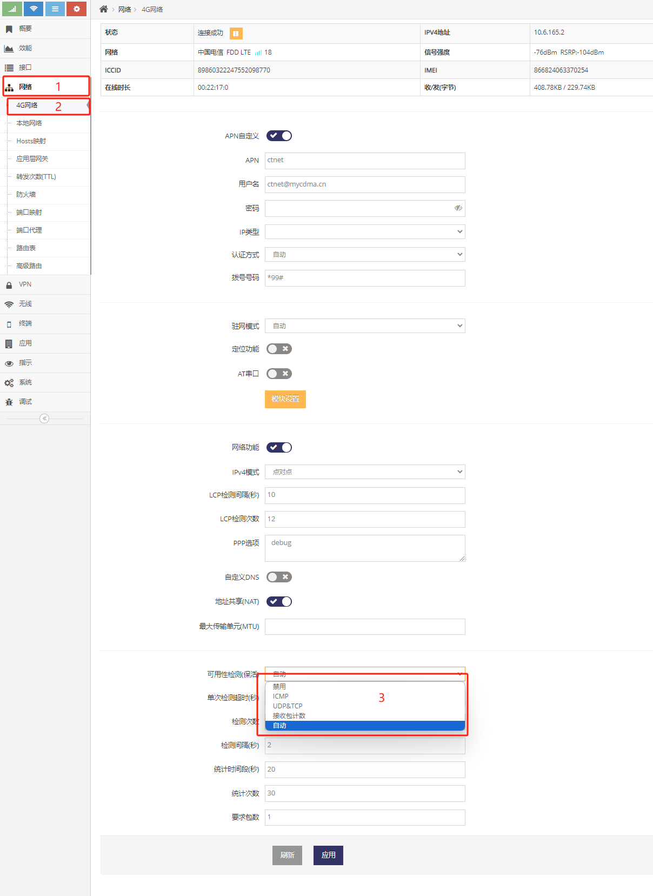
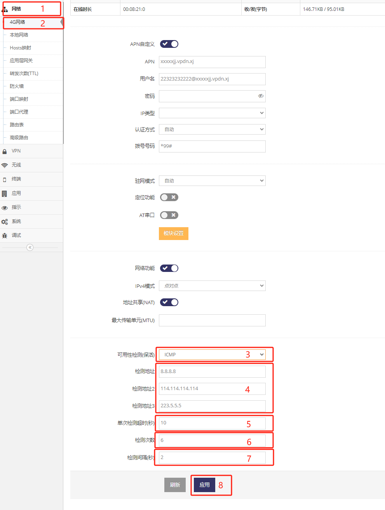
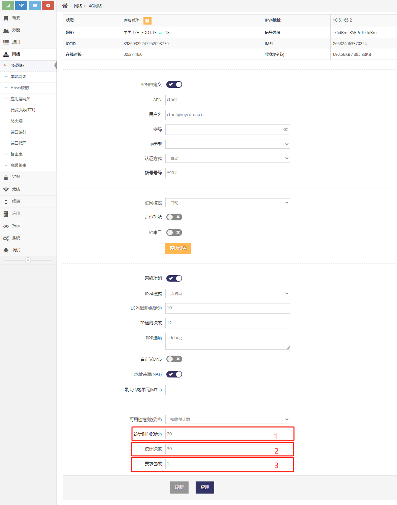
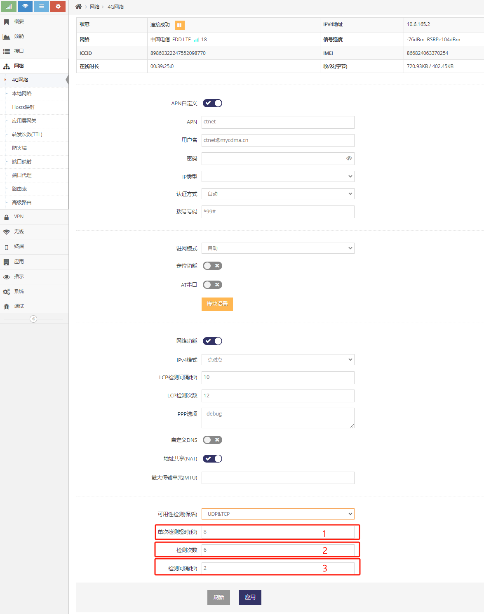
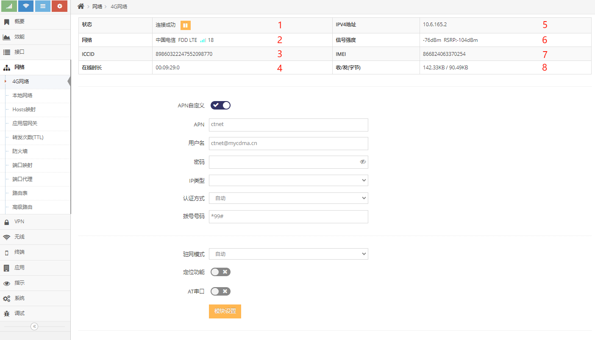
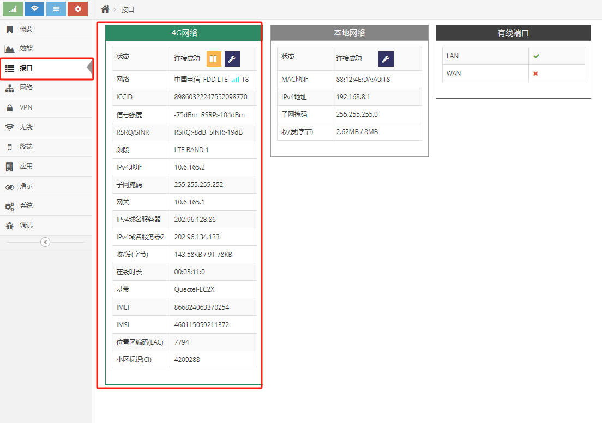

***

## 4G/5G(LTE/NR)接入虚拟专用网络(VPDN/APN)使用说明

对于支持4G/5G(LTE/NR)上网的网关可以通过设置4G/5G网络来接入VPDN网络

## 使用APN专网SIM卡接入虚拟专用网络(VPDN/APN)

常用的物联网卡或一些运营商APN卡都可用于让网关接入虚拟专用网络(这种SIM卡一般无法上互联网), 这种专用的SIM卡又分为两种:

#### 第一种, 通用拨号即可接入虚拟专用网络

这种情况按产品规格书中的要求插入SIM卡, 接上4G/5G天线后上电网关, 网关就会自动接入到虚拟专用网络

#### 第二种, 需要输入运营商指定的APN号才可接入虚拟专用网络

- 这种情况需要登录网关的 **管理界面**(默认网关的IP地址为192.168.8.1, 连上网关后打开浏览器在地址栏输入 http://192.168.8.1 回车即可)

- 点击 **红框1** 的 **网络** 菜单下的 **红框2** 的 **4G网络**(或4G/5G网络) 进入 **4G网络设置界面**(或4G/5G网络设置界面)

 

- 启用 **红框3** 的 **APN自定义** 后, 会显示 **红框4/5** 等APN的设置界面

- 然后在 **红框4** 中输入运营商要求填写的 **APN号**

- 部分运营商还会要求填写除APN号外的 **用户名** 及 **密码**(**红框5**), 如运营商无要求填写则留空

- 为兼容虚拟专用拨号网络对于网卡上网的兼容性差的问题, 建议用户在 **红框6** 的 **IPv4模式** 中选择 **点对点**

- 然后点击界面最下方的 **应用** 即可, 应用后网关会重新拨号, 等待1-3分钟后((取决于网络环境)网关将成功连接虚拟专用网络

- 当连接成功时显示 **连接成功**, 并且在 **红框7** 中会现在当前获取到的IP地址, 通过此IP地址来确认是否为APN专网运营商分配的地址

## 4G/5G(LTE/NR)上网的可用性检测介绍(为了LTE/NR网络的可靠性必须阅读)

- 4G/5G(LTE/NR)网络复杂, 涉及网关与基站的空口, 基站与核心网, 核心网与互联网等多个环节的连接, 任何一个环节出现异常或是与其它环节脱节都可能导致连接不可用
- 因此当网关成功连接到LTE/NR网络时需要开启可用性检测来保证连接的稳定性, 否则可能会出现网关显示成功在线但无法访问网络的情况
- 开启了可用性检测后, 网关会探测与运营商的连接是否有效, 当发现连接无效时能及时重新连接, 从而保证网关LTE/NR连接的可靠性

登录网关的 **管理界面**, 在 **网络** 菜单下点击 **4G网络**(或4G/5G网络) 菜单项进入 **4G网络设置界面**(或4G/5G网络设置界面)， 在其下方是对应的 **可用性检测** 的配置

上图 **红框3** 可以看到为了满足各种LTE/NR网络场景, 设计了四种可用性检测机制
- **ICMP**, 通过发送 **PING包** 到指定的地址, 确认能与 **检测地址** 中配置的任何一个地址通信来判断LTE连接有效, **强烈建议使用**此模式
- **接收包计数**, 通过间隔指定的时间来统计是否有收到包来判断LTE/NR连接是否有效
- **UDP&TCP**, 通过发送 **DNS查询包** 到指定LTE/NR上的DNS服务器来判断连接是否有效
- **自动**, 通过发送 **DNS查询包** 到指定LTE/NR上的DNS服务器来判断, 当 **DNS查询包** 开机即无回应则自动使用 **接收包计数**模式来判断连接是否有效, 当 **DNS查询包** 开机有回应则使用DNS查询包来检测连接是否有效

### ICMP, 即PING包检测

ICMP是所有可用性检测中最有效的机制, **强烈建议使用**, 但如APN专网中不能提供能PING通且稳定的服务器则无法使用些模式

 

- **红框4** 填写连接上LTE/NR网络后能PING通的三个地址, 这三个地址中有一个能PING通即表示LTE/NR连接有效

    - 如果是 **使用普通的SIM卡或物联卡接入互联网**， 在选择为ICMP模式时网关默认内置有三个互联网地址，不需要做修改，直接应用即可

    - 如果是 **使用APN专网SIM卡接入虚拟专用网络(VPDN/APN)** 则需要跟据APN专网中可PING通的IP地址来填写

- **红框5** 填写每次发送PING包后等待回复的超时时长, 超过这个时长未收到PING包的回复表示 ***检测失败***

- **红框6** 填写检测次数, ***检测失败*** 超过这个次数即表示连接不可用, 网关将会断开并重新连接

- **红框7** 填写每次PING包 ***检测成功*** 后等待一定的时间再进行下一次检测

##### ICMP模式下, 当链接不可用时, 网关最长多久能发现并重新连接

最长多久发现连接失效的公式为: **单次检测超时** X **检测次数**, 即以上图为例, 当链接失效后会在10X6=60秒内发现

##### ICMP模式下, 网关出现不停的连接成功之后断开又重新连接的问题

在ICMP模式下, 这种问题一般是填写的三个 **检测地址** 都无法PING通造成的, 这种情况在 **使用APN专网SIM卡接入虚拟专用网络(VPDN/APN)** 时最常出现，出现这种问题时可以先禁用可用性检测, 然后等网关连接成功后通过电脑测试下 **检测地址** 是否可以PING通， 找到可以长期稳定能PING通的IP地址然后填写进去即可

***对于不理解此处的请联系售后, 我们协助你进一步配置***

### 接收包计数

专门为 **使用APN专网SIM卡接入虚拟专用网络(VPDN/APN)** 时 **无长期稳定可PING通的IP地址** 而设计的

 

- **红框1** 用于指定每次检测的时间间隔

- **红框2** 用于指定连续检测失败在次数

- **红框3** 用于指定每次检测要求收到的包数

##### 接收包计数模式下的检测策略

即基于 **时间段** 来检测, 在这个时间段中统计LTE/NR网络连接有接收到 **要求包数** 的包则表示成功, 而未接收到或未达到 **要求包数** 则表示失败, 而连续失败达到 **检测次数** 认为LTE/NR网络连接失效, 网关将断开连接后重新连接

##### 接收包计数模式下, 当链接不可用时, 网关最长多久能发现并重新连接

最短多久发现连接失效的公式为: **时间段** X **检测次数**, 即以上图为例, 当链接失效后最短会在600秒后发现, 即当链接失效后需要10分钟的时间发现

##### 接收包计数模式下, 时间段及检测次数数值问题

如果 **时间段** 及 **检测次数** 填写的数值太小则容易误判, 比如时间段设为10, 而检测次数设为5, 即50秒, 这会导致当网关统计到在50秒未收到指定数的包时就会重新连接, 也就是当网关下的设备如果在50秒没有通信就会导致网关重新连接, 这就可能会造成问题

***对于不理解此处的请联系售后, 我们协助你进一步配置***

### UDP&UDP

通过向LTE/NR网络上的DNS服务器发送DNS的查询包, 以是否能收到DNS的回应来确认连接是否有效

 

- **红框2** 填写每次发送DNS查询包后等待的超时时长, 超过这个时长未收到DNS查询的回复表示 ***检测失败***

- **红框3** 填写检测次数, ***检测失败*** 超过这个次数即表示连接不可用, 网关将会断开并重新连接

- **红框4** 填写每次DNS查询包 ***检测成功*** 后等待一定的时间再进行下一次检测

## 查看4G/5G(LTE/NR)网络的相关信息

### 查看当前4G/5G(LTE/NR)网络的基本状态

在 **4G网络设置界面**(或4G/5G网络设置界面) 的上面首先会显示当前4G(或5G)的基本状态

*通过在 **管理界面** 点击 **网络** 菜单下的 **4G网络** 进入 **4G网络设置界面**(或4G/5G网络设置界面)*

 

- 1为当前的 **网络状态**, 正常网关会不同的阶段显示如下不同的状态:

    - **找到基带**, 表示找到了网关上安装的LTE/NR模块

    - **初始化**, 表示正在初始化LTE/NR模块

    - **检测SIM卡**, 正在查找网关上插入的SIM卡

    - **检测网络**, 表示正在检测当前LTE/NR网络

    - **检测信号**, 表示正在检测信号强度

    - **基带正常**, 表示LTE/NR模块及SIM卡都已找到, 硬件正常

    - **正在拨号**, 表示正在拨入互联网或VPDN网络

    - **重启基带**, 表示可能出现了故障, 网关正在尝试重置LTE/NR模块后再试

    - **正在连接**, 表示正在拨入互联网或VPDN网络

    - **连接成功**, 表示已成功连接到互联网或VPDN网络

    - **离线**, 连接被手动断开或暂时因为网络问题离线, 网关通常间隔一段时间会恢复, 或是无法恢复时会显示具体的异常的信息

    - **未连接**, 连接被手动断开或暂时因为网络问题离线, 网关通常间隔一段时间会恢复, 或是无法恢复时会显示具体的异常的信息

    而在出现异常是会显示如下信息:

    - **无信号**, 即当前环境没有LTE/NR信号

    - **无基带**, 网关未安装的LTE/NR模块或安装的LTE/NR模块出现故障

    - **IMEI错误**, 网关启用了锁LTE/NR模块的功能, 而且原锁定的LTE/NR模块已被更换

    - **PIN码**, 网关有PIN码而网关未配置PIN码

    - **PIN码错误**, PIN码错误

    - **无SIM卡**, 网关未插SIM卡或SIM卡出现故障, 可尝试断电后重新拨插SIM卡后再上电重试

    - **IMSI错误**, 网关启用了锁SIM卡的功能, 而且原锁定的SIM卡已被更换

    - **未注册**, 出现这个提示可等待5到10分钟再看, 如一直无法恢复则表示当前LTE/NR网络环境差无法注册或SIM卡未充值, 或运营商限制了网关接入

    - **拒绝注册**, 出现这个提示可等待5到10分钟再看, 如一直无法恢复则表示当前LTE/NR网络环境差无法注册或SIM卡未充值, 或运营商限制了网关接入

- 2为当前的 **运营商** , **网络类型** 及搜索到的 **信号格数**, **运营商**在中国通常显示 中国电信, 中国联系, 中国移动等信息

    - **网络类型**, 也就是网络制式, 可分为2G, 3G, 4G网络, 2G通常会显示有GSM, GPRS, EDGE, CDMA等关键字, 3G通常会显示WCDMA, EVDO, TDSCDMA, HSPA, HSDPA, HSUPA等关键字, 4G通常会显示LTE, FDD, TDD等关键字, 5G通常会显示NR, SA, NSA等关键字

    - **信号格数** 分为4格, 格数越高表示信息越强, 可供用户直观的了解当前的信号强度

    - **信号格数** 后面是 **CSQ** 的值, 通常取值范围为1-31, 数值越大信号越好

- 3为当前SIM卡的 **ICCID号**, 如果未插SIM卡将不显示内容

- 4为连接成功后一直连续 **在线时长**, 重新连接时会清零

- 5为获取到的 **IP地址**, 连接成功时才会显示

- 6为LTE/NR网络的 **信号强度** 及 **RSRP** 值

    - **信号强度** 的取值范围为-113dBm到-53dBm, 数值越大信号越好

    - **RSRP** 的取值范围为-140dBm到-44dBm, 数值越大信号越好
   
- 7为当前网关的 **IMEI号**, 当网关未安装LTE/NR模组时不显示内容

- 8为当次连接累计的 **收发字节**, 出现重新连接时会清零

### 查看当前LTE/NR网络的所有状态信息

在 **管理界面** 点击 **接口** 将会显示 **4G网络** 的所有状态信息

 

