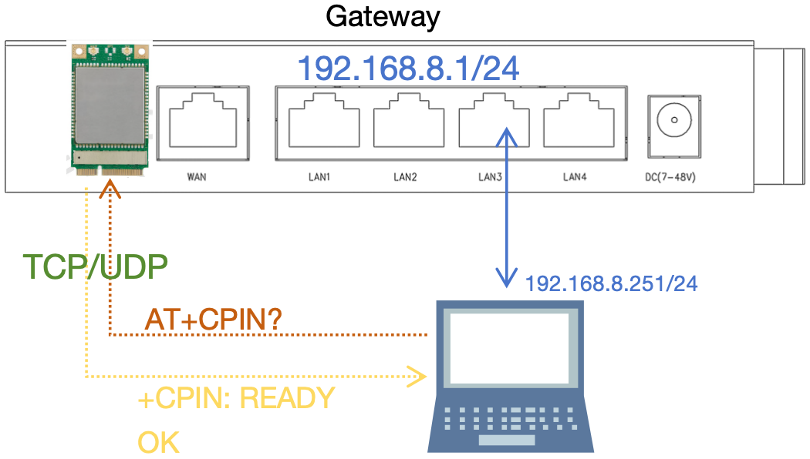
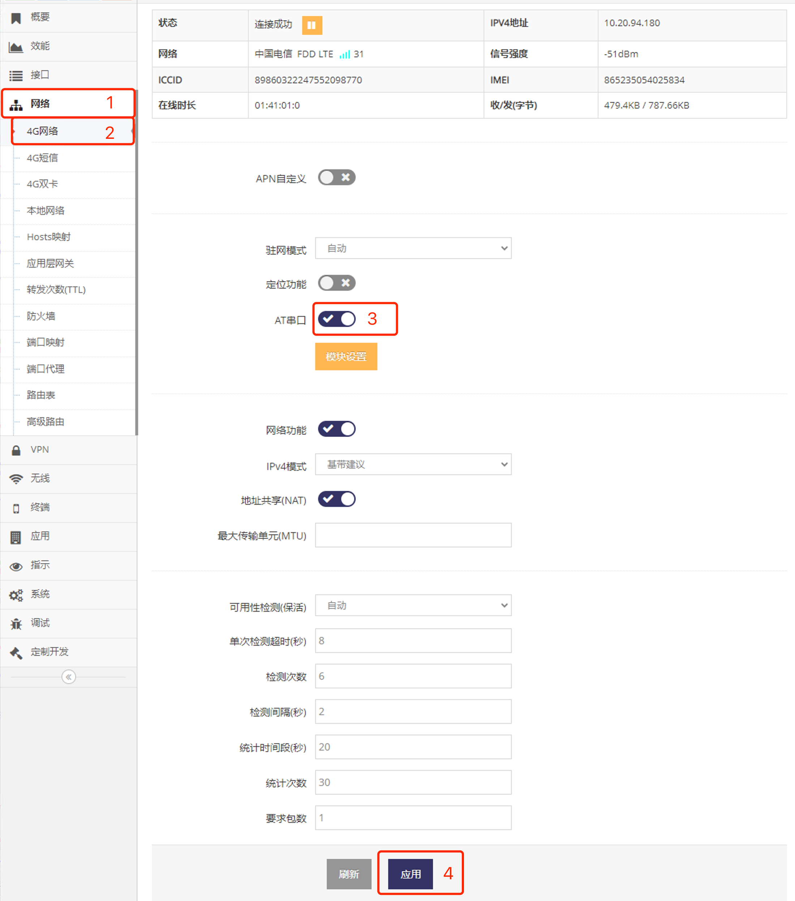
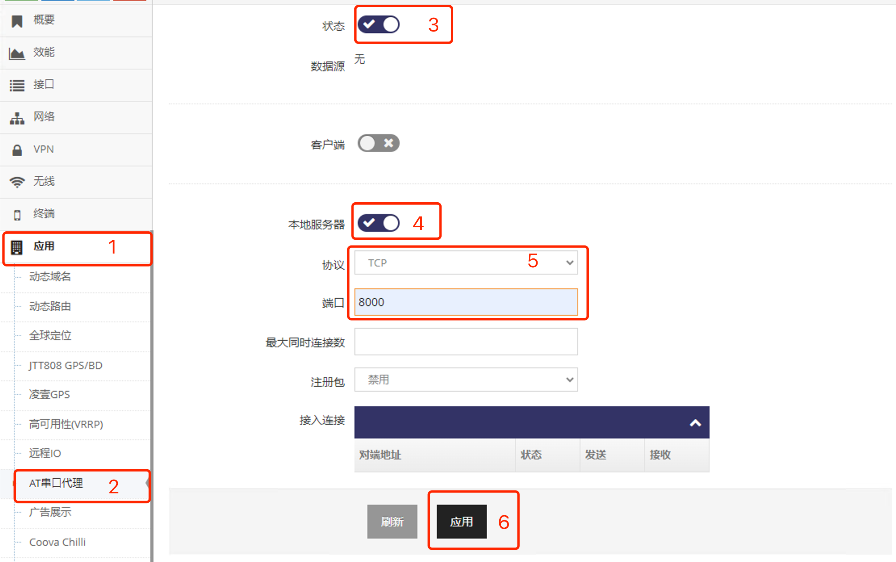
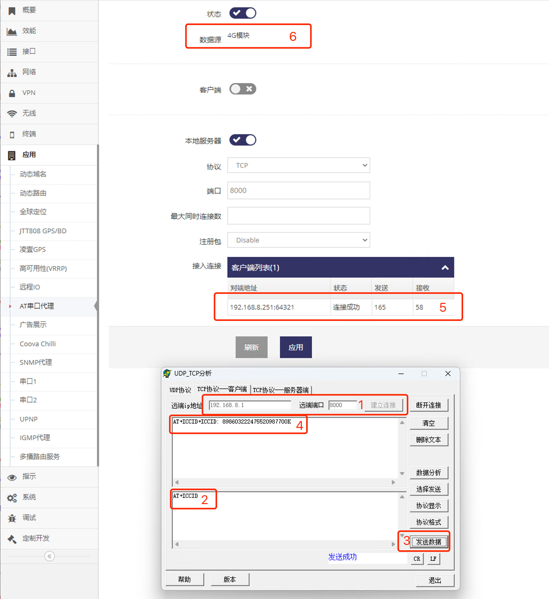
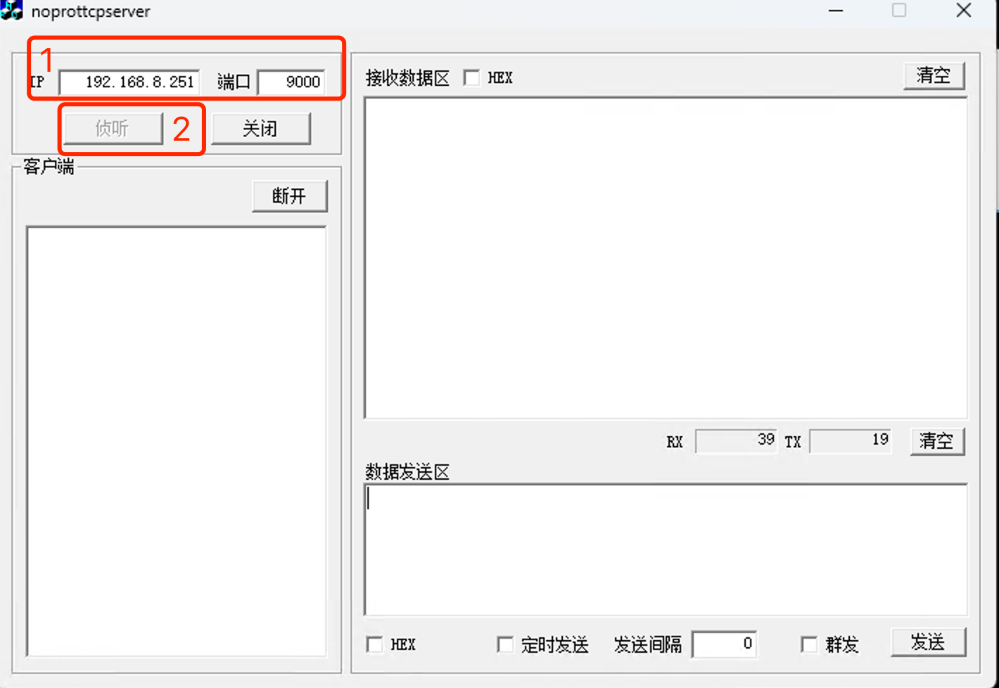
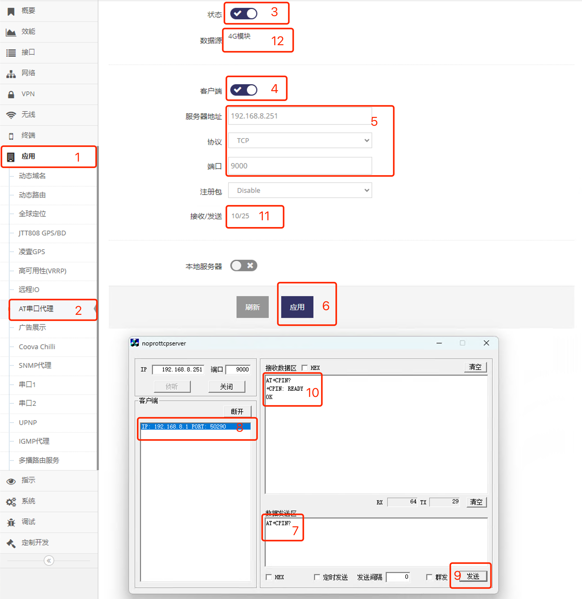

***

## AT指令网络透传使用

   

- 首先打开 **指定4G/5G(LTE/NR)模组** 的 **AT串口** 功能   
    - 因网关支持多4G/5G(LTE/NR)模组, 因此需要通过此步确定在哪一个模块上开启AT指令透传   

- 再打开 **AT串口代理** 的 **服务器** 或 **客户端** 功能   
    - AT串口代理即支持服务器模式也支持客户端模式   

### 首先启用指定4G/5G(LTE/NR)模组的AT串口功能

- 点击 **红框1** **网络** 菜单下的 **红框2** **4G网络**(或**4G/5G网络**) 进入 **4G网络设置界面**(或**4G/5G网络设置界面**)

 

- 点击 **红框3** 启用 **AT串口**, 之后点击 **红框4** 应用即可

在支持双4G/5G(LTE/NR)模组的网关上具体点选 **4G网络** 还是 **4G/5G网络** 取决于需要与哪一个 **4G/5G(LTE/NR)模组** 交互AT指令   
**不支持同时开始多个模组的AT串口功能**    

### AT指令串口代理服务器的使用

#### 1. 打开AT指令串口代理服务器

- 点击 **红框1** **应用** 菜单下的 **红框2** **AT串口代理** 进入 **AT串口代理设置界面**   
- 点击 **红框3** 启用后, 点击 **红框4** 启用 **本地服务器**   

   

- 在 **红框5** 中选择服务器 **协议**, 示例将使用TCP, 因此选TCP   
- 在 **红框5** **端口** 输入框输入服务器的端口, 示例使用8000    
- 点击 **红框5** 应用即可

#### 2. 使用TCP/UDP客户端测试发送AT指令   

- 在TCP/UDP工具的 **红框1** 输入网关地址及设置的端口后点击连接, 以上设置的端为8000, 网关为默认的地址192.168.8.1
- 在 **红框2** 输入测试的AT指令, 示例指令为查询ICCID号, 注意一定要 **换行**      
- 点击 **红框3** 发送数据, 即可在 **红框4** 看到模块的回复   

   

- **红框5** 也会显示TCP/UDP工具连入的信息及收发包字节数   
- **红框6** 显示当前AT指令串口代理使用的数据源, 即与哪一个4G/5G(LTE/NR)模组通信   

通过以上示例演示了AT指令串口代理服务器的使用, 开启AT指令串口代理服务器后设备可以连接其服务端口实现直接与4G/5G(LTE/NR)模组完成AT指令交互   

### AT指令串口代理客户端的使用

#### 1. 打开TCP/UDP服务器工具等待AT指令串口代理客户端连接

- 在电脑上运行TCP/UDP服务器工具
- 在 **红框1** 输入电脑的IP地址(有的工具会自动获取电脑的IP地址), 示例的电脑的IP地址为192.168.8.251, 并输入端口, 示例使用9000  
- 点击 **红框2** 侦听打开TCP/UDP服务器工具的服务器功能  

   

#### 2. 打开AT指令串口代理客户端   

- 点击 **红框1** **应用** 菜单下的 **红框2** **AT串口代理** 进入 **AT串口代理设置界面**   
- 点击 **红框3** 启用后, 点击 **红框4** 启用 **客户端**   
- 在 **红框5** **服务器地址** 输入电脑的IP地址, 以上示例为192.168.8.251  
- 在 **红框5** **协议** 选择协议, 以上示例为TCP   
- 在 **红框5** **端口** 输入框输入服务器的端口, 以上示例为9000    
- 点击 **红框6** 应用即可在TCP/UDP服务器工具的 **红框8** 看到网关连入

   

- 在 **红框7** 输入测试的AT指令, 示例为查询是否有SIM卡的指令, 注意一定要 **换行**      
- 在 **红框8** 中点选连入的网关, 点击 **红框9** 发送, 即可在 **红框10** 看到AT指令回复   
- **红框11** 也会显示收发包数      
- **红框12** 显示当前AT指令串口代理使用的数据源, 即使用哪一个4G/5G(LTE/NR)模组   

通过以上示例演示了AT指令串口代理客户端的使用, 开启AT指令串口代理客户端后设备接受其连接并实现直接与4G/5G(LTE/NR)模组完成AT指令交互   

