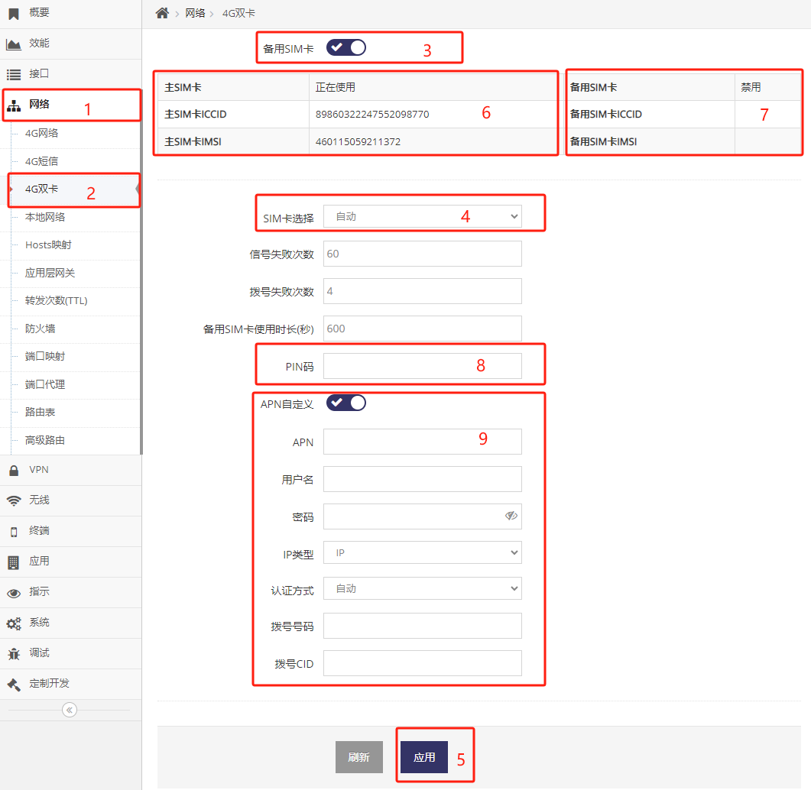

***

## 启用4G/5G(LTE/NR)双卡功能

**默认双卡功能处于禁用状态**

**双卡功能禁用时, SIM卡槽2处于禁用状态, 使用4G/5G上网时只能将SIM卡插入SIM卡槽1**

**双卡功能开启后, SIM卡槽2才会根据用户的配置决定是否工作**

通过登录网关的 **管理界面**(默认网关的IP地址为192.168.8.1, 连上网关后打开浏览器在地址栏输入 http://192.168.8.1 回车即可)

- 点击 **红框1** **网络** 菜单下的 **红框2** **4G双卡**(或4G/5G双卡) 进入 **4G双卡设置界面**(或4G/5G双卡设置界面)

- 点选 **红框3** 启用双卡功能, 设置好后点击 **红框5** 中的应用即可生效

 

### SIM卡选择

**红框4** 中点开后会列出了3种双卡的选择策略

#### **自动**

即优先使用SIM卡槽1, 当SIM卡槽1中的SIM卡不可用时才使用SIM卡槽2中的SIM卡

- 检测SIM卡槽1是否有卡, 如有卡则使用

    如果无卡则使用SIM卡槽2, SIM卡槽2使用达到 **备用SIM卡使用时长** 后再断开连接重新检测SIM卡槽1是否有卡

- 检测SIM卡槽1的卡是否有信号, 如有则使用

    如果无则使用SIM卡槽2, SIM卡槽2使用达到 **备用SIM卡使用时长** 后再断开连接重新检测SIM卡槽1是否有信号

    每次检测信号的次数为 **信号失败次数**, 每次检测间隔为1秒

- 尝试使用SIM卡槽1的卡可拨号上线, 如可上线则使用

    如果不可上线则使用SIM卡槽2, SIM卡槽2使用达到 **备用SIM卡使用时长** 后再断开连接重新尝试使用SIM卡槽1拨号上线
    
    每次尝试拨号上线的拨号次数为 **拨号失败次数**, 每次拨号上线花费的时长跟据环境的不同而不同, 大约花费在20-60秒

#### 主SIM卡

即只使用SIM卡槽1中的SIM卡上网, 禁用SIM卡槽2

#### 备用SIM卡

即只使用SIM卡槽2中的SIM卡上网, 禁用SIM卡槽1

### 备用SIM卡的PIN码设置

**红框8** 用于设置SIM卡槽2中SIM卡的PIN码

### 备用SIM卡的APN自定义

**红框9** 用于设置SIM卡槽2中SIM卡的自定义APN信息

### 当前主备卡的状态

启用双卡功能后   
**红框6** 中 **主SIM卡** 后会显示SIM卡槽1中卡 **正在使用** 或 **禁用**   
**红框6** 中 **主SIM卡ICCID** 后会显示 SIM卡槽1中卡的ICCID号   
**红框6** 中 **主SIM卡IMSI** 后会显示 SIM卡槽1中卡的IMSI   
**红框7** 中 **备用SIM卡** 后会显示SIM卡槽2中卡 **正在使用** 或 **禁用**   
**红框7** 中 **备用SIM卡ICCID** 后会显示 SIM卡槽2中卡的ICCID号   
**红框7** 中 **备用SIM卡IMSI** 后会显示 SIM卡槽2中卡的IMSI   
