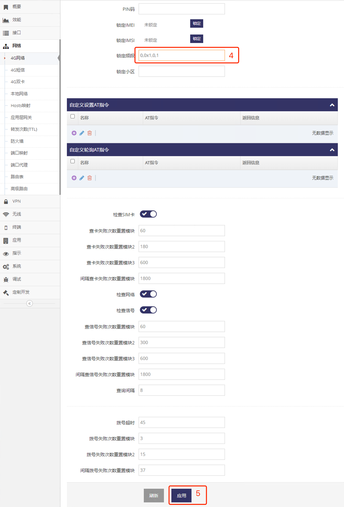

***

## 为4G/5G(LTE/NR)模组自定义指令   

可设置一些自定义的AT指令在网关初始化4G/5G(LTE/NR)模组时时执行, 也可以自定义AT指令在网关轮询4G/5G(LTE/NR)模组时时执行    
首先进入 **模块管理界面**   

- 点击 **红框1** **网络** 菜单下的 **红框2** **4G网络**(或**4G/5G网络**) 进入 **4G网络设置界面**(或**4G/5G网络设置界面**)

 

- 点击 **红框3** **模块管理** 进入 **模块管理界面**   

 

### 添加自定义设置指令   

自定义的设置指令会在每次4G/5G(LTE/NR)模组时被执行, 执行后的结果会显示在 **返回信息** 栏   
- 点击 **红框1** 弹出添加记录对话框 
- 在 **红框2** **名称** 中输入自定义的名称   
- 在 **红框2** **AT指令** 中输入完整的 **AT指令**  
- 点击 **红框3** **提示** 完成添加   

    

添加好后需要点击界面最下方的应用即可

### 添加自定义查询指令      

自定义的查询指令会在每次网关轮询4G/5G(LTE/NR)模组状态时被执行, 执行后的结果会显示在 **返回信息** 栏     
- 点击 **红框1** 弹出添加记录对话框 
- 在 **红框2** **名称** 中输入自定义的名称   
- 在 **红框2** **AT指令** 中输入完整的 **AT指令**  
- 点击 **红框3** **提示** 完成添加   

     

添加好后需要点击界面最下方的应用即可
