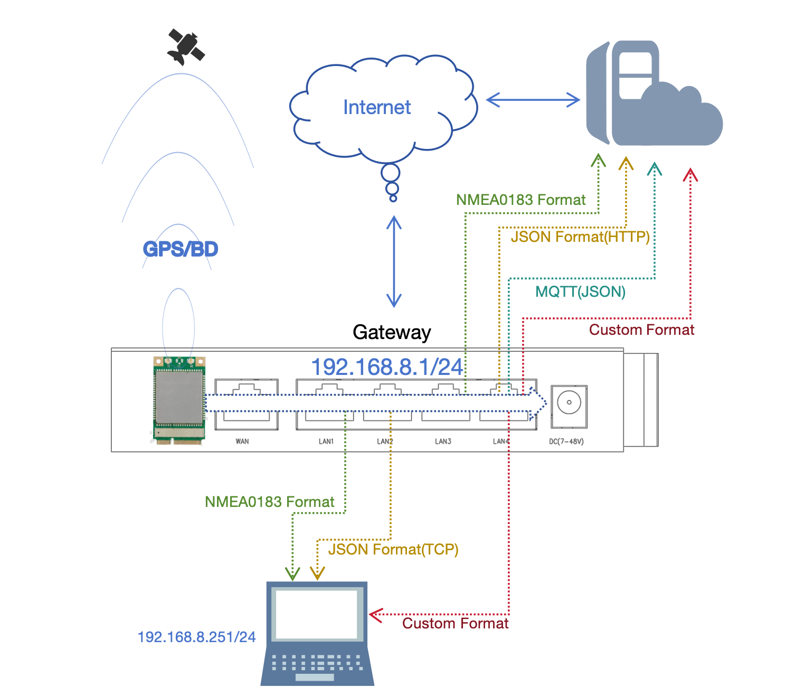
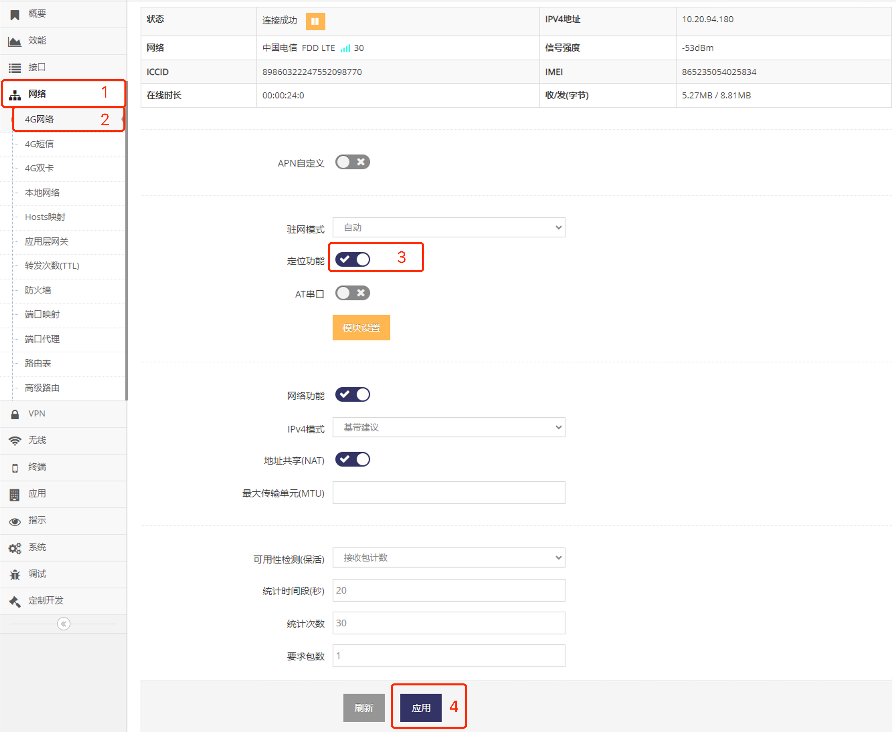
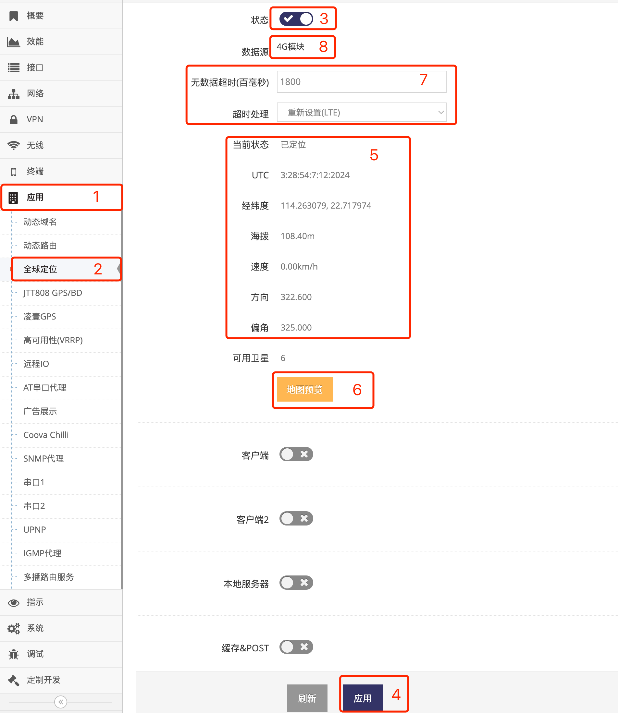

## 4G/5G(LTE/NR)定位功能及使用   
   
- 首先打开 **指定4G/5G(LTE/NR)模组** 的 **定位功能** 功能, 让其成为 **定位信号源**     
    - 因网关支持多4G/5G(LTE/NR)模组, 因此需要通过此步确定在哪一个模块上开启 **定位功能**   
- 再打开 **全球定位** 的 **服务器** 或 **客户端** 功能来向其它设备或云平台发送定位数据   
    - 定位功能即支持服务器模式也支持客户端模式发其它设备发送定位信息
    - 服务器客户端模式下支持TCP/UDP  
    - 客户端除了支持TCP/UDP还支持MQTT发送定位信息     

**注意: 系统只支持一个定位信号源, 请禁用其它串口的GPS定位及4G/5G(LTE/NR)模组的定位功能**   

### 首先启用指定4G/5G(LTE/NR)模组的定位功能成为信号源   
- 点击 **红框1** **网络** 菜单下的 **红框2** **4G网络**(或**4G/5G网络**) 进入 **4G网络设置界面**(或**4G/5G网络设置界面**)   
   
- 点击 **红框3** 启用 **定位功能**, 之后点击 **红框4** 应用即可   
在支持双4G/5G(LTE/NR)模组的网关上具体点选 **4G网络** 还是 **4G/5G网络** 取决于需要与哪一个 **4G/5G(LTE/NR)模组** 定位功能   

### 然后打开全球定位确认是否已定位    
- 点击 **红框1** **网络** 菜单下的 **红框2** **全球定位** 进入 **全球定位设置界面**     
   
- 点击 **红框3** 启用 **定位功能**, 之后点击 **红框4** 应用即可   
- **红框5** 的 **当前状态** 显示 **已定位**, **搜索中** 等状态   
- **红框5** 的 **UTC** 显示 UTC的时间   
- **红框5** 显示 **经纬度** 显示 当前的经纬度  
- **红框5** 显示 **海拨**   
- **红框5** 显示 **方向**   
- **红框5** 显示 **偏角**   
- 点击 **红框6** 的 **地址预览** 可在地图查看位置, 因所有型号都调用高德地图的接口,有次数限制, 超过次料可能不会正确显示    
- **红框7** 的 **无数据超时** 默认不用修改, 用于在4G/5G(LTE/NR)定位功能出现异常时恢复用的   
- **红框7** 的 **超时处理** 默认不用修改, 用于在4G/5G(LTE/NR)定位功能出现异常时恢复用的   
- **红框8** 显示当前定位信号源   

## 定位数据的获取   
- **[TCP/UDP协议发送GPS/BD定位数据(NMEA)](../gnss/gnss_tcpudp_cn.md)**   
- **[MQTT协议上报GPS/BD定位信息](../gnss/gnss_mqtt_cn.md)**   
- **[HTTP协议上报GPS/BD定位信息(支持无网时缓存定位数据)](../gnss/gnss_http_cn.md)**   
- **[本地设备获取GPS/BD定位信息](../gnss/gnss_tcpjson_cn.md)**   
