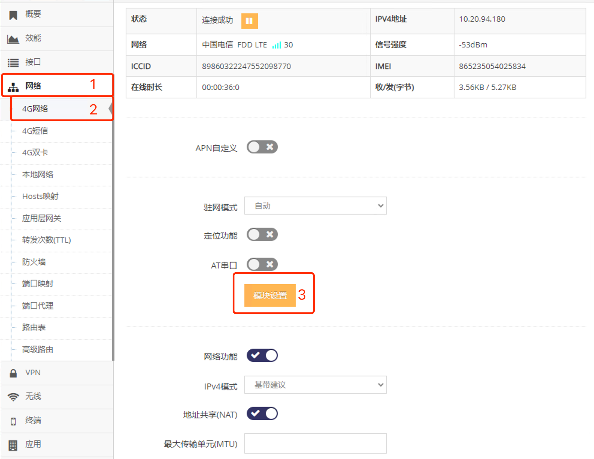

***

## 4G/5G(LTE/NR)锁定频段   

锁定4G/5G(LTE/NR)频段后模块只会注册到指定的频段, 如果没有此频段则无法上网     

- 点击 **红框1** **网络** 菜单下的 **红框2** **4G网络**(或**4G/5G网络**) 进入 **4G网络设置界面**(或**4G/5G网络设置界面**)

 

- 点击 **红框3** **模块管理** 进入 **模块管理界面**   

 

- 在 **红框4** 中输入 **锁频值** 后点击 **红框5** 应用即可, 以上示例为使用 **EC20模组** 的网关锁定 **LTE Band1**

## 常用4G/5G(LTE/NR)模组的锁频值

不同的4G/5G(LTE/NR)模组锁定频段需要在 **红框4** 中输入不同的锁频值

### EC20锁定不同的频段对应的锁频值 

**0,0x1,0,1**       锁定  **LTE Band1**   
**0,0x4,0,1**       锁定  **LTE Band3**   
**0,0x10,0,1**      锁定  **LTE Band5**   
**0,0x40,0,1**      锁定  **LTE Band7**   
**0,0x80,0,1**      锁定  **LTE Band8**   
**0,0x800000,0,1**  锁定  **LTE Band20**   
**0,0x7FFFFFFFFFFFFFFF,0,1**  不锁定LTE频段   

### EC200锁定不同的频段对应的锁频值 

**0,0x1**            锁定  **LTE Band1**    
**0,0x4**            锁定  **LTE Band3**    
**0,0x10**           锁定  **LTE Band5**    
**0,0x80**           锁定  **LTE Band8**    
**0,0x200000000**    锁定  **LTE Band34**    
**0,0x2000000000**   锁定  **LTE Band38**    
**0,0x4000000000**   锁定  **LTE Band39**    
**0,0x8000000000**   锁定  **LTE Band40**    
**0,0x10000000000**  锁定  **LTE Band41**    
**0,0x7FFFFFFFFFFFFFFF**       不锁定LTE频段       

**更多模组对应的锁频值请资询技术人员**