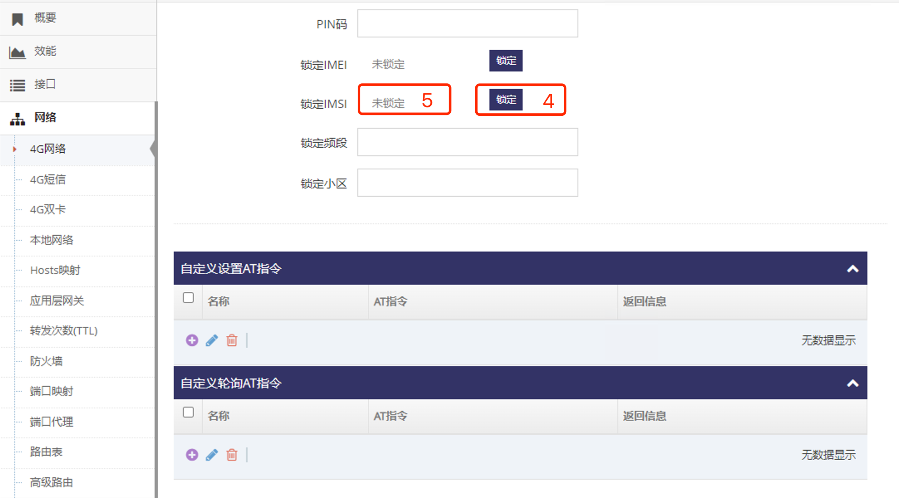

***

## 4G/5G(LTE/NR)锁定SIM卡

锁定SIM卡后使用别的SIM卡无法上网    
**注意, 锁定SIM卡后恢复出厂也不可撤销锁定请谨慎操作, 如出现意外锁定请联系技术人员**    

- 点击 **红框1** **网络** 菜单下的 **红框2** **4G网络**(或**4G/5G网络**) 进入 **4G网络设置界面**(或**4G/5G网络设置界面**)

 

- 点击 **红框3** **模块管理** 进入 **模块管理界面**   

 

- 然后点击 **红框4** **锁定** 当前SIM卡的IMSI号, 弹出窗口提示不可撤销, 点击 **确定** 即可锁定

- 锁定后 **红框5** 会显示当前锁定的SIM卡IMSI号

