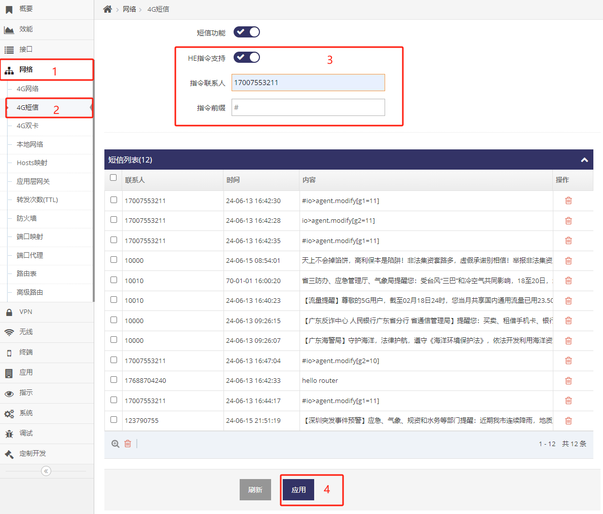

***

## 启用4G/5G(LTE/NR)短信功能

**默认短信功能处于禁用状态**

**短信功能开启前, 请先确认关闭了AT串口功能**

通过登录网关的 **管理界面**(默认网关的IP地址为192.168.8.1, 连上网关后打开浏览器在地址栏输入 http://192.168.8.1 回车即可) 关闭AT串口功能

 

- 点击 **红框1** 的 **网络** 菜单下的 **红框2** 的 **4G网络**(或4G/5G网络) 进入 **4G网络设置界面**(或4G/5G网络设置界面)
- 点击 **红框3** 的 **AT串口** 禁用AT串口功能后点击 **红框4** **应用**

然后启用短信功能

- 点击 **红框1** 的 **网络** 菜单下的 **红框2** 的 **4G短信**(或4G/5G短信) 进入 **4G短信设置界面**(或4G/5G短信设置界面)

- 点选 **红框3** 启用短信功能, 设置好后点击 **红框4** 中的 **应用** 即可

 

启用短信功能后在 **红框5** 中会显示当所收到的短信


## 启用短信控制网关功能

网关支持通过发送短信实现对网关的控制, 并支持只接受指定的手机号的控制

 

- 点击 **红框1** 的 **网络** 菜单下的 **红框2** 的 **4G短信**(或4G/5G短信) 进入 **4G短信设置界面**(或4G/5G短信设置界面)

- 点选 **红框3** 启用短信的 **HE指令支持** 功能, 设置好后点击 **红框4** 中的 **应用** 即可

- 默认启用了 **HE指令支持** 功能后, 网关接受所有联系人发送的控制, 在 **红框3** 的 **指令联系人** 填写电话号码后则只接受此电话号码的联系人的控制   
    有多个联系人填写时用 **分号( ; )** 分开即可

- 在 **红框3** 的 **指令前缀** 可以加入指定的前缀, 要求联系人发送的HE指令必须带有此前缀


### 通过短信控制网关

- 短信管理设备也是基于 [HE指令介绍](../he/he_command_cn.md)

- 但因短信传输长度有限制, 因此需要基于 **HE指令** 的功能减少单次传输的字符长度即可

- 需要用到HE指令中的 **:号** 及 **/号** 的功能来限制到传输单个属性即可

- 在短信的传输中因 **@号** 通信会被运营商过滤所以需要将 **@** 改成 **>**

基于以上的配置, 通过17007553211的手机号向网关SIM卡号发送短信即可管理网关, 以下示例一些常用的控制短信

#### 查询LTE/NR网络是否自定义APN

```
#ifname>lte:profile
```
对应的HE指令为ifname@lte:profile, 前面加#因为 **红框3** 中 **指令前缀** 为#, 发送后将收到
```
enable
```
enable表示有自定义, disable表示未自定义

#### 查询LTE/NR网络自定义的APN号
```
#ifname>lte.profile/apn
```
对应的HE指令为ifname@lte:profile/apn, 前面加#因为 **红框3** 中 **指令前缀** 为#, 发送后将收到当前自定义的APN号
```
cmnet
```

#### 设置LTE/NR网络自定义APN号

1. 发送以下启用APN自定义

```
#ifname>lte:profile=enable
```
收到
```
ttrue
```

2. 发送以下设置APN号

```
#ifname>lte:profile/apn=gddw@163.com
```
收到
```
ttrue
```

#### 立即重启网关

```
#land>machine.restart
```

#### 延迟5秒后重启网关

```
#land>machine.restart[5]
```
收到
```
ttrue
```

#### 将网关恢复默认设置
```
#land>machine.default
```


#### 查询LTE/NR的CSQ

```
#ifname>lte.status:csq
```

#### 查询LTE/NR的IP

```
#ifname>lte.status:ip
```

#### 查询LTE/NR的上线时长

```
#ifname>lte.status:livetime
```

#### 查询LTE/NR的IMEI号

```
#ifname>lte.status:imei
```

#### 查询LTE/NR的ICCID号

```
#ifname>lte.status:iccid
```


#### 将IO口G1设置输出高电平

```
#io@agent.modify[g1=11]
```   
设置成功后设置后的网关所有IO的状态


#### 将IO口G1设置输出低电平

```
#io@agent.modify[g1=10]
```   
设置成功后设置后的网关所有IO的状态


#### 将IO口G1设置输入模式

```
#io@agent.modify[g1=00]
```   
设置成功后设置后的网关所有IO的状态


#### 将IO口G2设置输出高

```
#io@agent.modify[g2=11]
```   
设置成功后设置后的网关所有IO的状态


