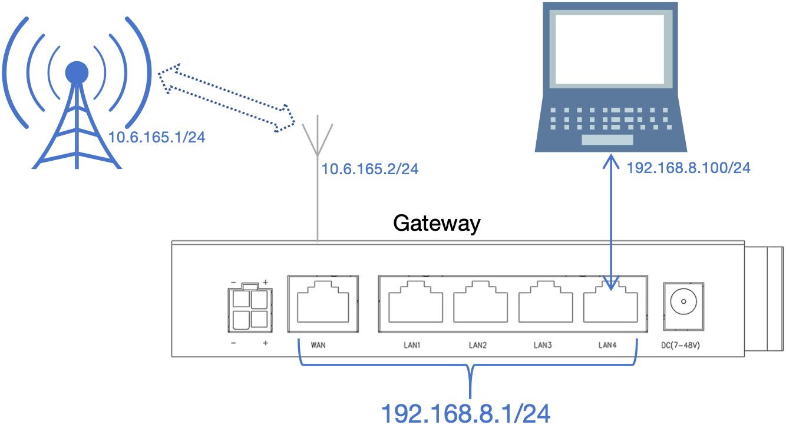
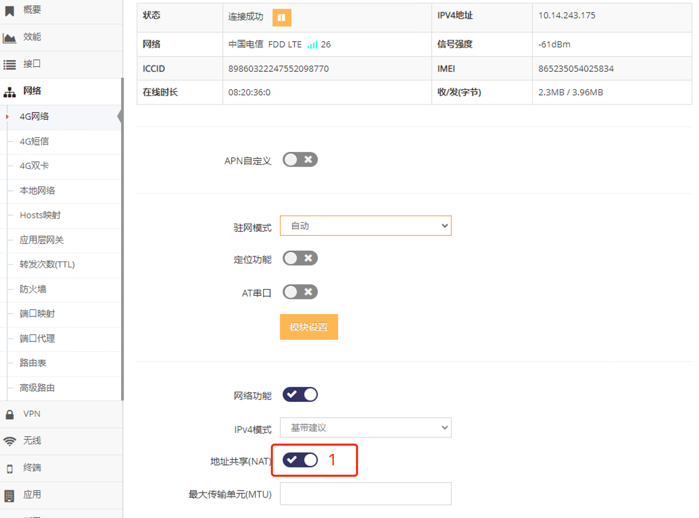

***

## 4G/5G(LTE/NR)接入自建基站网络使用说明

自建基站网络有两种方式:

- 使用了专用的频段, 如使用的专用频段需要与技术支持确认购买的网关型号是否支持此频段

- 使用了通用的频段, 这种自建基站网络使用通用模块也可接入, 具体需要跟技术支持确认

## 接入自建基站网络需要使用基站方制作的SIM卡

 

按产品规格书中的要求插入基站方制作的SIM卡, 接上4G/5G天线后上电网关, 网关通常会接入自建基站网络, 但也可能需要一些特别的需求和设置

#### 需要输入运营商指定的APN号才可接入自建基站网络

- 这种情况需要登录网关的 **管理界面**(默认网关的IP地址为192.168.8.1, 连上网关后打开浏览器在地址栏输入 http://192.168.8.1 回车即可)

- 点击 **红框1** **网络** 菜单下的 **红框2** **4G网络**(或**4G/5G网络**) 进入 **4G网络设置界面**(或**4G/5G网络设置界面**)

 

- 启用 **红框3** 的 **APN自定义** 后, 会显示 **红框4/5** 等APN的设置界面

- 然后在 **红框4** 中输入运营商要求填写的 **APN号**

- 部分运营商还会要求填写除APN号外的 **用户名** 及 **密码**(**红框5**), 如运营商无要求填写则留空

- 如果使用4G上网为防止对于网卡上网的兼容性差的问题, 用户在 **红框6** 的 **IPv4模式** 中选择 **点对点**

- 然后点击界面最下方的 **应用** 即可, 应用后网关会重新拨号, 等待1-3分钟后((取决于网络环境)网关将成功连接自建基站网络

- 当连接成功时显示 **连接成功**, 并且在 **红框7** 中会现在当前获取到的IP地址, 通过此IP地址来确认是否为自建基站网络分配的地址

#### 需要输入APN号才可接入自建基站网络

- 这种情况需要登录网关的 **管理界面**(默认网关的IP地址为192.168.8.1, 连上网关后打开浏览器在地址栏输入 http://192.168.8.1 回车即可)

- 点击 **红框1** **网络** 菜单下的 **红框2** **4G网络**(或**4G/5G网络**) 进入 **4G网络设置界面**(或**4G/5G网络设置界面**)

 

- 启用 **红框3** 的 **APN自定义** 后, 会显示 **红框4/5** 等APN的设置界面

- 然后在 **红框4** 中输清空 **APN号**, 在 **红框5** 中输清空 **用户名** 及 **密码**

- 如果使用4G上网为防止对于网卡上网的兼容性差的问题, 用户在 **红框6** 的 **IPv4模式** 中选择 **点对点**

- 然后点击界面最下方的 **应用** 即可, 应用后网关会重新拨号, 等待1-3分钟后((取决于网络环境)网关将成功连接自建基站网络

- 当连接成功时显示 **连接成功**, 并且在 **红框7** 中会现在当前获取到的IP地址, 通过此IP地址来确认是否为自建基站网络分配的地址

#### 以纯路由模式下接入自建基站网络

在纯路由模式下 **自建基站网络端** 可以直接访问到网关下的 **设备和电脑**   

只需要基于之前原有的 **4G网络**(或**4G/5G网络**) 联网设置基础上禁用 **地址共享(NAT)**

- 即在 **4G网络设置界面**(或**4G/5G网络设置界面**) 点击 **红框1** 禁用即可

 

- 为了防止 **自建基站网络端** 访问被防火墙阻止还需要禁用 **4G网络**(或**4G/5G网络**) 的防火墙, 按以下红框数字步骤点选即可禁用

 

## 4G/5G(LTE/NR)上网的可用性检测介绍(为了LTE/NR网络的可靠性必须阅读)

参见 **[4G/5G(LTE/NR)上网的可用性检测介绍](../lte/lte_apn_cn.md#4g5gltenr上网的可用性检测介绍为了ltenr网络的可靠性必须阅读)**

## 查看4G/5G(LTE/NR)网络的相关信息

参见 **[查看4G/5G(LTE/NR)网络的相关信息](../lte/lte_apn_cn.md#查看4g5gltenr网络的相关信息)**

