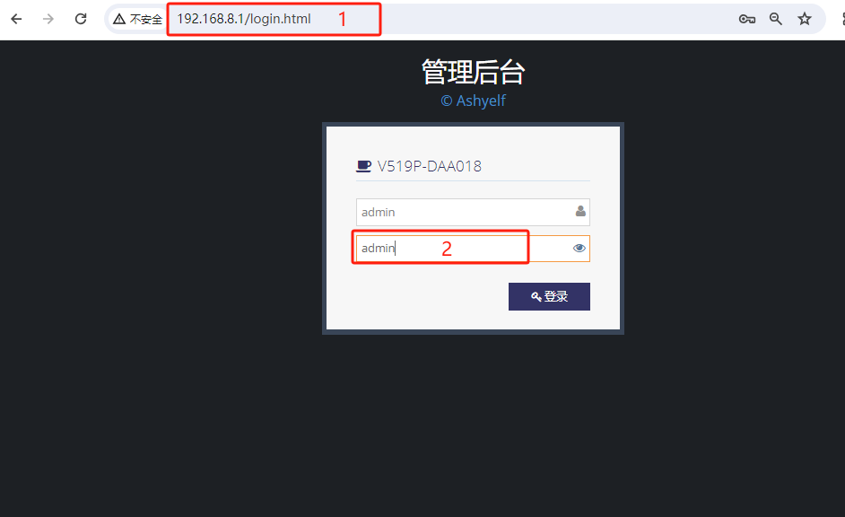
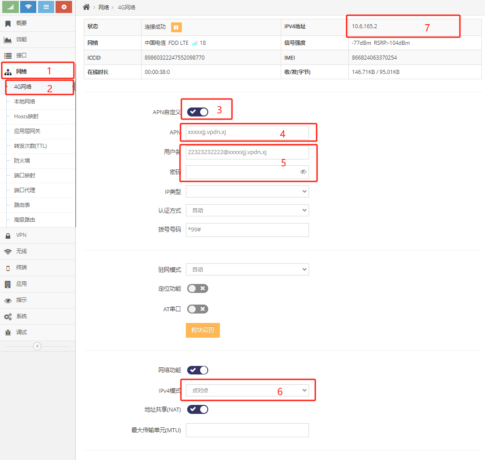
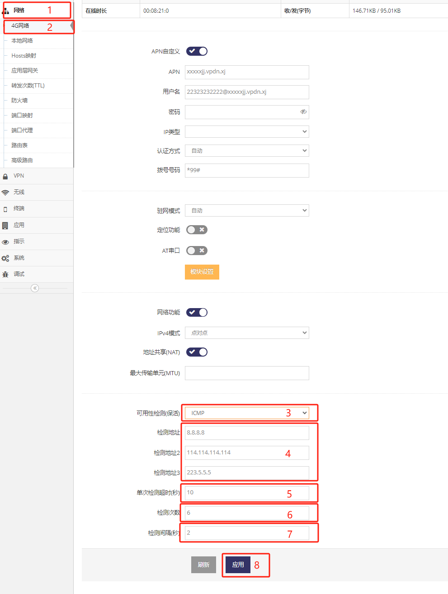
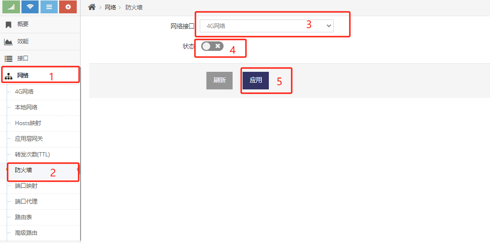
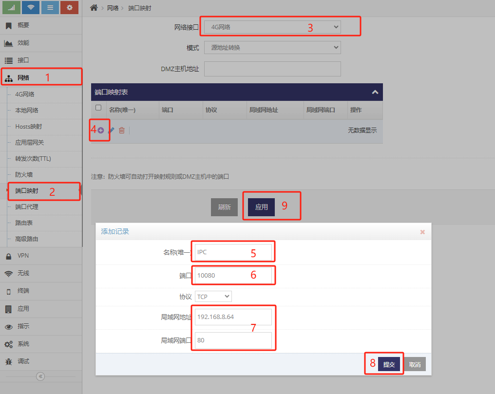

***
## 将IPC接入APN专网的快速设置

此文档以简洁的方式介绍设置APN及设置端口映射, 针对现场安装人员以最简单的方式快速设置路由器接入APN专网

**在无技术支持的情况下此文档中未用红框标识的设置请不要做任何变动**

### 连接路由器

路由器的默认IP地址为192.168.8.1

通过网线将电脑用网络与路由器的网口连接(LAN/WAN)即可

打开浏览器(IE)输入http://192.168.8.1回车即可打开路由器的配置界面

 

- 输入密码后(默认密码为admin), 点击 **登录** 即可进入路由器的配置界面

### 填写APN

- 依次点击 **红框1** **红框2** 进入 **4G网络设置界面**

 

- 启用 **红框3** 的 **APN自定义** 后, 会显示 **红框4/5** 等APN的设置界面
- 然后在 **红框4** 中输入运营商要求填写的 **APN号**
- 部分运营商还会要求填写出APN号外的 **用户名** 及 **密码**(**红框5**), 如果运营商无要求填写则留空
- 为兼容虚拟专用拨号网络对于网卡上网的兼容性差的问题, 建议用户在 **红框6** 的 **IPv4模式** 中选择 **点对点**

### 设置ICMP检测地址

设置了ICMP检测地址将使得LTE网络出现异常时路由器可快速自动恢复

 

- 将 **红框3** 的 **可用性检测** 的值设置为 **ICMP**
- 在 **红框4** 检测地址中输入专网中可以稳定ping通的IP地址, **建议至少填写两个可ping通的IP地址**
- 点击 **红框8** 的 **应用** 即可, 然后等待设备上线
- 设备上线后会在此界面的最上方的 **IPv4地址** 后显示获取到的IP地址

**如填写的检测地址无法ping通则会出现LTE网络无法使用**

### 关闭防火墙

关闭防火墙后可通过专网使用路由器LTE的地址直接访问路由器

 
- 依次点击 **红框1** **红框2** 进入防火墙设置界面
- **红框3** 中点选 **4G网络**
- **红框4** 中点选 **禁用**
- 点击 **红框5** **应用**

### 添加端口映射

添加端口映射后可通过专网使用路由器LTE的地址及端口直接访问路由器下的设备

 
- 依次点击 **红框1** **红框2** 进入 端口映射 设置界面
- **红框3** 中点选 **4G网络**
- 点击 **红框4** 添加端口映射规则
- **红框5** 填写一个自定义的规则名
- **红框6** 填写LTE网络地址的端口
- **红框7** 填写IPC本地网络的地址及服务端口
- 点击 **红框8** 提交
- 点击 **红框9** 应用即可

