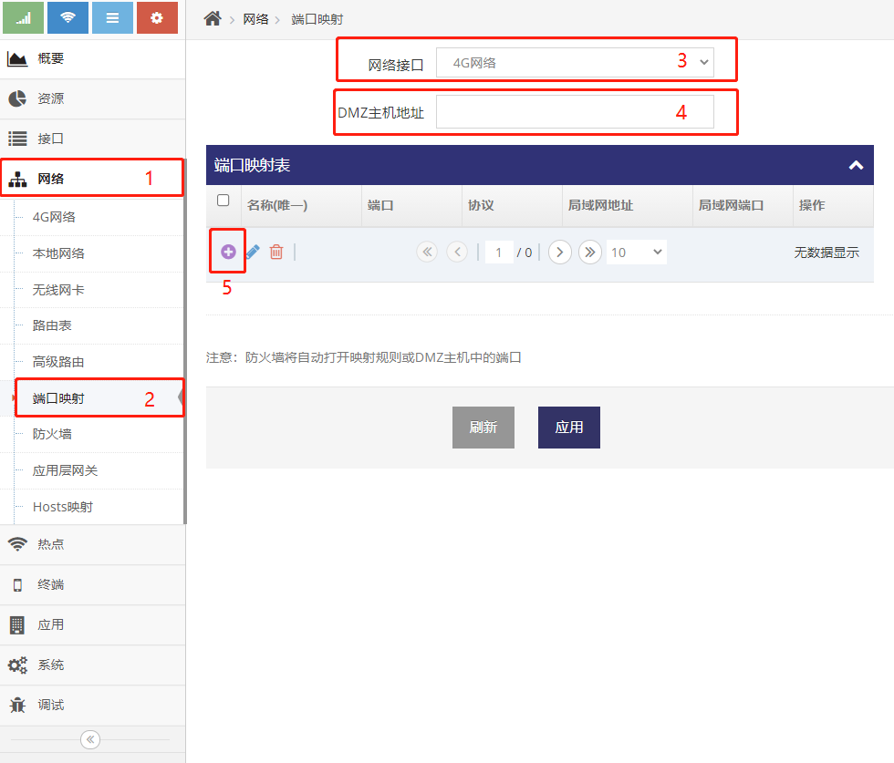
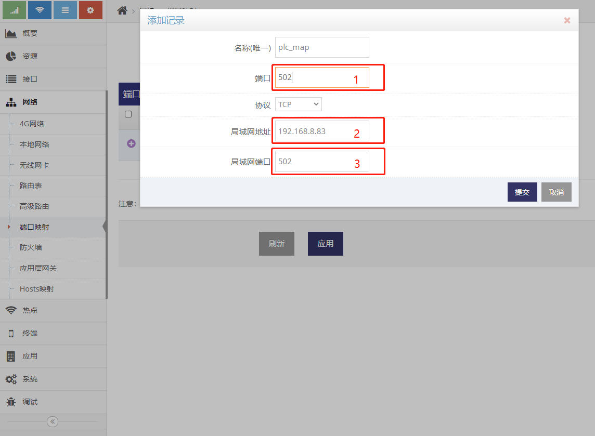

***
## 端口映射使用说明
路由器LAN网口下的设备对于外部网络(互联网/VPDN网)来说是不可用的, 因此路由器下的设备的访问外网时都会被转换成路由器外部网络(互联网/VPDN网)的IP地址(此地址是路由器通过拨号获得), 因此设备获得了访问外部网络的能力
- 路由器的此功能叫 **地址共享(NAT)**, 正如其名, 就是把路由器获取到的外部网络的IP地址共享给路由器下的设备用, 这也是终端路由器核心功能之一
- 如上所说, 路由器下的设备对于外部网络来说是不可用的, 所以外部网络也无法访问路由器下的设备, 当外部网络需要访问路由器下设备的某些有服务时就需要用到 **端口映射** 或 **DMZ主机**, 这也是路由器的核心功能之一
- **端口映射** 或 **DMZ主机** 只针对接入可获取到公网IP地址互联网或通过LTE(4G)接入VPDN网络时有效

***地址共享(NAT) 在链接对应的配置界面中可以禁用, 针对一些专用及私用的拨号网络可以禁用而实现纯路由功能, 纯路由功能下路由器下的设备对于外部网络可以直接访问, 属于针对特定网络的特定用法, 在此不做介绍***

### 基本应用示例
以下示例路由器2218的LAN网口接有设备, 即网络摄像头(IPC)和有线PLC
远程PC需要访问路由器下的网络摄像头(IPC)及有线PLC, 就需要在路由器上做 **端口映射**
即将路由器上的LTE地址的端口映射到网络摄像头(IPC)及有线PLC, 从远程PC访问路由器地址对应的端口即等于访问网络摄像头(IPC)及有线PLC对应的端口
 
- **IPC及其下的PORT:80** 表示网络摄像头(IPC)的服务端口为80端口，一般网络摄像头(IPC)的访问端口也就是TCP的80端口
- **PLC及其下的PORT:502** 表示有线PLC的服务端口为502端口, 一般PLC的访问端口也就是TCP的502端口
- **PORT 8080<=>IPC 80** 表示需要在2218上设置一个端口映射, 将2218的LTE地址的8080端口映射到IPC的80端口, 这样远程的PC就可以通过 **访问2218的LTE地址的8080端口** 获得 **访问网络摄像头(IPC)的80端口** 相同的效果
- **PORT 502<=>PLC 502** 表示需要在2218上设置一个端口映射, 将2218的LTE地址的502端口映射到有线PLC的502端口, 这样远程的PC就可以通过 **访问2218的LTE地址的502端口** 获得 **访问有线PLC的502端口** 相同的效果

以上为端口映射的基本原理, 包括 **DMZ主机** 等功能都是基于以上的基本原理来实现的, 深入了解了以上图示的各种部分及关系后就理解了整个端口映射的用法

### 如何添加端口映射规则
点击路由器 **管理界面** 的 **网络** 菜单下的 **端口映射** 菜单项即可进入端口映射的设置界面
  
- **红框3** 选择针对的外部网络, 如使用LTE(4G)拨号上网则选择4G网络即可
- 点击 **红框5** 即可添加对应的端口映射规则
  
- 点击 **红框1** 后即弹出 **添加记录** 的对话框
- 在对话框的 **红框2** 填写用户自定义的 **名称** 
- 在对话框的 **红框2** 填写路由器的 **端口**, LTE地址上的此端口将会映射到设备上的端口
- 在对话框的 **红框3** 选择协议类型, 大部分应用都是TCP的协议
- 在对话框的 **红框4** 填写设备的IP地址, 如基本应用示例中网络摄像头(IPC)或有线PLC的地址
- 在对话框的 **红框5** 填写设备的服务端口, 即网络摄像头(IPC)通常是80端口, 而有线PLC是502端口
- 之后点击 **红框7** 的提交按键即可

### 针对基本应用示例添加对应的规则

#### 添加网络摄像头(IPC)的 **PORT 8080<=>IPC 80** 映射规则
  
- **红框1** 是路由器的端口, 远程PC访问路由器LTE地址的此端口即等于访问网络摄像头(IPC)的80端口, 此处填写8080端口, 即远程PC想要访问网络摄像头(IPC)的80的端口时只需要访问路由器的8080端口即可
- **红框2** 是网络摄像头(IPC)的IP地址, 基于 **基本应用示例** 的图, 网络摄像头(IPC)的IP地址为192.168.8.88
- **红框2** 是网络摄像头(IPC)的服务端口, 此处为80端口

添加以上规则后, 基于 **基本应用示例** 的图, 远程PC想要访问网络摄像头(IPC)的80端口时, 需要访问路由器LTE地址(即28.79.216.7)的8080端口即可

#### 添加PLC的 **PORT 502<=>PLC 502** 映射规则
 
- **红框1** 是路由器的端口, 远程PC访问路由器LTE地址的此端口即等于访问有线PLC的502端口, 此处填写502端口, 即远程PC想要访问有线PLC的502的端口时只需要访问路由器的502端口即可
- **红框2** 是有线PLC的IP地址, 基于 **基本应用示例** 的图, 有线PLC的IP地址为192.168.8.83
- **红框2** 是有线PLC的服务端口, 此处为502端口

添加以上规则后, 基于 **基本应用示例** 的图, 远程PC想要访问有线PLC的502端口时, 需要访问路由器LTE地址(即28.79.216.7)的502端口即可

### DMZ主机使用说明

**DMZ主机** 填写一个路由器LAN网口上的设备的IP地址, 路由器会将LTE地址上所有的端口都映射到这个IP地址上(除端口映射规则)
以接上示例, 见以下设置
 

- **红框1** 及 **红框2** 的内容表示 **4G网络** 对应的IP地址上的所有端口都映射到192.168.8.222上
    - 即远程PC访问路由器(即28.79.216.7)的TCP的1至65535间所有的端口等于是访问192.168.8.222上对应的TCP端口
    - 即远程PC访问路由器(即28.79.216.7)的UDP的1至65535间所有的端口等于是访问192.168.8.222上对应的UDP端口
- **红框3** 及 **红框2** 的内容表示 **4G网络** 对应的IP地址上的TCP端口8080及502不会被映射到192.168.8.222上, 而是基于端口映射优先级更高的原则分别映射到192.168.8.88及192.168.8.83上
