------
## 修改设备默认配置

修改设备默认配置的步骤
1. 首先将设备恢复到默认配置
2. 按正常使用的方式修改设备的配置
3. 导出配置
4. 通过.cfkbn.html界面将第3步导出的配置导入为默认配置
以下章节分别介绍这4个步骤

#### 1.首先将设备恢复到默认配置

- 登录管理网页后点击 **系统** 下的 **配置管理** 菜单项进入配置管理界面, 在此界面中可以点 **恢复默认设置** 按键后按提示重启即可
 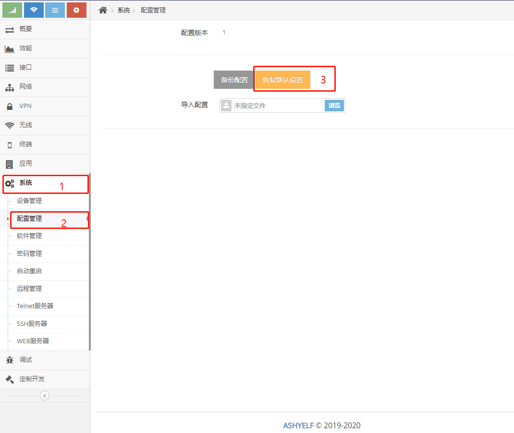

- 也可通过按住设备 **复位** 按键5-8秒后松开来恢复默认设置

#### 2. 修改设备的配置

- 登录管理网页后可以修改设备任何配置, 这些修改后的配置等待完成3/4/5步后都将成为设备的默认设置
  ###### 以下示例修改本地网络的IP地址为例
   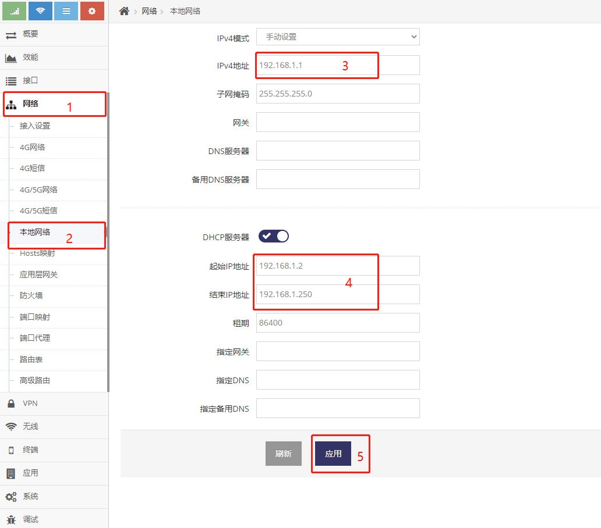

#### 3. 导出配置

- 登录管理网页后点击 **系统** 下的 **配置管理** 菜单项进入配置管理界面, 在此界面中可以点 **备份设置** 按键后可导出得到一个配置包
   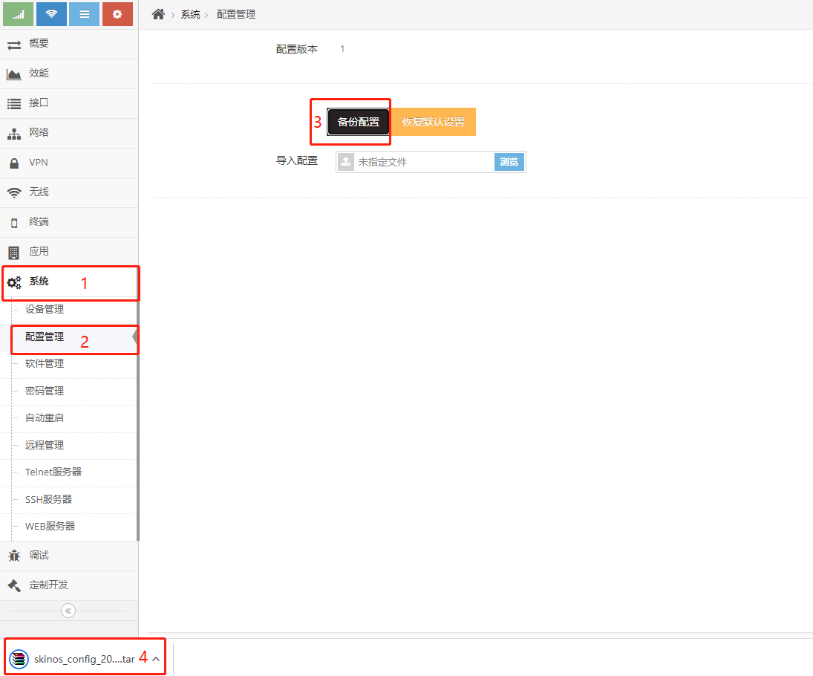

#### 4. 通过.cfkbn.html界面将第3步导出的配置导入为默认配置
- 如下图导入默认配置后自动重启即可
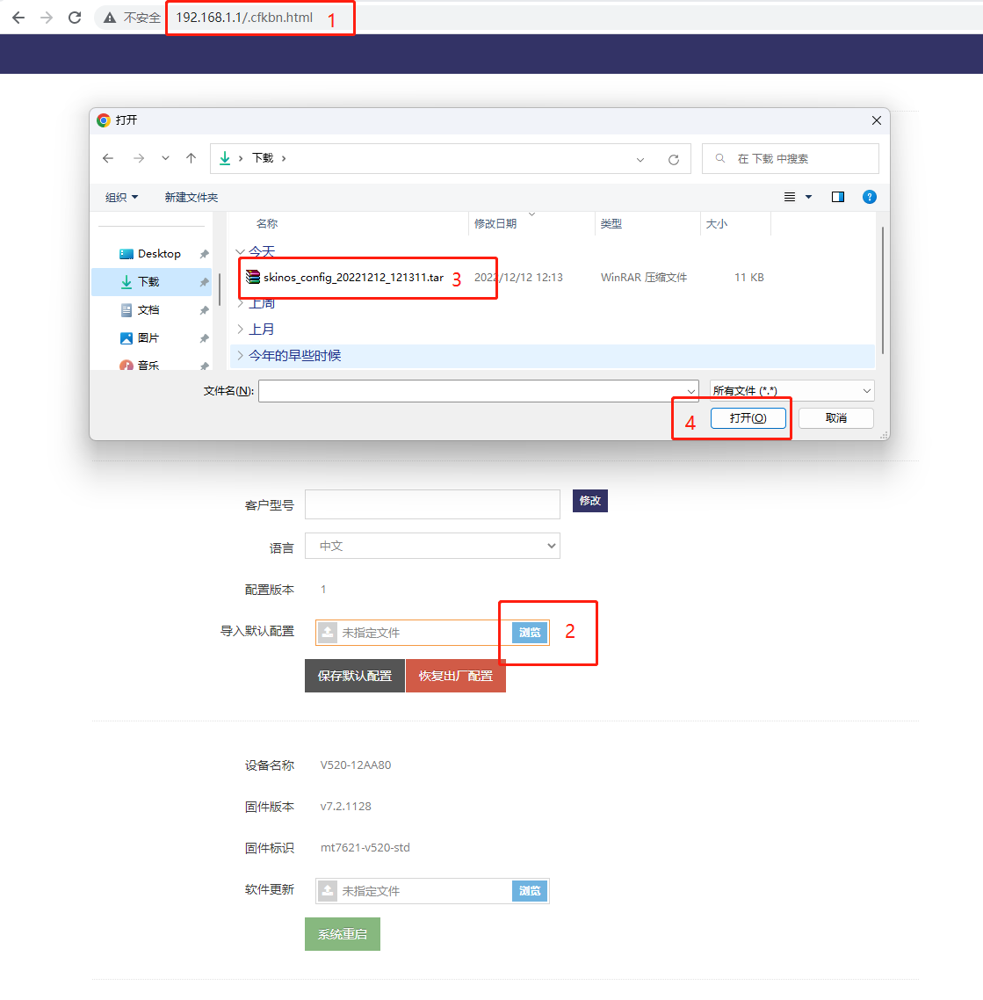

## 手动修改导出的默认配置包

- 如频繁或反复的修改默认配置， 不合适界面修改配置再导出， 这个方式过于繁琐， 因此可以通过手动修改导出的默认配置包实现
- 手动修改导出的默认配置需要 **7-Zip工具**， 因为导出的配置文件是压缩后的
- 手动修改导出的默认配置需要 **VScode** 或 **其它纯文件编辑工具** ， 因为需要编辑JSON配置文件
- 手动修改导出的默认配置需要熟悉 **JSON** 格式， 因为导出的配置文件是JSON格式的
- 手动修改导出的默认配置需要熟悉 **设备的配置**， 因为你需要知道你修改的是设备的哪些配置

以下承接以上示例手动修改设备的IP地址来做一个说明

#### 1. 通过7-Zip打开导出的配置文件包
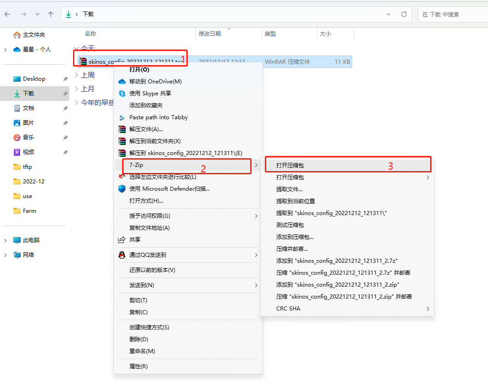

#### 2. 找到对应的配置文件

以下示例找到LAN口的配置文件并拷贝出来
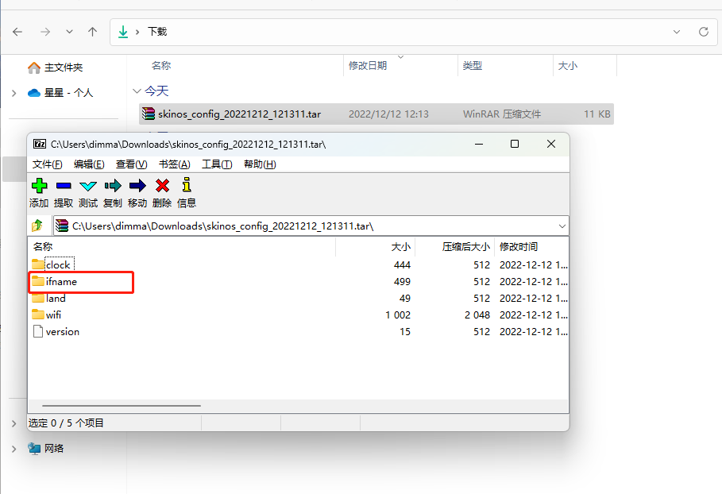
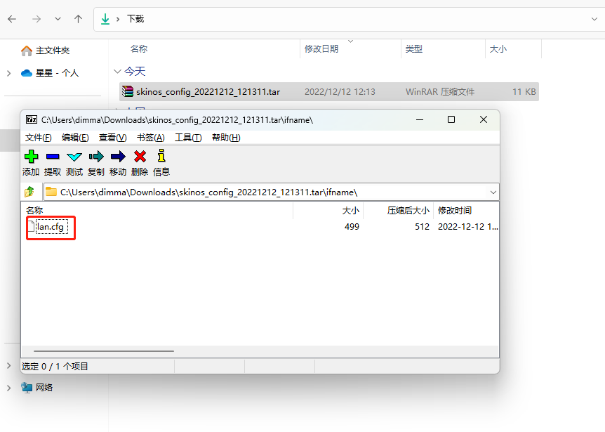
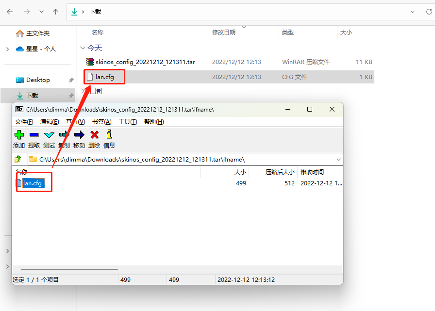

#### 3. 修改对应的配置文件

以下示例修改本地IP地址为192.168.2.1, 并且修改LAN口DHCP分配的地址池为192.168.2.2至192.168.2.250
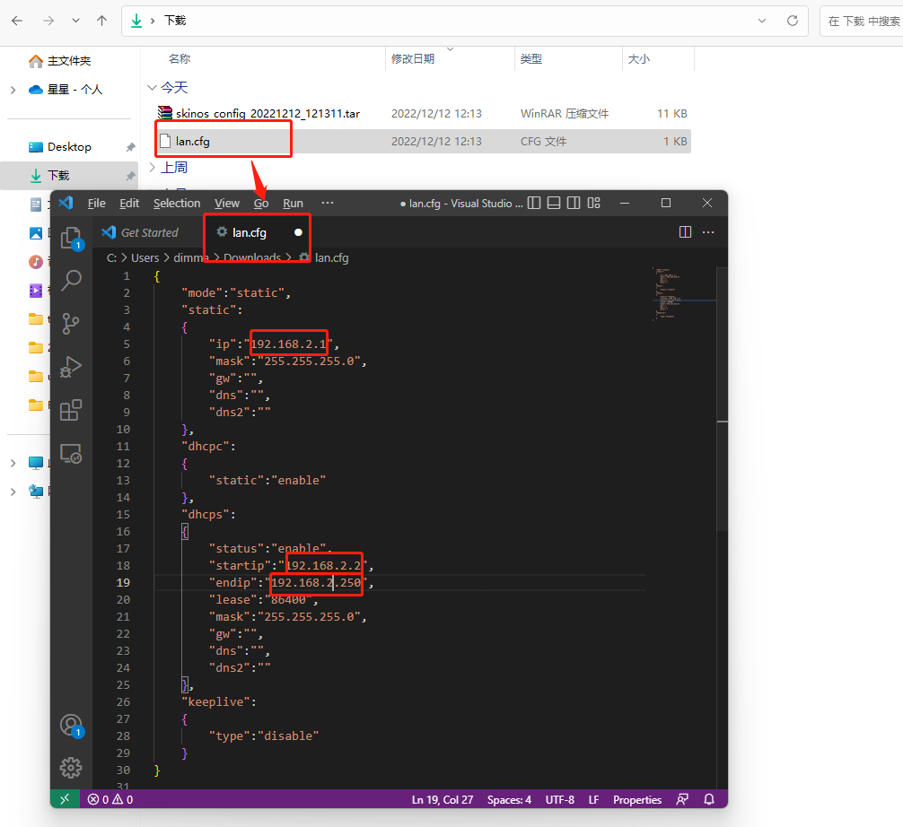
修改后记得保存

#### 4. 重新打包

将修改后的lan.cfg拖入7-Zip打开的配置包中对应的ifname目录下

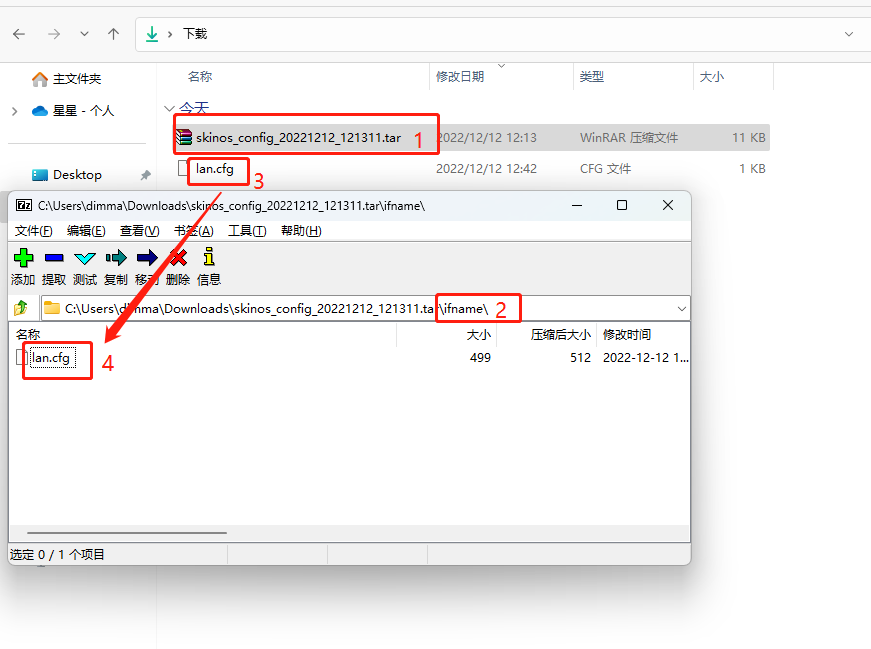
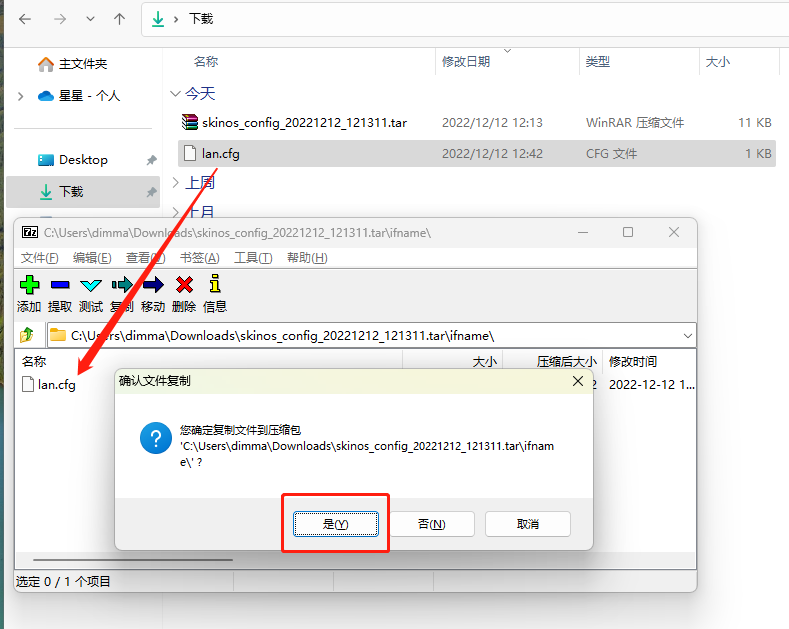

通过以上步骤即完成了对导出的配置包中LAN地址的修改， 修改后的配置包导入成默认配置后, 设备的默认LAN口的地址即变成了192.168.2.1