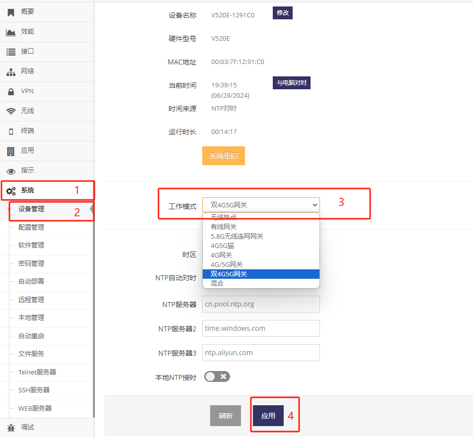

------

## 双4G/5G网关模式说明

- 支持双4G/5G的网关可以实现两个LTE/NR的模块同时上网
- 并可以在这两个LTE/NR连接间实现相互备份或是负载均衡

#### 切换网关到双4G/5G网关

通常支持双4G/5G的网关出厂默认模式就是 **双4G/5G网关**, 如果不处于 **双4G/5G网关** 模式则可通过以下方式切换

- 点击 **红框1** 的 **系统** 菜单下的 **红框2** 的 **设备管理** 进入 **设备管理设置界面**   
- 点击 **红框3** 点选 **双4G/5G网关** 后, 提示需要重启点击 **确定** 等待网关重启完成即可

 

在 **双4G/5G网关** 下, 网关的所有WAN及LAN口都可用于接电脑或是其它设备上网用   

## 双4G/5G网关的设置

- 首先可点击 **红框1** 后点击 **红框3/4** 可分别设置 **4G网络(LTE)** **5G网络(NR)** 的设置

    在这些对应的设置界面中设置好对应的链接, 如可分别在 **4G网络(LTE)** **5G网络(NR)** 中设置其对实的APN等

- 然后再依次点击 **红框1** **红框2** 进入 **接入设置** 界面
- 在 **接入设置** 界面选择接入策略, 系统预设的6种接入策略, 切换需要重启系统
    1. 链路备份(主/备用)
    2. 热备份(主/备用)
    3. 热备份(主/备用/导流)
    4. 热备份(主/备用/导流/保留)
    5. 负载均衡(主/备用)
    6. 负载均衡(主/备用/导流/保留) 

*如果需更多连接策略可资询售前工程师*

### 链路备份(主/备用)
- 开机时 **主链接** 与 **备用链接** 将同时发起连接, 禁用其它链接
- 当 **主链接** 可用则禁用 **备用链接**
- 当 **主链接** 不可用则启用 **备用链接**
- 启用 **备用链接** 后当 **备用链接** 可用则使用 **备用链接**

以上图示将会以以下策略接入互联网
1. 开机时 **有线宽带** 与 **4G网络** 将同时发起连接
2. **有线宽带** 连接成功并可用后会 立即禁用 **4G网络** 的连接
3. **有线宽带** 不可用时 立即启动 **4G网络** 的连接, 并一直 **有线宽带** 处于连接中
4. 启用 **4G/5G网络** 后当 **4G网络** 可用则使用 **4G网络** 上网

### 热备份(主/备用)
- 开机时 **主链接** 与 **备用链接** 将同时发起连接, 禁用其它链接
- 当 **主链接** 可用则使用 **主链接**
- 当 **主链接** 不可用而 **备用链接** 可用时使用 **备用链接**

以上图示将会以以下策略接入互联网
- 开机时 **无线连网(5.8G)** 与 **4G网络** 将同时发起连接, 禁用其它链接
- 当 **无线连网(5.8G)** 可用则使用 **无线连网(5.8G)** 上网
- 当 **无线连网(5.8G)** 不可用而 **4G网络** 可用时使用 **4G网络** 上网

### 热备份(主/备用/导流)
- 开机时 **主链接** 与 **备用链接** 及 **导流链接** 将同时发起连接, 禁用其它链接
- 当 **主链接** 可用则使用 **主链接**
- 当 **主链接** 不可用而 **备用链接** 可用时使用 **备用链接**
- 当 **主链接** 不可用且 **备用链接** 也不可用而 **导流链接** 可用时使用 **导流链接**

以上图示将会以以下策略接入互联网
- 开机时 **无线连网(5.8G)** 与 **4G/5G网络** 及 **有线宽带** 将同时发起连接, 禁用其它链接
- 当 **无线连网(5.8G)** 可用则使用 **无线连网(5.8G)** 上网
- 当 **无线连网(5.8G)** 不可用而 **4G/5G网络** 可用时使用 **4G/5G网络** 上网
- 当 **无线连网(5.8G)** 不可用且 **4G/5G网络** 也不可用而 **有线宽带** 可用时使用 **有线宽带** 上网

### 热备份(主/备用/导流/保留)
- 开机时 **主链接** 与 **备用链接** 及 **导流链接** 及 **保留链接** 将同时发起连接, 禁用其它链接
- 当 **主链接** 可用则使用 **主链接**
- 当 **主链接** 不可用而 **备用链接** 可用时使用 **备用链接**
- 当 **主链接** 不可用且 **备用链接** 也不可用而 **导流链接** 可用时使用 **导流链接**
- 当 **主链接** 不可用且 **备用链接** 也不可用且 **导流链接** 也不可用而 **保留链接** 可用时使用 **保留链接**

以上图示将会以以下策略接入互联网
- 开机时 **无线连网(5.8G)** 与 **4G/5G网络** 及 **有线宽带** 及 **无线连网(2.4G)** 将同时发起连接, 禁用其它链接
- 当 **无线连网(5.8G)** 可用则使用 **无线连网(5.8G)** 上网
- 当 **无线连网(5.8G)** 不可用而 **4G/5G网络** 可用时使用 **4G/5G网络** 上网
- 当 **无线连网(5.8G)** 不可用且 **4G/5G网络** 也不可用而 **有线宽带** 可用时使用 **有线宽带** 上网
- 当 **无线连网(5.8G)** 不可用且 **4G/5G网络** 也不可用且 **有线宽带** 也不可用而 **无线连网(2.4G)** 可用时使用 **无线连网(2.4G)** 上网

### 负载均衡(主/备用)
- 开机时 **主链接** 与 **备用链接** 及 **导流链接** 及 **保留链接** 将同时发起连接, 禁用其它链接
- 当 **导流链接** 可用则只使用 **导流链接**
- 当 **导流链接** 不可用则同时使用 **主链接** 与 **备用链接**, 并在这两种链接间做负载均衡
- 当 **导流链接** 不可用而 **主链接** 可用且 **备用链接** 不可用则只使用 **主链接**
- 当 **导流链接** 不可用且 **主链接** 不可用而 **备用链接** 可用则只使用 **备用链接**
- 而  **保留链接** 只会连接上而上网数据不走此链接

以上图示将会以以下策略接入互联网
- 开机时 **无线连网(5.8G)** 与 **4G/5G网络** 及 **有线宽带** 及 **无线连网(2.4G)** 将同时发起连接, 禁用其它链接
- 当 **有线宽带** 可用则只使用 **有线宽带** 上网
- 当 **有线宽带** 不可用则同时使用 **无线连网(5.8G)** 与 **4G/5G网络**, 并在这两种链接间做负载均衡上网
- 当 **有线宽带** 不可用而 **无线连网(5.8G)** 可用且 **4G/5G网络** 不可用则只使用 **无线连网(5.8G)** 上网
- 当 **有线宽带** 不可用且 **无线连网(5.8G)** 不可用而 **4G/5G网络** 可用则只使用 **4G/5G网络** 上网
- 而  **无线连网(2.4G)** 只会连接上而上网数据不走此链接

### 负载均衡(主/备用/导流/保留) 
- 开机时 **主链接** 与 **备用链接** 及 **导流链接** 及 **保留链接** 将同时发起连接, 禁用其它链接
- 在 **主链接** , **备用链接** , **导流链接** , **保留链接** 中所有可用的链接做负载均衡
- 任何以上链接中有一条不可用则在另外三条链接接做负载均衡
- 任何以上链接中有两条不可用则在另外两条链接接做负载均衡
- 任何以上链接中有三条不可用则只使用可用的那条链接

以上图示将会以以下策略接入互联网
- 开机时 **无线连网(5.8G)** 与 **4G/5G网络** 及 **有线宽带** 及 **无线连网(2.4G)** 将同时发起连接, 禁用其它链接
- 在 **无线连网(5.8G)** , **4G/5G网络** , **有线宽带** , **无线连网(2.4G)** 中所有可用的链接做负载均衡上网
- 任何以上链接中有一条不可用则在另外三条链接接做负载均衡上网
- 任何以上链接中有两条不可用则在另外两条链接接做负载均衡上网
- 任何以上链接中有三条不可用则只使用可用的那条链接上网

### 负载均衡(主/备用) 下的延迟统计调流策略
- 默认情况下当 **主链接** 及 **备用链接** 都可用时, 设备会向 **主链接** 及 **备用链接** 平均分配TCP或UDP的会话
- 开启延迟统计后系统将会跟据 **主链接** 及 **备用链接** 的ICMP包检测的 **延迟** 来分配, 以便更合理的分配分配TCP或UDP的会话
- 开启延迟统计需要以下要求:
    1. **主链接** 及 **备用链接** 的配置界面中的 **可用性检测** 必须为 **ICMP**
    2. **接入设置** 中的 **延迟统计数次** 必须大于0
- 延迟统计调流策略:
    1. 统计 **延迟统计次数** 次, 计算平均延迟
    2. 在满足以下两个条件时不向平均延迟大的链路分配流量
        - 主链接和备用链接的平均延迟即有大于位于 **延迟分界(毫秒)** 也有小于 **延迟分界(毫秒)** 
        - 主链接与备用链路之间的平均延迟大于 **延迟差值(毫秒)**
    3. 不满2提及的两个条件时向主链接及备用链接平均分配流量

以下是在 **接入设置** 中对应的延迟统计配置, 以下图示3指出延迟统计相关的配置

上图的配置表示:
- 路由器统计最近10次 **有线宽带** 和 **4G网络** 的平均延迟, 如果 **有线宽带** 大于150毫秒而 **4G网络** 小于150毫秒, 并且 **有线宽带** 比 **4G网络** 平均延迟大100毫秒, 则后续新的TCP/UDP会话都会被分配到 **4G网络**
- 路由器统计最近10次 **有线宽带** 和 **4G网络** 的平均延迟, 如果 **4G网络** 大于150毫秒而 **有线宽带** 小于150毫秒, 并且 **4G网络** 比 **有线宽带** 平均延迟大100毫秒, 则后续新的TCP/UDP会话都会被分配到 **有线宽带**
- 除以上两种情况外所有的TCP/UDP会话都会被平均的分配在 **有线宽带** 和 **4G网络** 之间
