## Gateway Coova Chilli Configuration introduction

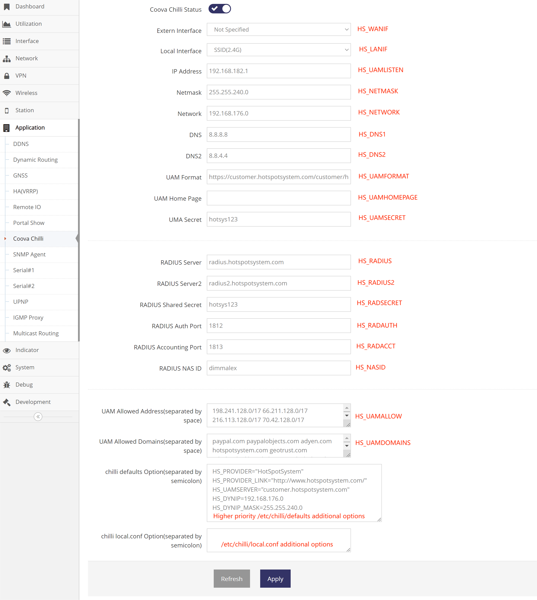

**The red annotations above are the corresponding configuration items in /etc/chilli/default**

- Extern Interface  
Not Specified for default internet connection  
You can also specify a specific interface in the multi-internet configuration( Mix operation )

- Local Interface  
You can choose to portal only on WIFI(SSID) or the entire LAN(SSID and Ethernet) network

- IP Address, Netmask, Network  
Define the local chilli network and the IP addresses used by chilli

- DNS, DNS2  
DNS used by local chilli network

- UAM Format  
URL of web server to use for authenticating clients. also call it Portal URL or Login URL

- UAM Home Page  
URL of homepage to redirect unauthenticated users to. If not specified this defaults to UAM Format.

- UMA Secret   
Shared secret between uamserver and chilli. This secret should be set in order not to compromise security.

- RADIUS Server, RADIUS Server2, RADIUS Shared Secret, RADIUS Auth Port, RADIUS Accounting Port
radius server settings

- RADIUS NAS ID  
Network access server identifier 

- UAM Allowed Address   
Adding to your walled garden is useful for allowing access to a credit card payment gateways, community website, or other publicly available resources. ChilliSpot resolves the domain names to a set of IP addresses during startup

- UAM Allowed Domains   
One domain prefix per use of the option; defines a list of domain names to automatically add to the walled garden. This is done by the inspecting of DNS packets being sent back to the subscriber.

- chilli defaults Options   
additional options for /etc/chilli/defaults

- chilli local.conf Options   
additional options for /etc/chilli/local.conf

## Configuration of Coova Chilli when https://www.hotspotsystem.com is used

### Register

Access the https://www.hotspotsystem.com click Sign up for Register

 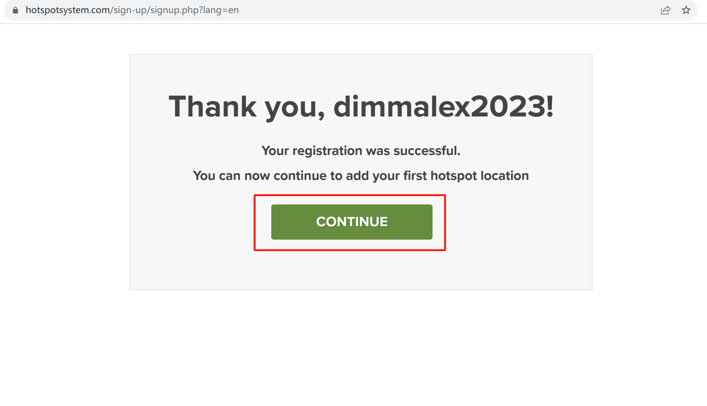

### Create HOTSPOT LOCATIONS

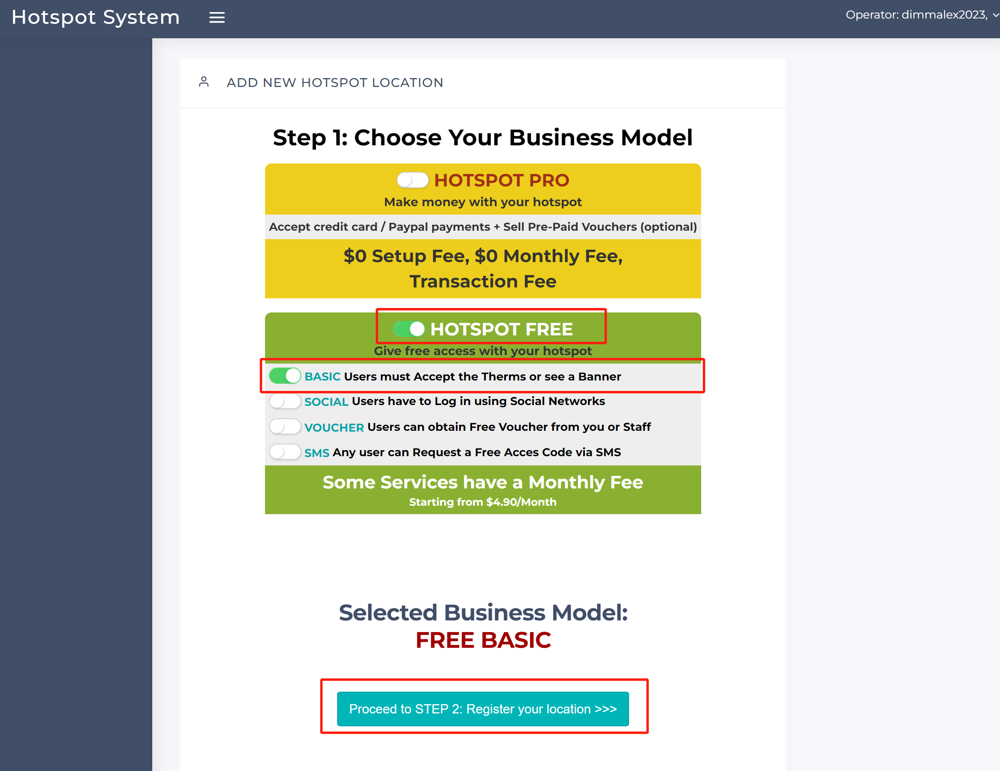
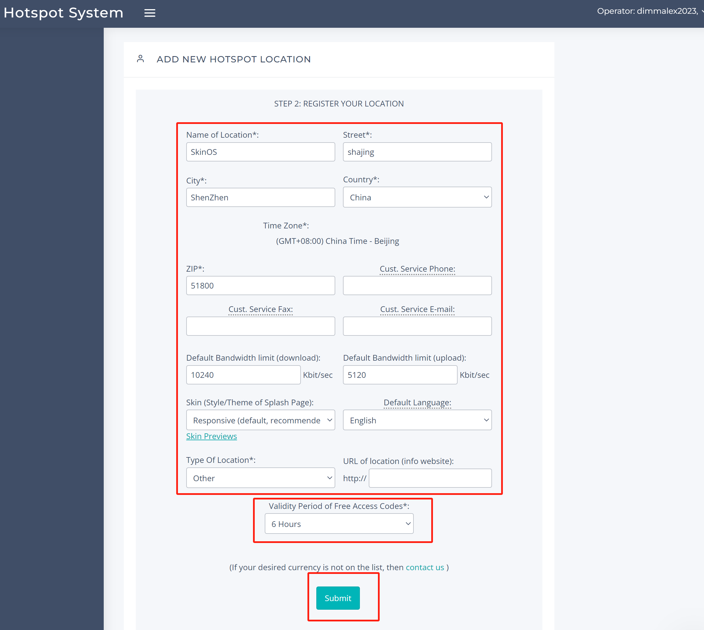

### Obtain the corresponding configuration

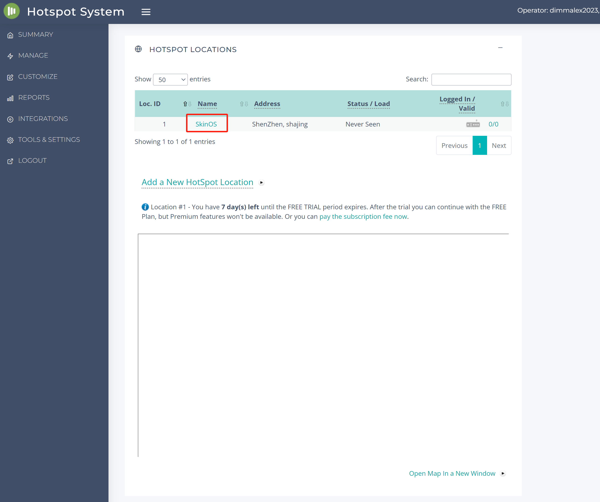
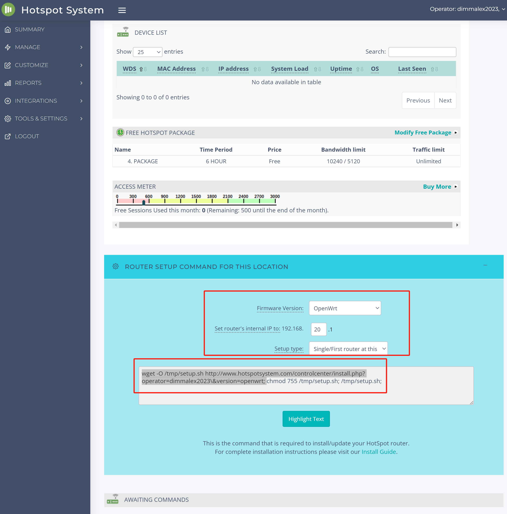
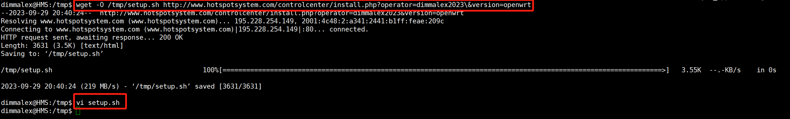
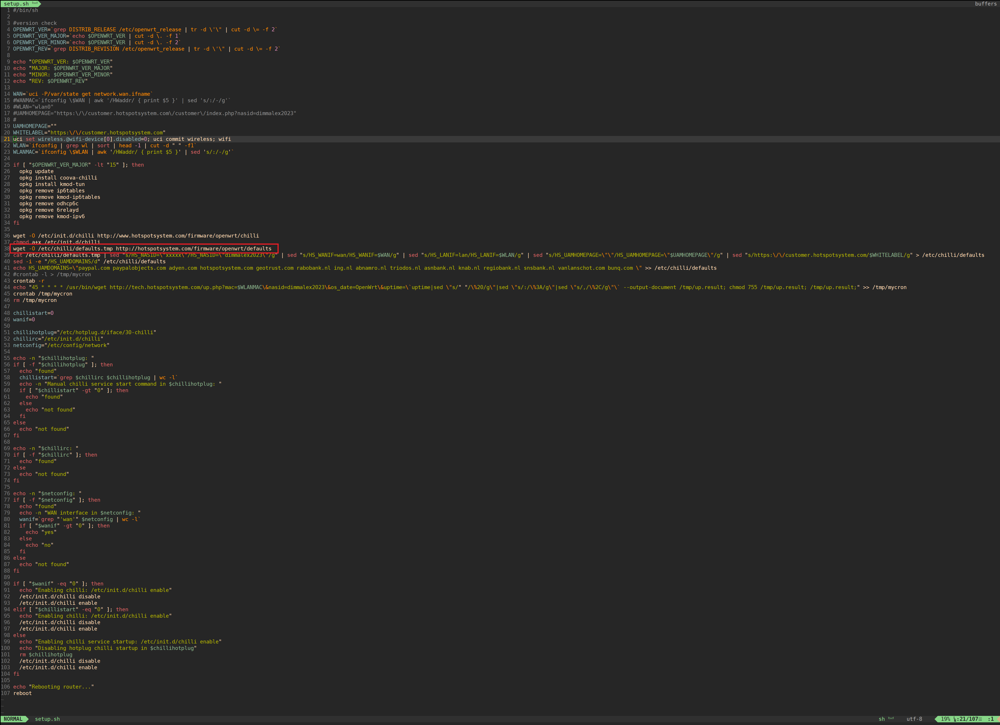
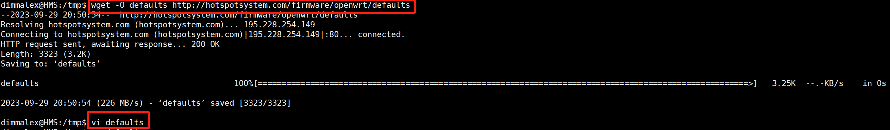

### Configure the gateway according to the configuration

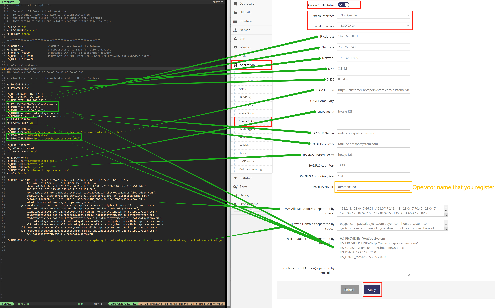

### Test pop-ups with your phone

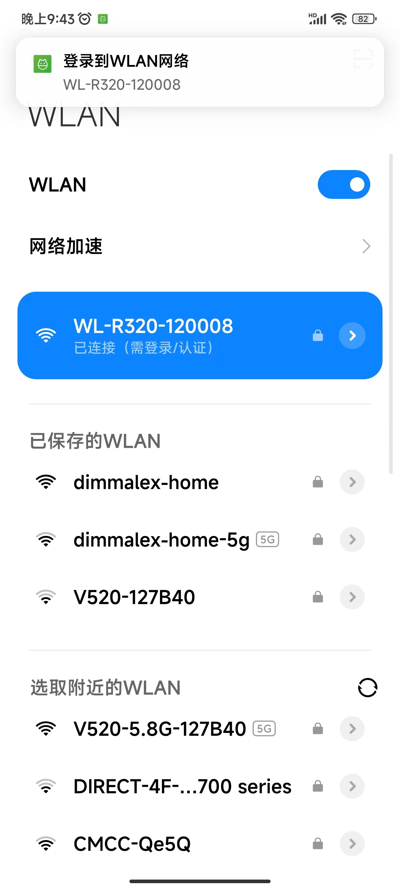 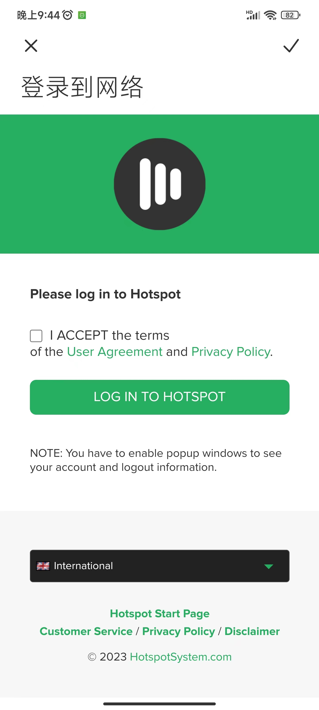 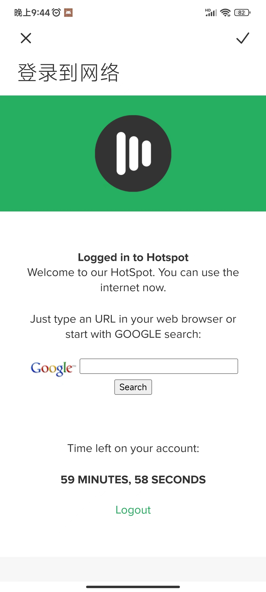

## Configuration of Coova Chilli when https://manage.trustedwifi.com is used

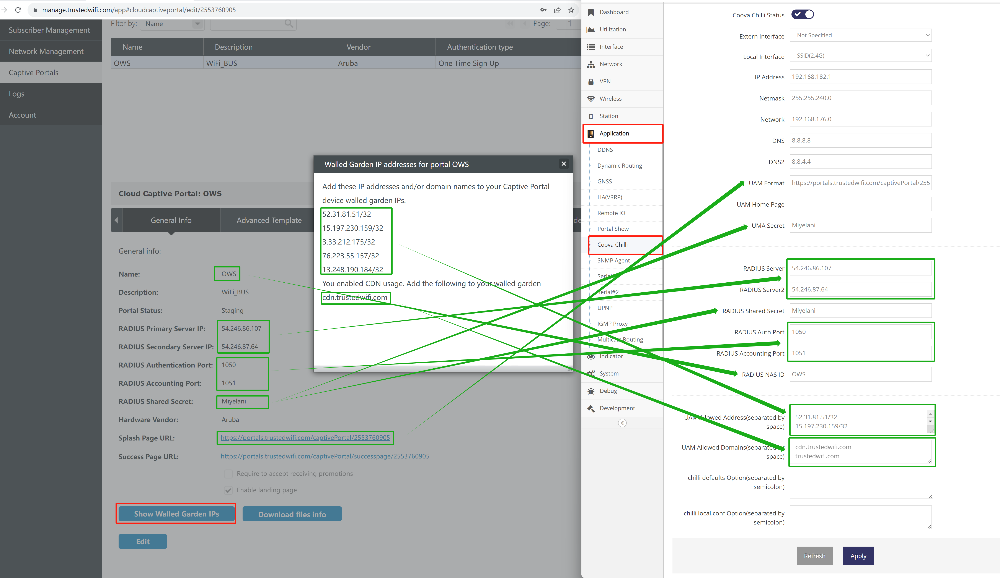

**Unable to verify temporarily due to permission issue, Careful reference**
