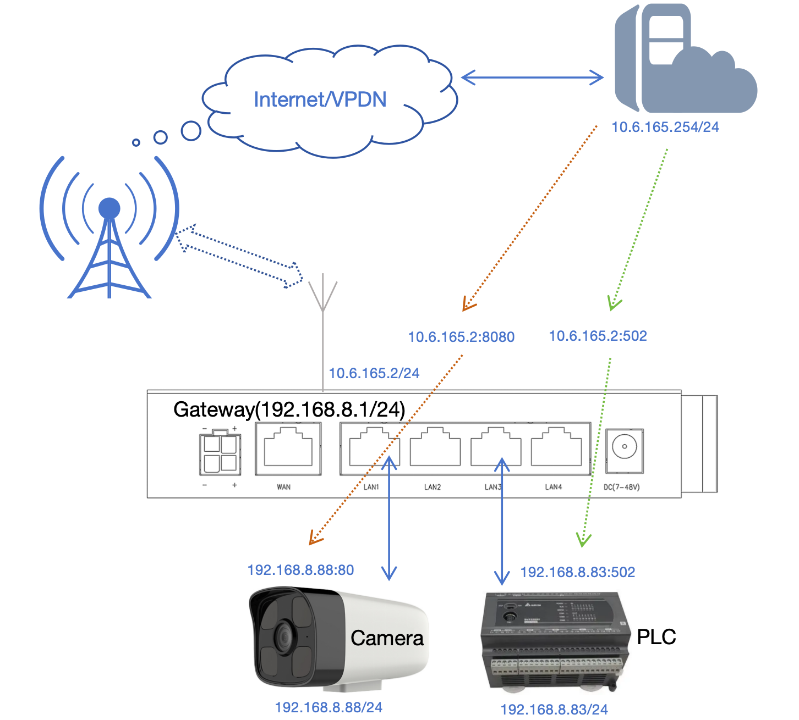
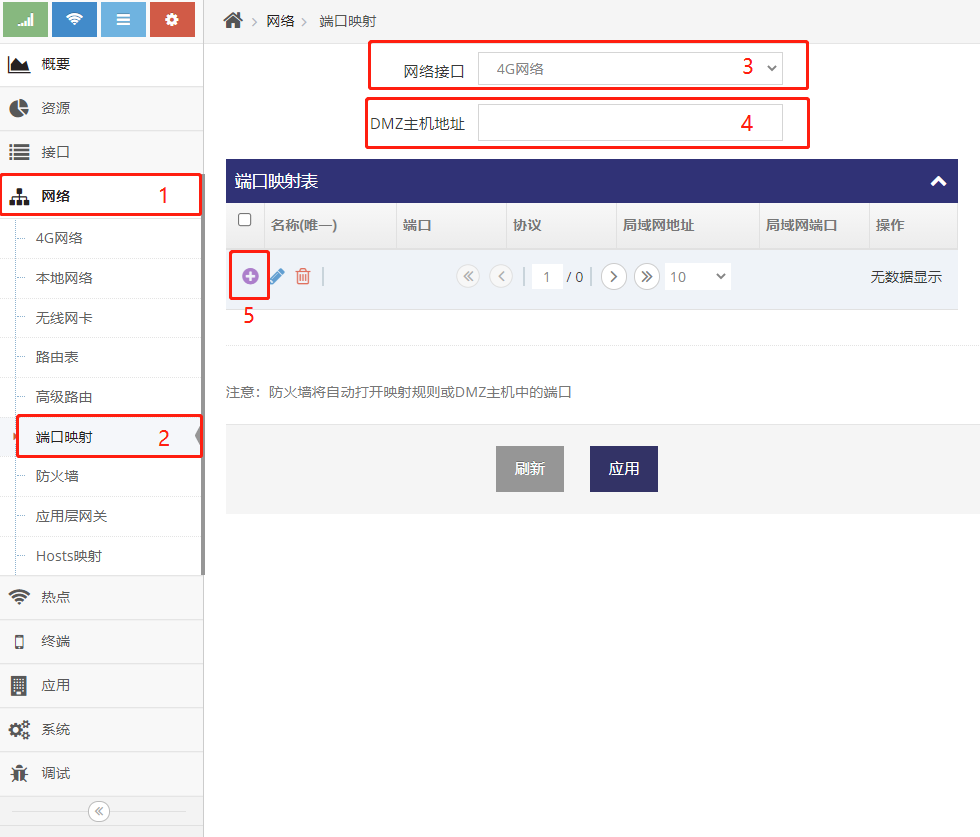
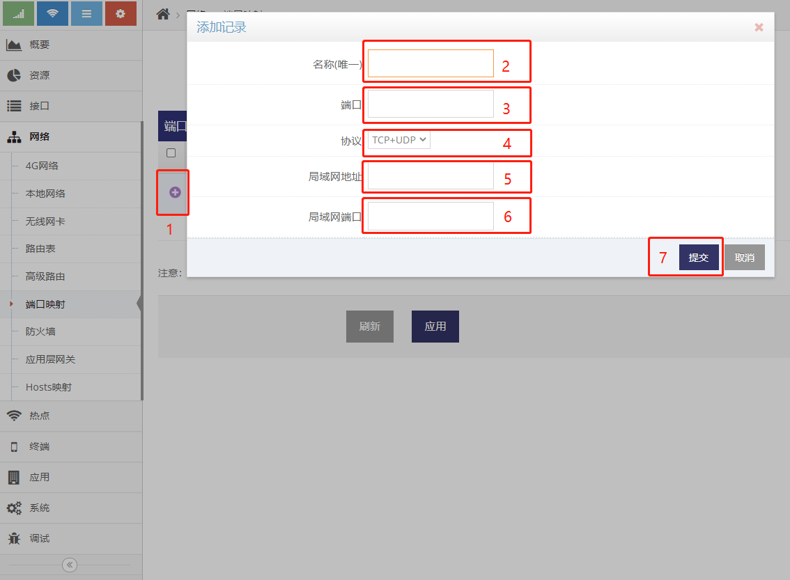
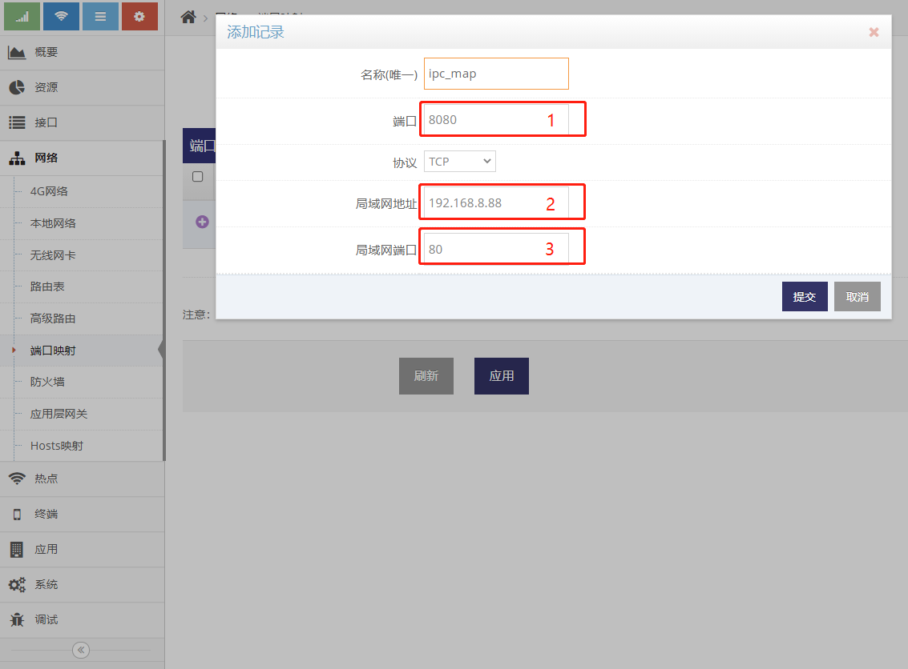
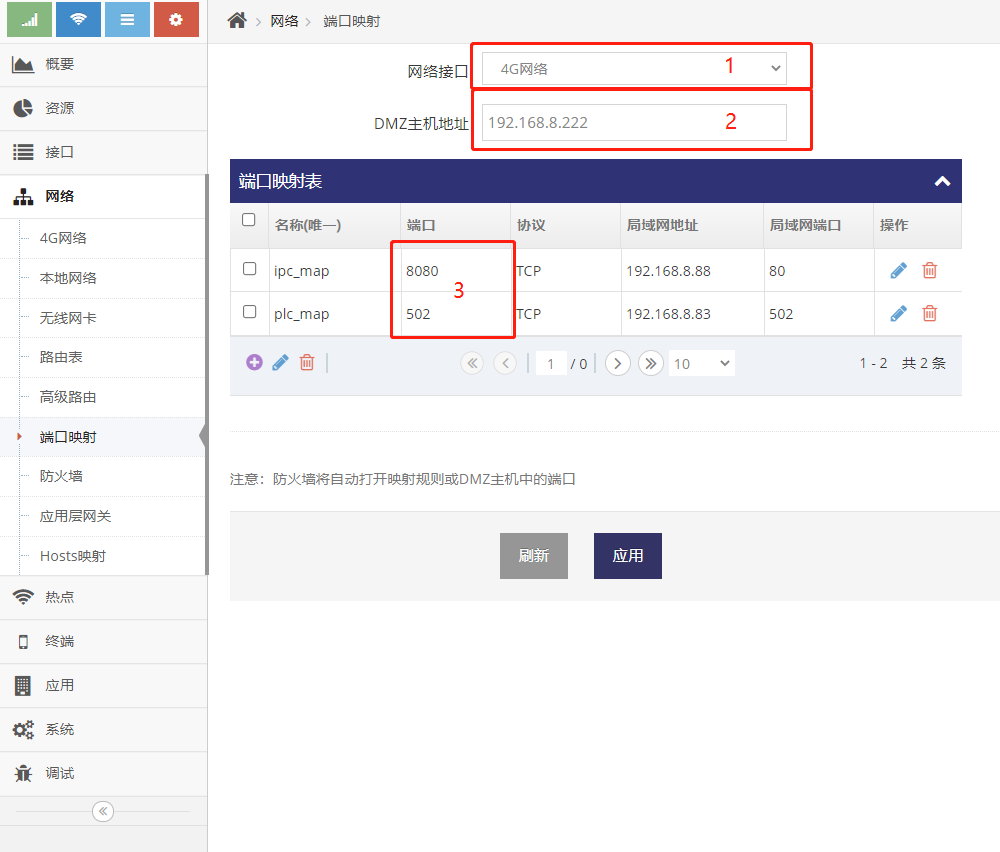

***

## 端口映射使用说明   

- 通常网关LAN网口下的设备对于外部网络(互联网/VPDN网)来说是不访问的    
- 网关下的设备的访问外网时都会被转换成网关外部网络(互联网/VPDN网)的IP地址(此地址是网关通过拨号获得), 网关的此功能叫 **地址共享(NAT)**, 这是终端网关的核心功能之一    
- 当外部网络需要访问网关下设备的某些有服务时就需要用到 **端口映射** 或 **DMZ主机**, 这也是网关的核心功能之一    
- **端口映射** 或 **DMZ主机** 只针对接入可获取到公网IP地址互联网或通过LTE(4G)接入VPDN网络时有效

***地址共享(NAT) 在外部网络连接对应的配置界面中可以禁用, 针对一些专用及私用的拨号网络可以禁用而实现纯路由功能, 纯路由功能下网关下的设备对于外部网络可以直接访问, 属于针对特定网络的特定用法, 在此不做介绍***

### 基本应用示例     
以下示例网关LAN网口接有设备, 即 **网络摄像头(Camera)** 和 **PLC(可编程逻辑控制器)**    
远程服务器需要访问网关下的 **网络摄像头(Camera)** 及 **PLC(可编程逻辑控制器)**, 就需要在网关上做 **端口映射**     
设置好端口映射后, 远程服务器访问网关地址对应的端口即等于访问 **网络摄像头(Camera)** 及 **PLC(可编程逻辑控制器)** 对应的端口   

     

- **PORT 8080 <=> IPC 80**   
    - 将网关LTE地址8080端口映射到 **网络摄像头(Camera)** 地址的80端口   
    - 远程服务器通过 **访问网关LTE地址的8080端口** 获得 **访问网络摄像头(Camera)地址的80端口** 相同的效果   
- **PORT 502 <=> PLC 502**
    - 将网关LTE地址502端口映射到 **PLC(可编程逻辑控制器)** 地址的502端口   
    - 远程服务器通过 **访问网关LTE地址的502端口** 获得 **PLC(可编程逻辑控制器)地址的502端口** 相同的效果   

以上为端口映射的基本原理, 包括 **DMZ主机** 等功能都是基于以上的基本原理来实现的, 深入了解了以上图示的各种部分及关系后就理解了整个端口映射的用法    

### 添加端口映射规则   

- 点击 **红框1** **网络** 菜单下的 **红框2** **端口映射** 进入 **端口映射管理界面**   
- **红框3** 选择针对的外部网络, 如使用LTE(4G)拨号上网则选择 **4G网络** 即可   

  

- 点击 **红框5** 即可添加对应的端口映射规则    

   

- 点击 **红框1** 后即弹出 **添加记录** 的对话框   
- 在对话框的 **红框2** 填写用户自定义的 **名称**   
- 在对话框的 **红框2** 填写网关的 **端口**, LTE地址上的此端口将会映射到设备上的端口   
- 在对话框的 **红框3** 选择协议类型, 大部分应用都是TCP的协议   
- 在对话框的 **红框4** 填写设备的IP地址, 如基本应用示例中 **网络摄像头(Camera)** 或 **PLC(可编程逻辑控制器)** 的地址   
- 在对话框的 **红框5** 填写设备的服务端口, 即 **网络摄像头(Camera)** 通常是80端口, 而 **PLC(可编程逻辑控制器)** 是502端口   
- 之后点击 **红框7** 的提交按键即可, 等待添加好所有的映射规则后点击 **应用** 即完成设置       

### 针对以上图示示例添加对应的规则    

#### 添加网络摄像头(Camera)的 **PORT 8080 <=> IPC 80** 映射规则    

    

- **红框1** 是网关的端口, 此处填写8080端口, 即远程服务器想要访问网络摄像头(Camera)的80的端口时只需要访问网关的8080端口即可
- **红框2** 是网络摄像头(Camera)的IP地址, 基于以上图示, 网络摄像头(Camera)的IP地址为192.168.8.88
- **红框2** 是网络摄像头(Camera)的服务端口, 此处为80端口

添加以上规则后, 远程服务器想要访问网络摄像头(Camera)的80端口时, 需要访问网关LTE地址(即10.6.165.2)的8080端口即可

#### 添加PLC的 **PORT 502 <=> PLC 502** 映射规则   

    

- **红框1** 是网关的端口, 此处填写502端口, 即远程服务器想要访问PLC的502的端口时只需要访问网关的502端口即可  
- **红框2** 是PLC的IP地址, 基于以上图示, PLC的IP地址为192.168.8.83   
- **红框2** 是PLC的服务端口, 此处为502端口   

添加以上规则后, 远程服务器想要访问PLC的502端口时, 需要访问路由器LTE地址(即10.6.165.2)的502端口即可   

### DMZ主机使用说明   

**DMZ主机** 填写一个网关LAN网口上的设备的IP地址, 网关会将LTE地址上所有的端口都映射到这个IP地址上(除端口映射规则)   

以接上示例, 见以下设置   

 

- **红框1** 及 **红框2** 的内容表示 **4G网络** 对应的IP地址上的所有端口都映射到192.168.8.222上   
    - 即远程服务器访问路由器(即10.6.165.2)的TCP的1至65535间所有的端口等于是访问192.168.8.222上对应的TCP端口    
    - 即远程服务器访问路由器(即10.6.165.2)的UDP的1至65535间所有的端口等于是访问192.168.8.222上对应的UDP端口     
- **红框3** 及 **红框2** 的内容表示 **4G网络** 对应的IP地址上的TCP端口8080及502不会被映射到192.168.8.222上, 而是基于端口映射优先级更高的原则分别映射到192.168.8.88及192.168.8.83上
