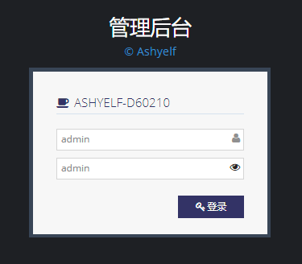
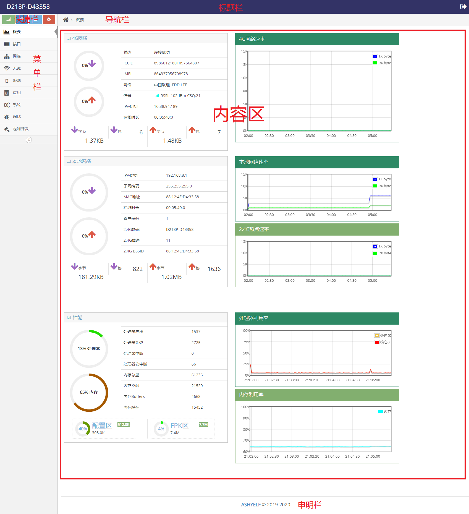
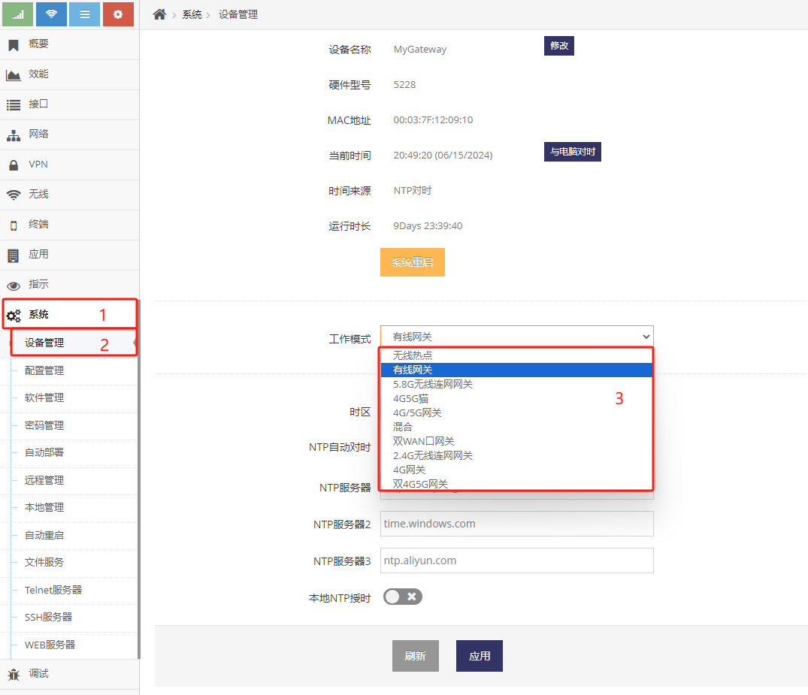

------

## 如何登录SkinOS管理界面

#### 通过有线或无线连接网关后打开浏览器
- 在浏览器地址栏输入 **192.168.8.1** 后回车进入网关的 **登录界面** 
- 输入用户名, 默认的用户名是 **admin**
- 输入管理密码, 默认的管理密码是 **admin**
- 点击 **登录** 按键即可进入 **管理界面**

 

#### 管理界面介绍
管理界面分为六个区域, 管理界面的菜单分为十几个大类

 

#### 菜单简介

**概要**: 显示网关当前的基本状态, 主要为连接状态及实时流量， 终端数量， 无线名称信道

**效能**: CPU内存负载

**接口**: 所有网络接口的详细信息

**网络**: 常用的网络设置， 如4G/5G网络连网, 有线宽带上网, 无线连网上网，本地网络，路由表，端口映射，防火墙等基本的网络设置

**VPN**: 虚拟专用网相关的设置

**无线**: 无线热点的设置

**终端**: 终端的管理，上网控制，访问控制，流量管理等

**应用**: 各种应用, 固件中自带的软件或软件仓库中安装软件都将在此菜单项中显示

**指示**: 用于指示一些信息的应用, 如LED灯, LED屏, 向摄象头叠加OSD等功能等

**传感**: 传感器

**系统**: 针对网关的管理配置，如升级，配置管理，密码管理等

**调试**: 调试或开发需要用到的一些功能

**定制开发**: 开发中需要用到的相关管理

#### 工作模式简介

针于不同的应用场景网关可提供不同的工作方式，**工作模式** 的配置在 **系统** 菜单下 **设备管理** 中, 网关常用的工作模式如下： 

  

**4G网关**: 通过3G/4G连接互联网的网关模式

**4G/5G网关**: 通过4G/5G连接互联网的网关模式

**4G5G猫**: 提供4G/5G猫的功能, 开机会完成与4G/5G网络连接但不获取IP地址, 需要其它的客户端通过DHCP协议获取4G/5G的IP地址

**双4G/5G网关**：通过两个4G/5G连接互联网的网关模式, 只有在有两个4G/5G基带的产品上才支持

**有线网关**：通过有线WAN口连接互联网的网关模式

**双WAN口网关**：通过两个有线WAN口连接互联网的网关模式

**2.4G无线连网网关**：通过2.4G无线客户端连接其它WIFI网络的网关模式

**5.8G无线连网网关**：通过5.8G无线客户端连接其它WIFI网络的网关模式

**无线热点**：相当于带无线功能的交换机, 此模式下默认不会分配IP地址, 通常用于放置在路由器的下一级

**混合**：此模式下可使用4G/5G、有线WAN口、无线连网三种模式中组合上网, 实现多种上网方式同时存在并相互备份或负载均衡

## 常用的功能使用说明

#### 4G/5G上网设置

- 连接普通的4G(LTE)网络
    1. 网关插上SIM卡后
    2. 将设备的 **工作模式** 设置为 **4G网关**, 4G网关默认即为此模式

    网关就会自动通过4G(LTE)连上互联网, 不需要任何设置, 将终端设备或电脑通过有线或无线连接网关即可访问互联网

- 连接普通的5G(NR)网络
    1. 网关插上SIM卡后
    2. 将设备的 **工作模式** 设置为 **4G/5G网关**, 4G网关默认即为此模式
    
    网关就会自动通过5G(NR)连上互联网, 不需要任何设置, 将终端设备或电脑通过有线或无线连接网关即可访问互联网

- **[4G/5G(LTE/NR)接入虚拟专用网络(VPDN/APN)](./lte/lte_apn_cn.md)** 介绍使用LTE/NR接入VPDN/APN网络  

- **[4G/5G(LTE/NR)双SIM卡](./lte/lte_bsim_cn.md)** 介绍LTE/NR双卡的使用  

- **[4G/5G(LTE/NR)短信功能](./lte/lte_sms_cn.md)** 介绍LTE/NR短信的使用  

#### 有线宽带上网设置

- **[PPPOE拨号上网](./wan/wan_pppoe_cn.md)**

- **[自动获取(DHCP)上网](./wan/wan_dhcp_cn.md)**

- **[静态地址上网](./wan/wan_static_cn.md)**

#### 2.4G/5.8G无线连网上网设置

- **[无线连网上网](./wisp/wisp.md)**

- **[在多个热点中连接信号最好热点](./wisp/wisp_better.md)**

#### 使用4G/5G, 有线宽带, 2.4G/5.8G无线连网同时上网

- **[混合模式的使用](./mix-mode/mix.md)**

#### 本地网络设置

- **[本地地址设置](./lan/lan_ip.md)**

- **[设置多个本地地址](./lan/lan_mip.md)**

- **[本地分配地址段设置](./lan/dhcps.md)**

- **[给终端分配指定的IP地址](./client/bind_ip.md)**

#### Hosts文件配置

- **[域名劫持设置](./hosts/hosts.md)**

#### 防火墙

- **[允许外网访问路由器指定的服务](./firewall/allow_access.md)**

#### 端口映射

- **[端口映射使用说明](./portmap/portmap.md)**

#### 端口代理

- **[端口代理使用说明](./portproxy/portproxy.md)**

#### 路由表

- **[路由表管理](./route/route.md)**

#### 高级路由

- **[基于源地址的路由设置](./route/src_route.md)**

- **[基于端口的路由设置](./route/port_route.md)**

#### 无线热点

- **[无线热点名称及密码修改](./wifi/ssid.md)**

- **[无线热点黑白名单设置](./wifi/acl.md)**

- **[中继其它热点](./wifi/sta.md)**

#### 终端管理

- **[为所有的终端设置访问权限](./client/acl.md)**

- **[为指定的终端设置访问权限](./client/client_acl.md)**

- **[网络白名单设置](./client/black.md)**

- **[网络黑名单设置](./client/white.md)**

- **[为所有的终端设置上网权限](./client/internet.md)**

- **[为指定的终端设置上网权限](./client/client_internet.md)**

#### 网关时间管理

- **[时间管理](./date/date.md)**

#### 软件管理

- **[固件升级](./firmware/upgrade.md)**
- **[强制升级](./firmware/force_upgrade.md)**

#### 配置管理

- **[恢复及导入配置](./config/backup.md)**

#### 用户名密码管理

- **[admin用户的密码修改](./password/password.md)**

#### 自动重启

- **[自动重启](./restart/restart.md)**

#### 服务器管理

- **[Telnet服务器](./service/telnetd.md)**
- **[SSH服务器](./service/sshd.md)**
- **[WEB服务器](./service/webs.md)**
- **[FTP服务器](./service/ftps.md)**

#### 指示灯管理

- **[LED灯关闭](./indicate/led.md)**

## 高级功能使用说明

- **[全球定位的使用](./lte/lte_apn_setup.md)**

- **[短信的使用](./lte/lte_apn_setup.md)**

- **[通过短信管理设备](./lte/lte_apn_setup.md)**

- **[串口透传的使用](./lte/lte_apn_setup.md)**

- **[串口MQTT转发](./lte/lte_apn_setup.md)**

- **[串口Modbus转发](./lte/lte_apn_setup.md)**

- **[串口终端命令行模式](./lte/lte_apn_setup.md)**

- **[远程IO的使用](./lte/lte_apn_setup.md)**

- **[LTE/NR模块AT代理](./lte/lte_apn_setup.md)**

- **[自定议LTE/NR模块的AT指令](./lte/lte_apn_setup.md)**

## 行业中常用的配置案例

- **[将摄象头接入虚拟专用网络(VPDN/APN)的快速设置](./lte/lte_apn_ipc_cn.md)**

