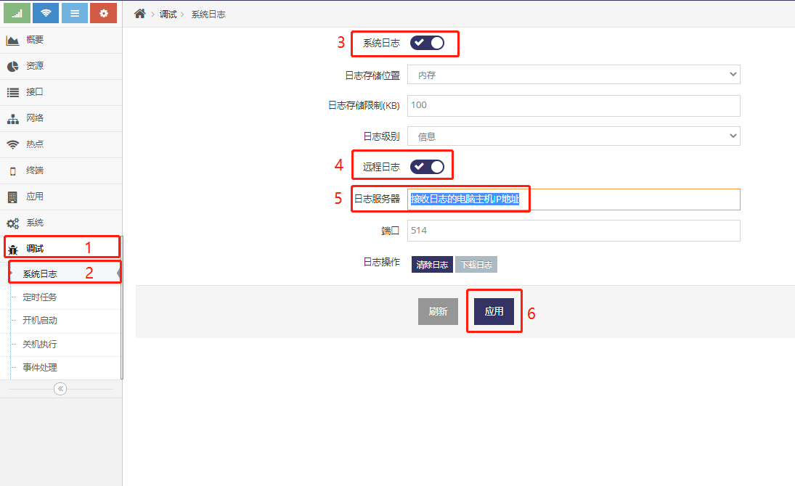
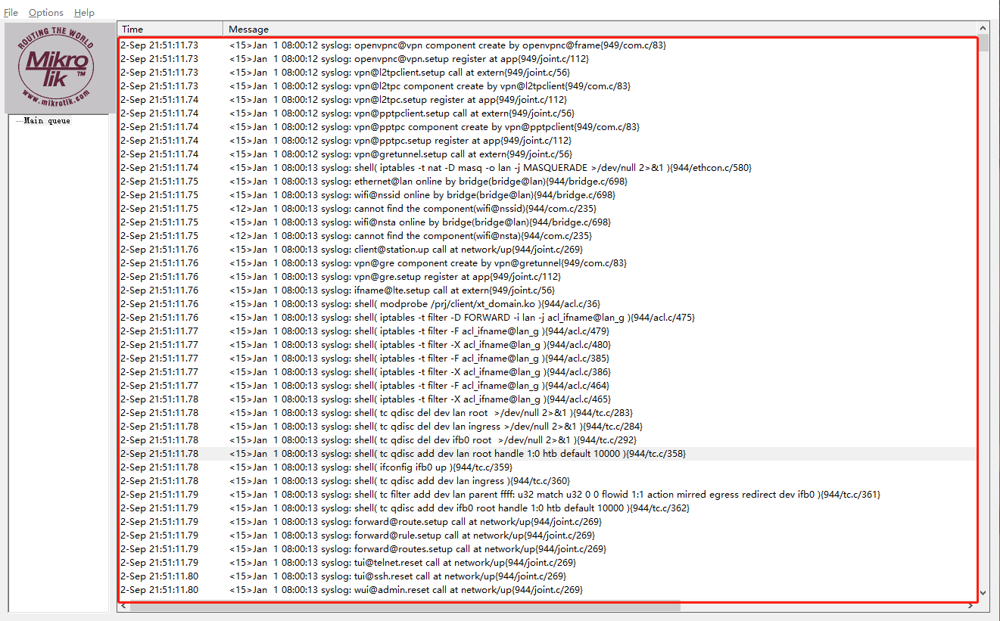

------
## 远程日志使用说明
#### 远程日志介绍
通过将设备日志发送的到其它的电脑主机, 可以实时并长时间的监控设备在运行过程时的问题, 在网页界面中的**调试**下的**系统日志**中可以设置

#### 在设备上设置远程日志
- 打开设备管理界面
- 点击**调试**菜单下的**系统日志**菜单项
- 开启**远程日志**并将接收日志的电脑主机IP地址填写到**日志服务器**中应用即可


#### 在其它电脑主机上运行日志接收软件
- 首先关闭要接收日志的主机上的防火墙及其它防火墙软件
- 下载日志接入软件
    ftp://ftp.wmdevice.com/pub/tools/MT_Syslog.exe
- 运行MT_Syslog.exe, 默认MT_Syslog.exe会在UDP端口514上接收日志, 而设备上的服务器日志端口默认也是514， 所以默认不需要改动日志端口



#### 在设备上开启调试日志
通常设备不会记录调试相关的日志， 如需要更多的设备运行细节日志则需要进入设备终端执行更指令   

- 记录系统调试日志
    ```
    # land@log:level=debug  
    ```
