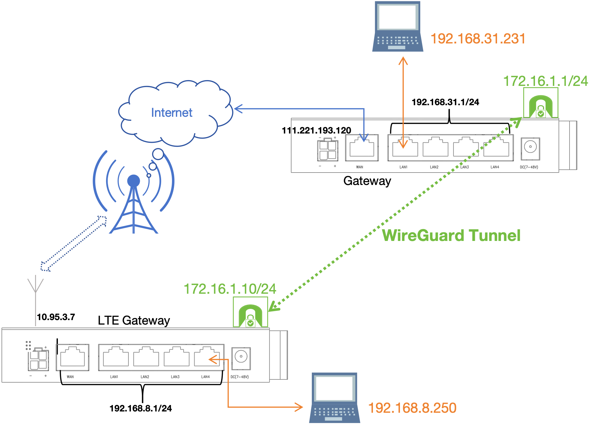
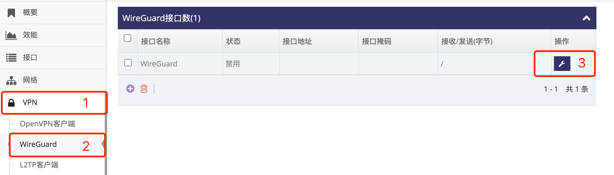
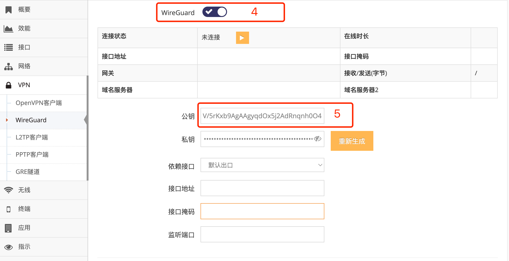
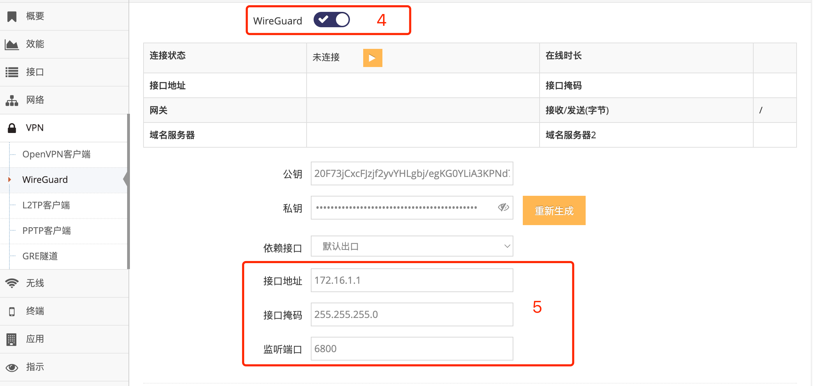
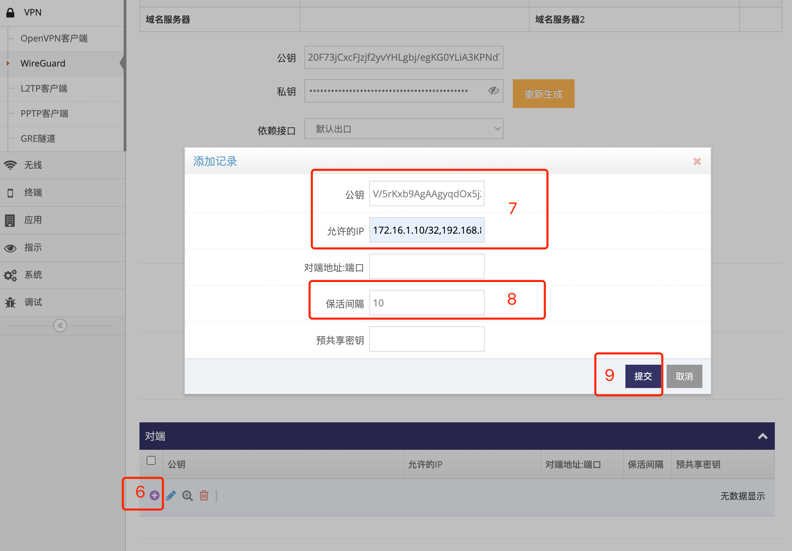
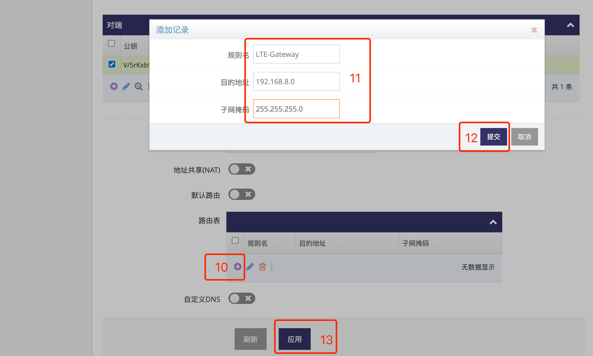
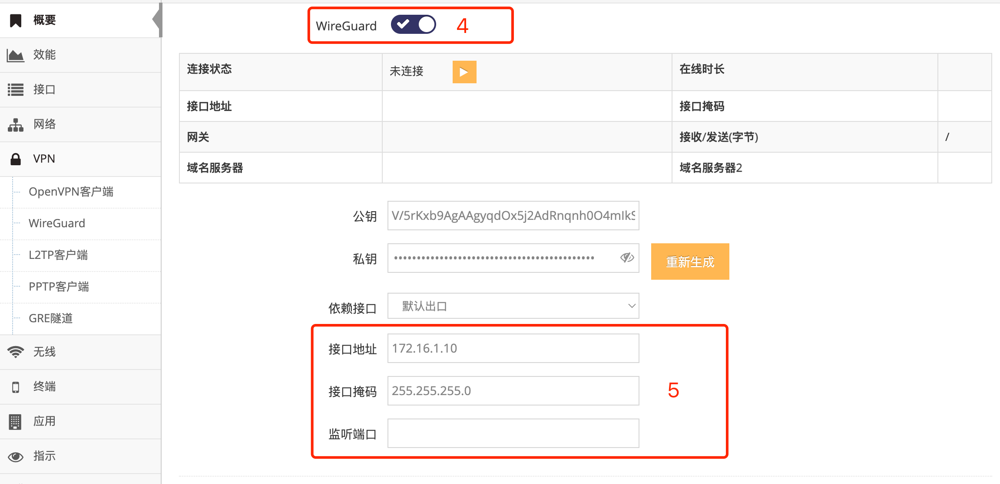
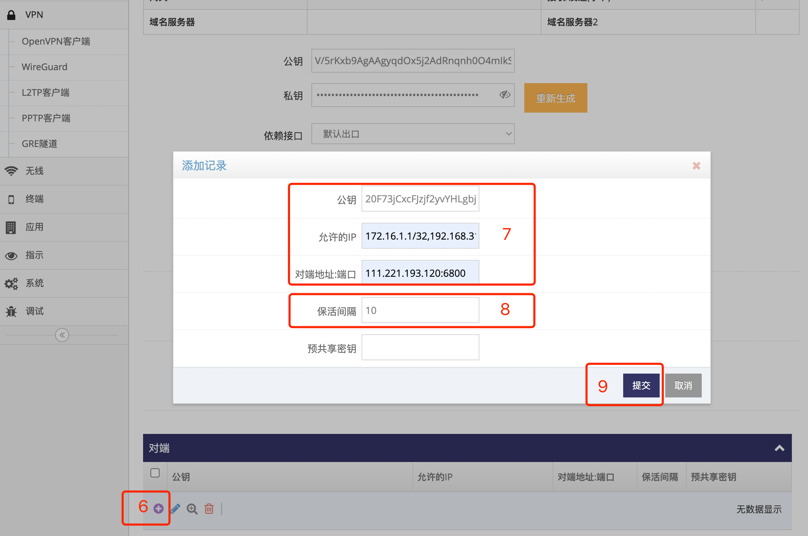
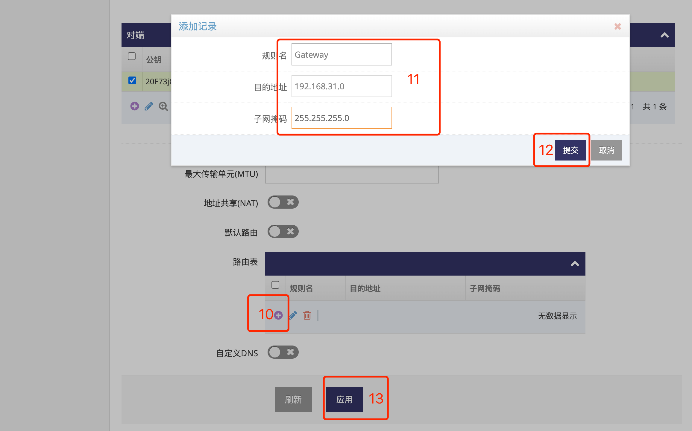

***

## 设置两台网关Wireguard实现互通示例

在网关上设置Wireguard可实现两个网关本地网络(子网网段)之间加密通信, 前提是需要其中一台网关有公网地址   

- 基于以下拓扑图示例设置Wireguard实现两台网关本地网络下 **电脑192.168.8.250** 与 **电脑192.168.31.231** 互通    

- 其中 **公网地址网关(Gateway)** 使用有线宽带上网, 公网地址为 **111.221.193.120**    

- 另一台 **4G网关(LTE Gateway)** 使用4G(LTE)上网, 无公网地址   

- WireGuard虚拟网段为 **172.16.1.0/24**, 其中 **公网地址网关(Gateway)** 的WireGuard接口IP为 **172.16.1.1**, **4G网关(LTE Gateway)** 的WireGuard接口IP为 **172.16.1.10**

 

#### 1. 获取4G网关(LTE Gateway)的Wireguard公钥

登录 **4G网关(LTE Gateway)** 的 **管理界面**(以上拓扑图示的本地地址为192.168.8.1, 连接网关后打开浏览器在地址栏输入 http://192.168.8.1 回车即可登录)

- 点击 **红框1** **VPN** 菜单下的 **红框2** **WireGuard** 进入 **WireGuard接口列表界面**   

- 点击 **红框3** **小扳手** 进入 **WireGuard接口设置界面**   

 

- 点击 **红框4** 中的开关显示对应接口的所有设置, 拷贝 **红框5** 中的 **公钥** 即可   

 

以上图示 **4G网关(LTE Gateway)** 公钥为 **V/5rKxb9AgAAgyqdOx5j2AdRnqnh0O4mIkSzGSHeXF4=**, 下一步设置 **公网地址网关(Gateway)** 需要用到此公钥

#### 2. 设置公网地址网关(Gateway)的Wireguard

登录 **公网地址网关(Gateway)** 的 **管理界面**(以上拓扑图示的本地地址为192.168.31.1, 连接网关后打开浏览器在地址栏输入 http://192.168.31.1 回车即可)

- 点击 **红框1** **VPN** 菜单下的 **红框2** **WireGuard** 进入 **WireGuard接口列表界面**   

- 点击 **红框3** **小扳手** 进入 **WireGuard接口设置界面**   

 

- 点击 **红框4** 中的启用WireGuard  

 

- 在 **红框5** 的 **接口地址** 设置 **公网地址网关(Gateway)** 的WireGuard接口IP, 基于以上拓扑图为172.16.1.1   
- 在 **红框5** 的 **接口掩码** 设置 **公网地址网关(Gateway)** 的WireGuard接口掩码, 基于以上拓扑图为255.255.255.0   
- 在 **红框5** 的 **监听端口** 设置WireGuard的监听端口为6800, 此端口即为的WireGuard服务端口, 需保证 **4G网关(LTE Gateway)** 可直接访问   

以上即完成了对 **公网地址网关(Gateway)** Wireguard基本的配置   
并且也可以看到 **公网地址网关(Gateway)** 的公钥, 此公钥 **20F73jCxcFJzjf2yvYHLgbj/egKG0YLiA3KPNd7X7ls=**, 之后设置 **4G网关(LTE Gateway)** 需要用到此公钥

#### 3. 在公网地址网关(Gateway)的Wireguard中添加4G网关(LTE Gateway)的信息

在 **公网地址网关(Gateway)** 的Wireguard中添加 **4G网关(LTE Gateway)** 的信息后, 确保允许 **4G网关(LTE Gateway)** 的接入

 

- 点击 **红框6** 的加号添加对端    
- 在 **红框7** 的 **公钥** 填写 **4G网关(LTE Gateway)** 的 **公钥**, 即为 **V/5rKxb9AgAAgyqdOx5j2AdRnqnh0O4mIkSzGSHeXF4=**
- 在 **红框7** 的 **允许的IP** 填写 **4G网关(LTE Gateway)** 的WireGuard的接口IP(172.16.1.10)及本地子网网段(192.168.8.0/24), 即 **172.16.1.10/32,192.168.8.0/24** (以逗号隔开)
- 建议在 **红框8** 的 **保活间隔** 中填写填写保活间隔, 以秒为单位, 此示例中设置的是10秒
- 之后点击 **红框9** 提交即可   

 

- 因需要访问 **4G网关(LTE Gateway)** 本地网络(子网网段), 因此需要再添加对应的路由, 点击 **红框10** 的加号添加路由
- 在 **红框11** 的 **规则名** 填写名称, 可自定义
- 在 **红框11** 的 **目的地址** 填写 **4G网关(LTE Gateway)** 本地子网地址, 即 **192.168.8.0**
- 在 **红框11** 的 **子网掩码** 填写 **4G网关(LTE Gateway)** 本地子网掩码, 即 **255.255.255.0**  
- 点击 **红框12** 提交即可    
- 以上所有的配置好后点击 **红框13** 应用即可   

以上即完成了对 **公网地址网关(Gateway)** 的Wireguard的所有配置   

#### 4. 查看公网地址网关(Gateway)的Wireguard公钥

基于以上 **[设置公网地址网关(Gateway)的Wireguard](./wireguard_cn.md#2.设置公网地址网关(Gateway)的Wireguard)** 操作时得到了其公钥为 **20F73jCxcFJzjf2yvYHLgbj/egKG0YLiA3KPNd7X7ls=**   

#### 5. 设置4G网关(LTE Gateway)的Wireguard

登录 **4G网关(LTE Gateway)** 的 **管理界面**(以上拓扑图示的本地地址为192.168.8.1, 连上网关后打开浏览器在地址栏输入 http://192.168.8.1 回车即可)

- 点击 **红框1** **VPN** 菜单下的 **红框2** **WireGuard** 进入 **WireGuard接口列表界面**   

- 点击 **红框3** **小扳手** 进入 **WireGuard接口设置界面**   

 

- 点击 **红框4** 中的启用WireGuard  

 

- 在 **红框5** 的 **接口地址** 设置 **4G网关(LTE Gateway)** 的WireGuard接口IP, 基于以上拓扑图为172.16.1.10   
- 在 **红框5** 的 **接口掩码** 设置 **4G网关(LTE Gateway)** 的WireGuard接口掩码, 基于以上拓扑图为255.255.255.0   

以上即完成了对 **公网地址网关(Gateway)** Wireguard基本的配置   
并且也可以看到 **公网地址网关(Gateway)** 的公钥, 此公钥 **20F73jCxcFJzjf2yvYHLgbj/egKG0YLiA3KPNd7X7ls=**, 之后设置 **4G网关(LTE Gateway)** 需要用到此公钥

#### 3. 在4G网关(LTE Gateway)的Wireguard中添加公网地址网关(Gateway)的信息

 

- 点击 **红框6** 的加号添加对端    
- 在 **红框7** 的 **公钥** 填写 **公网地址网关(Gateway)** 的 **公钥**, 即为 **20F73jCxcFJzjf2yvYHLgbj/egKG0YLiA3KPNd7X7ls=**
- 在 **红框7** 的 **允许的IP** 填写 **公网地址网关(Gateway)** 的WireGuard的接口IP(172.16.1.1)及本地子网网段(192.168.31.0/24), 即 **172.16.1.1/32,192.168.31.0/24** (以逗号隔开)
- 在 **红框7** 的 **对端地址:端口** 填写 **公网地址网关(Gateway)** 的公网IP地址及设置的监听端口为6800, 即 **111.221.193.120:6800** (以冒号隔开)
- 建议在 **红框8** 的 **保活间隔** 中填写填写保活间隔, 以秒为单位, 此示例中设置的是10秒
- 之后点击 **红框9** 提交即可   

 

- 因需要访问 **公网地址网关(Gateway)** 本地网络(子网网段), 因此需要再添加对应的路由, 点击 **红框10** 的加号添加路由
- 在 **红框11** 的 **规则名** 填写名称, 可自定义
- 在 **红框11** 的 **目的地址** 填写 **公网地址网关(Gateway)** 本地子网地址, 即 **192.168.31.0**
- 在 **红框11** 的 **子网掩码** 填写 **公网地址网关(Gateway)** 本地子网掩码, 即 **255.255.255.0**  
- 点击 **红框12** 提交即可    
- 以上所有的配置好后点击 **红框13** 应用即可   

以上即完成了对 **4G网关(LTE Gateway)** 的Wireguard的所有配置, 如网络正常 **电脑192.168.8.250** 与 **电脑192.168.31.231** 即可互通
