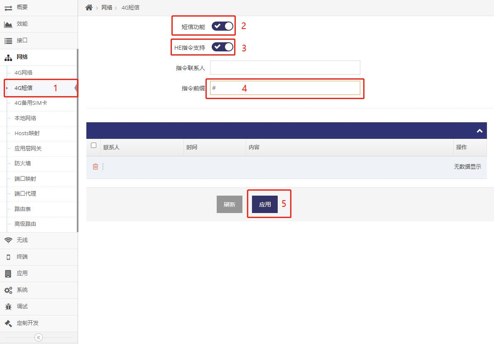

## 通过短信管理设备
设备开启 **短信功能** 并打开 **HE指令支持** 后即可通过短信来管理设备


##### Telnet/SSH等终端下使用命令打开短信功能

1. 通过Telnet/SSH客户端使用 用户名及密码 登录后即可进入终端HE指令界面

2. 打开LTE的短信功能
```shell
# modem@lte:sms=enable
# ttrue
```

3. 打开LTE短信功能的HE指令支持
```shell
# modem@lte:sms_cfg/he=enable
# ttrue
```

4. 设置LTE短信指令前缀为#号, 即发送指令必须前缀为#号
```shell
# modem@lte:sms_cfg/he_prefix=#
# ttrue
```

##### 通过WEB界面打开短信功能



- 以上指令联系人为空， 即表示接收所有的联系发送的短信, 也可指定联系人， 有多个联系人时以 **分号;** 隔开即可
- 以上指令前缀为#, 即发送的短信指令必须带有#字符的前缀

**注意： 文档之后的示例都以此设置交互，即短信指令前缀为#**


## 短信管理设备

- 短信管理设备也是基于 [HE终端指令](./he_command.md)
- 但因短信传输长度有限制, 因此需要基于 **HE终端指令** 的功能减少单次传输的字符长度即可
- 需要用到HE指令中的 **:号** 及 **/号** 的功能来限制到传输单个属性即可


## 示例基于HE终端指令转化为短信收发来实现对LTE状态的查询

- 在 **HE终端指令** 中使用ifname@lte.status即可查询到所有的LTE的状态
    ```shell
    # ifname@lte.status  // 调用ifname@lte的status接口, 即查询系统中LTE的状态
    {
        "mode":"dhcpc",
        "ifname":"ifname@lte2",
        "netdev":"usb1",
        "gw":"10.33.13.104",
        "dns":"120.80.80.80",
        "dns2":"221.5.88.88",
        "ifdev":"modem@lte2",
        "ontime":"754",
        "metric":"10",
        "status":"up",
        "ip":"10.33.13.103",
        "mask":"255.255.255.240",
        "livetime":"05:03:36:0",
        "rx_bytes":"2681665",
        "rx_packets":"27616",
        "tx_bytes":"1433806",
        "tx_packets":"21926",
        "mac":"02:50:F4:00:00:00",
        "tid":"2",
        "devcom":"modem@device",
        "name":"Quectel-EC2X",
        "imei":"864337056708978",
        "mversion":"20CEFHLGR06A05M1G",
        "iccid":"89860121801097564807",
        "imsi":"460015356123463",
        "pcid":"184",
        "lac":"2604",
        "ci":"6DA5A09",
        "netera":"4G",
        "rsrp":"-96",
        "nettype":"FDD LTE",
        "rssi":"-66",
        "rsrq":"-9",
        "sinr":"-19",
        "band":"LTE BAND 3",
        "plmn":"46001",
        "csq":"25",
        "signal":"4",
        "operator":"中国联通"
        "operator_advise":
        {
            "name":"中国联通",
            "dial":"*99#",
            "apn":"3gnet"
        },
        "state":"connected"
    }
    ```

- 但在短信的传输中因ifname@lte.status中的@号通信会被运营商过滤所以需要将 **@** 改成 **>** ， 即需要发送ifname>lte.status
    ```
    #ifname>lte.status
    ```

- 但是发送以上短信也无法得到回复， 这是因为ifname>lte.status返回的JSON过长无法通过短信发出因此需要通过 **:号** 来指定单个属性
    ```
    #ifname>lte.status:status          // 发送此查询LTE的csq
    up                                    // 返回
    #ifname>lte.status:ip              // 发送此查询LTE的IP地址
    10.33.13.103                          // 返回
    #ifname>lte.status:livetime        // 发送此查询LTE的上线时长
    05:03:36:0                            // 返回
    #ifname>lte.status:rx_bytes        // 发送此查询LTE的接收字节数
    2681665                               // 返回
    #ifname>lte.status:imei            // 发送此查询LTE的imei号
    864337056708978                       // 返回
    #ifname>lte.status:imsi            // 发送此查询LTE的imsi号
    460015356123463                       // 返回
    #ifname>lte.status:iccid           // 发送此查询LTE的iccid号
    89860121801097564807     
    ```
- 通过以上使用 **:号** 来限制单个属性的规则可以查询到LTE状态的所有的属性


## 示例基于HE终端指令转化为短信收发来实现对LTE的管理

- 在 **HE终端指令** 中使用ifname@lte即可查询到所有的LTE的配置
    ```shell
    # ifname@lte  // 查询系统中LTE的配置
    {
        "tid":"1",
        "metric":"10",
        "static":
        {
            "ip":"",
            "mask":""
        },
        "dhcpc":
        {
            "static":"disable"
        },
        "ppp":
        {
            "lcp_echo_interval":"10",
            "lcp_echo_failure":"12",
            "txqueuelen":"1000",
            "pppopt":"debug"
        },
        "masq":"enable",
        "keeplive":
        {
            "type":"recv",
            "icmp":
            {
                "dest":
                {
                    "test":"8.8.8.8",
                    "test2":"114.114.114.114",
                    "test3":"223.5.5.5"
                },
                "dest-help":"google-114-ali",
                "timeout":"10",
                "failed":"6",
                "interval":"20"
            },
            "recv":
            {
                "timeout":"20",
                "failed":"30",
                "packets":"1"
            }
        },
        "mode":"",
        "ttl":"",
        "bsim_cfg":
        {
            "mode":"auto",
            "signal_failed":"60",
            "dial_failed":"4",
            "failover":"600"
        },
        "bsim":"disable",
        "lock_nettype":"auto",
        "gnss":"disable",
        "profile":"enable",
        "profile_cfg":
        {
            "dial":"*99#",
            "apn":"cmnet",
            "user":"",
            "passwd":"",
            "auth":"",
            "cid":""
        }
    }
    ```

- 但在短信的传输中因ifname@lte中的@号通信会被运营商过滤所以需要将 **@** 改成 **>** ， 即需要发送ifname>lte
    ```
    #ifname>lte
    ```

- 但是发送以上短信也无法得到回复， 这是因为ifname>lte返回的JSON过长无法通过短信发出因此需要通过 **:号** 来指定单个属性
    ```
    #ifname>lte:profile          // 发送此查询LTE的profile的配置是否为自定义， 返回enable为自定义
    enable                          // 返回
    #ifname>lte.profile/apn      // 发送此查询LTE的profile自定义的APN
    cmnet                          // 返回   
    ```

- 通过以上使用 **:号** 来限制单个属性的规则可以查询到LTE所有的配置

- 也可以通过此方式来修改LTE的配置
    ```
    #ifname>lte:profile=disable            // 发送此设置LTE的APN为自动
    ttrue                                    // 返回ttrue表示成功, 返回tfalse表示失败
    #ifname>lte:profile=enable            // 发送此设置LTE的APN为自定义
    ttrue                                    // 返回ttrue表示成功, 返回tfalse表示失败
    #ifname>lte:profile/apn=gddw@163.com  // 发送此设置LTE的APN为gddw@163.com
    ttrue                                    // 返回ttrue表示成功, 返回tfalse表示失败    
    ```


## 其它常用的指令

- 重启设备
    ```
    #land>machine.restart          // 发送
    ttrue                          // 接收, 不一定能接收到, 因为设备会马上重启
    ```

- 基于以上重启设备可能无法收到回复, 可以使用延迟重启, 以下指令为5秒后重启
    ```
    #land>machine.restart[ 5 ]          // 发送
    ttrue                                     // 接收
    ```

- 重置设备并重启
    ```
    #land>machine.default          // 发送
    ttrue                          // 接收, 不一定能接收到, 因为设备会马上重置
    ```

- 基于以上重置设备可能无法收到回复, 可以使用延迟重置, 以下指令为5秒后重置
    ```
    #land>machine.default[ 5 ]          // 发送
    ttrue                                     // 接收
    ```

- 重置设备不重启
    ```
    #arch>data.default          // 发送
    ttrue                       // 接收
    ```

- PING指定地址确定延迟
    ```
    #network>keeplive.icmp[ 192.168.8.250 ]          // 发送此PING主机192.168.8.250
    0                                                // 接收到0表示 0ms
    ```
    ```
    #network>keeplive.icmp[ www.baidu.com ]          // 发送PING地址www.baidu.com
    45                                               // 接收到45表示45ms
    ```
    ```
    #network>keeplive.icmp[ 192.168.8.222 ]          // 发送PING主机192.168.8.222
    NULL                                             // 接收到NULL表示无法PING通
    ```

- 更多功能可以参看HE终端指令, 原则上所有的HE终端指令都可执行, 只是需要使用HE指令功能限定交互数据不超过短信的最大限制即可


