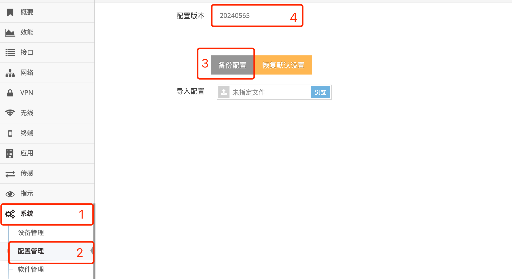

***

## 网关配置备份及导入

网关 **配置版本** 在每次修改时会加1, 以此有限的区分每份配置
在 **备份配置** 时会为备份出来的配置自动生成一个 **配置版本**, 此配置版本通过是以 **当前日期及时间** 随机生成

### 配置的备份

- 点击 **红框1** **系统** 菜单下的 **红框2** **配置管理** 进入 **配置管理界面**

 

- 点击 **红框3** 的 **备份配置** 后会即可下载当前网关的配置包, 此配置包中为一个tar的包

***备份的配置对于不同型号间的网关的不通用不允许导入***

### 配置的导入

- 点击 **红框1** **系统** 菜单下的 **红框2** **配置管理** 进入 **配置管理界面**

 

- 点击 **红框3** 的 **浏览** 后选择要导入的 **红框4** **配置包** 点击 **红框5** **打开** 即可

- 导入成功后会提示重启, 点击 **确定** 后网关重启即可

***备份的配置对于不同型号间的网关的不通用不允许导入***

