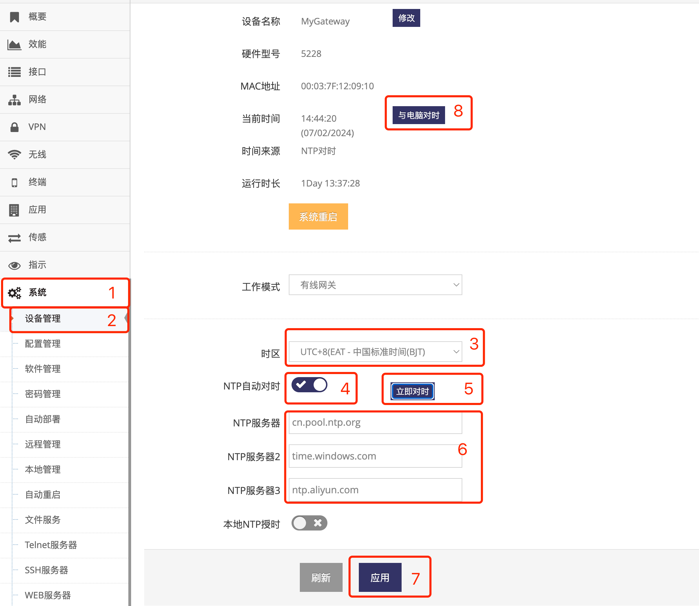

***

## 管理网关的时间及时区

网关开机会尝试以下三个方式获取时间:   
- 当有 **4G/5G(LTE/NR)模组** 并连接到 **基站** 后会首先向 **基站** 获取时间   
- 当有 **定位模组** 时并成功定位则会使用定位模块的时间   
- 如有设置 **NTP对时** 则NTP对时获取的时间优先级最高, 会覆盖以上2个方式获取的时间   

以下是设置网关时间及NTP对时的介绍:

- 点击 **红框1** **系统** 菜单下的 **红框2** **设备管理** 进入 **设备管理界面**

 

- 点击 **红框3** 下拉列表可以修改网关的 **时区**

- 点选 **红框4** 中启用或禁用 **NTP自动对时**

- 启用  **NTP自动对时** 后, 可在 **红框6** 中填写多个 **NTP服务器**, 网关在对时时会一一请求直到成功拿到时间

- 修改好 **时区** **NTP自动对时** **NTP服务器** 后即可点击 **红框7** 应用即可

- 点击 **红框8** 的 **与电脑对时** 即可让网关与配置的电脑对时

- 并且启用  **NTP自动对时** 后, 也可直接点击 **红框5** 的 **立即对时** 即可让网关立即与 **NTP服务器** 对时

