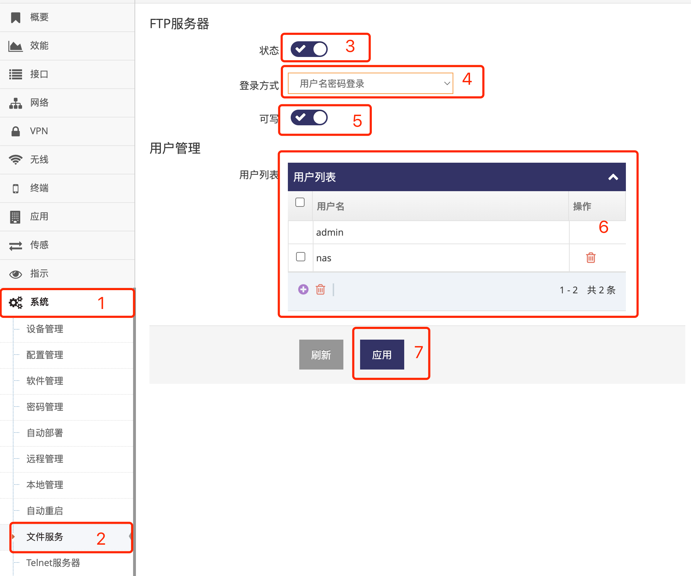
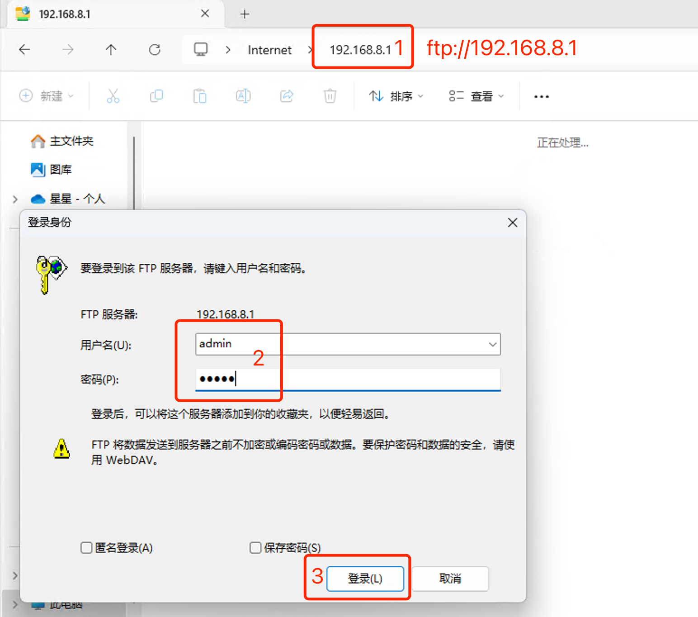
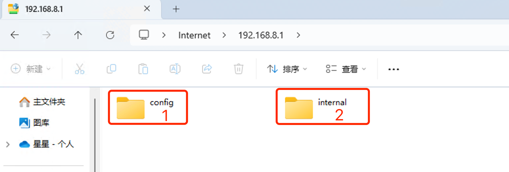

***

## 文件服务

网关跟据不同的型号提供不同的文件服务, 通常会有FTP服务及Samba(Window文件共享)服务

### FTP服务器

- 点击 **红框1** **系统** 菜单下的 **红框2** **文件服务** 进入 **文件服务界面**

 

- 点击 **红框3** 用于打开或者关闭 **FTP服务器**

- **红框4** 中用于选择 **登录方式**, 可选 **匿名登录** 或 **用户名密码登录**

- **红框5** 中用于选择是 **可写** 权限

- **红框6** 可添加 **用户**, 在 **登录方式** 为 **用户名密码登录** 下可以使用这些用户登录

- 修改好后即可点击 **红框7** 应用即可

打开FTP服务器后即可通过电脑或设备的FTP客户端访问网关

 

- 打开 **电脑资源管理器** 在 **红框1** 输入ftp://192.168.8.1回车
- 弹出对话框后在 **红框2** 中输入用户名密码点击 **红框3** 登录即可访问到网关, 注意有的 **电脑资源管理器** 不弹出对话框请点右键选择 **登录** 后再弹出对话框

 

**红框1** 为网关的配置文件目录, 掉电保存, 请谨慎使用, 如出现空间不足将影响网关的配置
**红框2** 为网关的Flash上的文件目录, 掉电保存, 请谨慎使用, 如出现空间不足将影响网关的功能   

**Telnet服务器的用户名及密码与网页管理界面一致**

