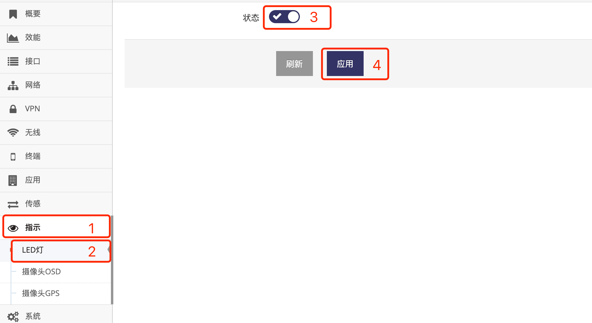

***

## LED指示灯管理

除 **电源灯** 及 **网口LINK灯** 不可关闭外, 网关其它的指示灯都可以关闭

- 点击 **红框1** **指示** 菜单下的 **红框2** **LED灯** 进入 **LED灯管理界面**

 

- 点击 **红框3** 打开或关闭LED指示灯后 **应用** 即可, 关闭或打开LED指示灯可能需要重启系统, 如提示重启点 **确定** 即可

**关闭LED指示灯后, 除电源灯及网口LINK灯外都会被关闭**

