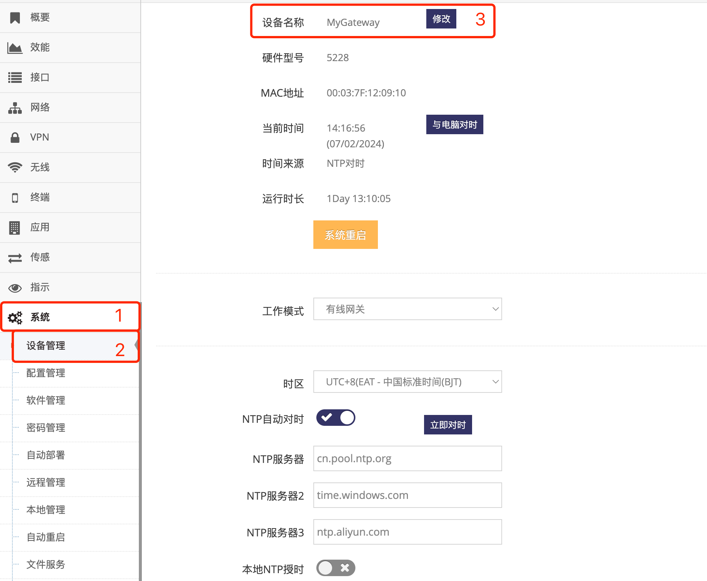

***

## 修改网关的名称

网关名称通常会显示在:
- 管理网页界面的右上角的提头
- 终端命令行提示符前
- DHCP获到IP时给出这个主机名
- 各种协议交互时都使用这个主机名

- 点击 **红框1** **系统** 菜单下的 **红框2** **设备管理** 进入 **设备管理界面**

 

- 点击 **红框3** 的 **修改** 后会弹出修改对话框, 在对话框的输入框给出新的 **主机名** 后点击 **确定** 即可

- 修改后可以在 **红框3** 中 **设备名称** 后看到新修改的 **主机名**

### 网关的主机名命名要求

- 主机名中允许英文字母, 数字, 横杠, 下划线   
- 并且必须以字母开头   
- 主机名中不允许含有空格   
- 主机名中不允许中文及全角字符   

