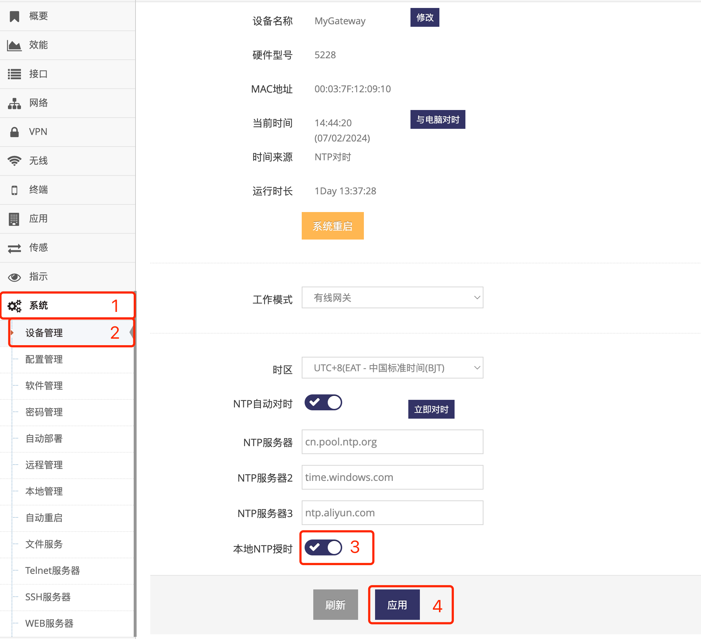

***

## 开启NTP服务为本地设备授时

网关开机会尝试以下三个方式获取时间:   
- 当有 **4G/5G(LTE/NR)模组** 并连接到 **基站** 后会首先向 **基站** 获取时间   
- 当有 **定位模组** 时并成功定位则会使用定位模块的时间   
- 如有设置 **NTP对时** 则NTP对时获取的时间优先级最高, 会覆盖以上2个方式获取的时间   

网关获取时间后可以提供NTP服务为局域网的设备或电脑提供正确的时间   
***对于没有公网访问权限的专网更有用, 因为网关可以通过基站及定位模组获取时间并提供给局域网设备***    
以下介绍开启NTP服务为本地设备授时:   

- 点击 **红框1** **系统** 菜单下的 **红框2** **设备管理** 进入 **设备管理界面**

 

- 点击 **红框3** 打开 **本地NTP授时** 后点击 **红框4** **应用** 即可

