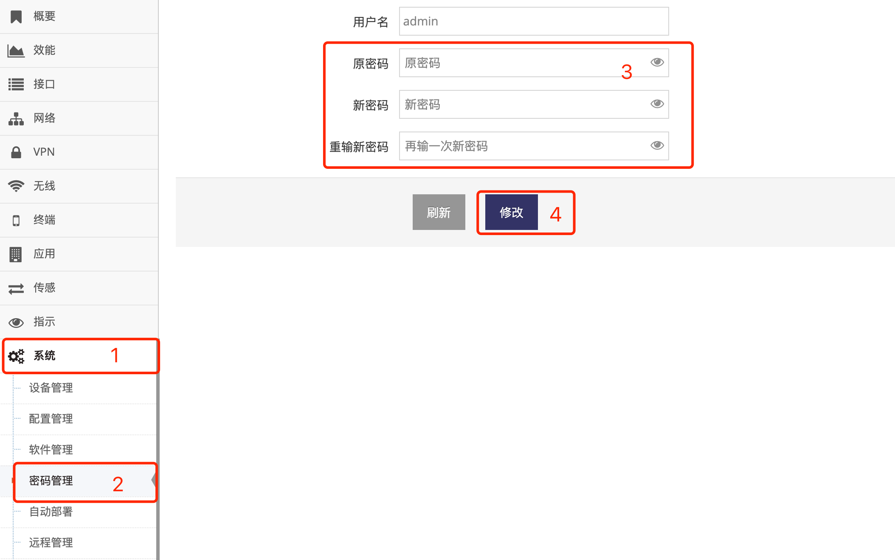

***

## 管理员密码修改

网关管理员用户名为 **admin**, 标准版不允许修改管理员用户名    
默认密码通常也为 **admin**   

- 点击 **红框1** **系统** 菜单下的 **红框2** **密码管理** 进入 **密码管理界面**

 

- 在 **红框3** **原密码** 输入框中输入当前使用的密码

- 在 **红框3** **新密码** 输入框中输入新的密码

- 在 **红框3** **重输新密码** 输入框中再一次输入新的密码

- 之后点击 **红框4** **修改** 即可   

- 修改成功会要求重新登录, 修改失败会提示失败原因

### 密码要求

- 密码中允许英文字母, 数字, 横杠, 下划线   
- 密码中不允许单引号及双引号   
- 主机名中不允许中文及全角字符   

