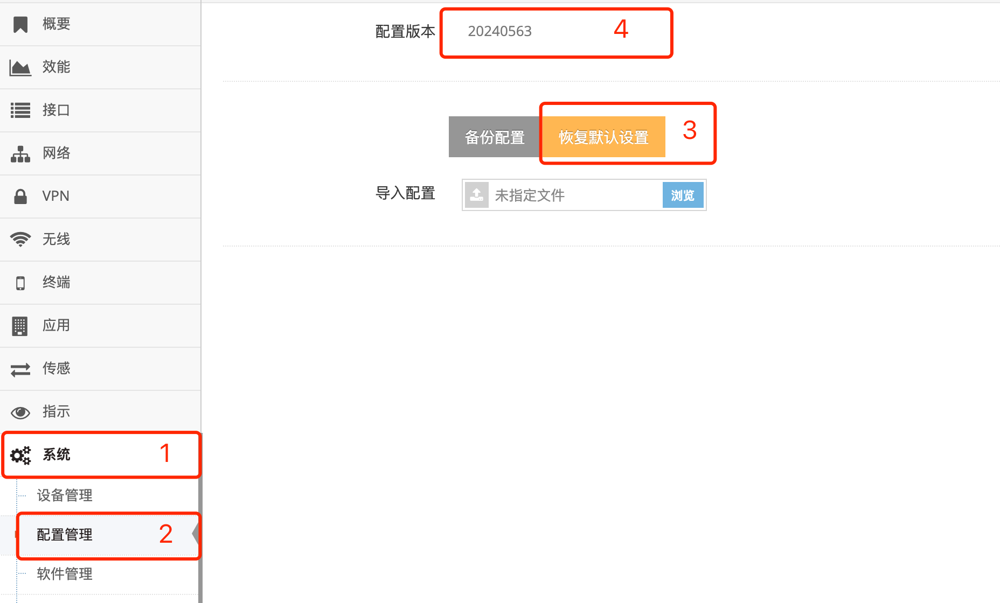

***

## 重置网关配置(恢复出厂设置)

- 点击 **红框1** **系统** 菜单下的 **红框2** **配置管理** 进入 **配置管理界面**

 

- 点击 **红框3** 的 **恢复默认设备** 后会确定对话框点击 **确定** 后网关立即重启, 重启后设备即恢复到出厂时的设置

- 在 **红框4** 中可以查看当前的 **配置版本**, 导入的配置则会显示导入配置的版本号, 而如果修改网关配置时每修改一次配置版本会加1

