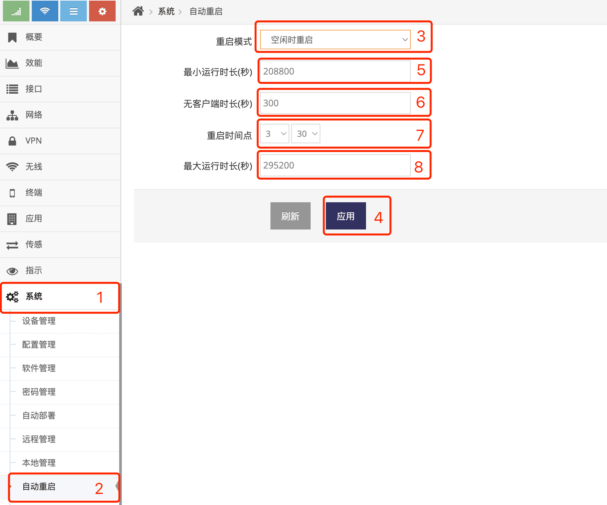
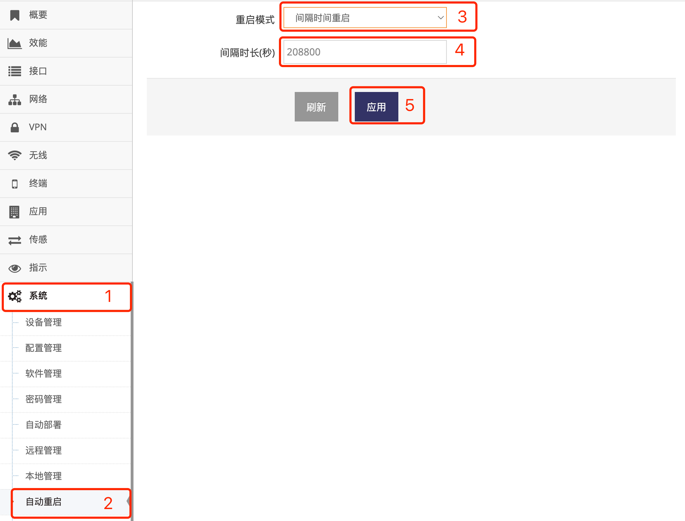
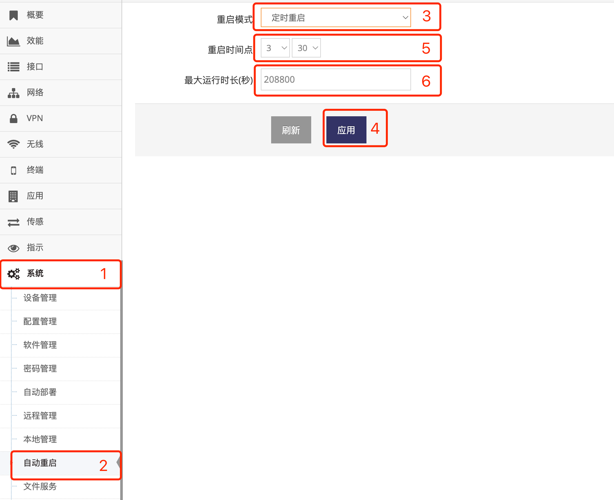

***

## 设置网关定时重启

网关可以设置以下四种定时重启模式:   

- **禁用**, 即不自动重启

- **空闲时重启**, 即指定运行一段时间后在设备无客户端连接时重启

- **间隔时间重启**, 即指定运行一段时间后重启

- **定时重启**, 指定从第二天开始每天固定的时间重启

### 设置网关空闲时重启

- 点击 **红框1** **系统** 菜单下的 **红框2** **自动重启** 进入 **自动重启设置界面**   
- 点击 **红框3** **重启模式** 点选 **空闲时重启** 后, 点击 **红框4** **应用** 即可   

 

**红框5** 指定细节: 系统必须运行达到 **最小运行时长(秒)**, 低于这个时长系统不会重启   
**红框6** 指定细节: 系统运行达到 **最小运行时长(秒)** 后, 如果无客户端连接的时间超过 **无客户端时长(秒)** 后即重启系统    
**红框7** 指定细节: 系统运行达到 **最小运行时长(秒)** 后, 并且系统有获取到时间, 即会在这个 **重启时间点** 重启系统   
**红框8** 指定细节: 系统运行达到 **最大运行时长(秒)** 后就立即重启系统   

基于以上示例会在以下几种情况下重启   
- 系统向在运行208800秒后查看是否有客户端, 如果无客户端且连接时长达到300秒即重启系统   
- 系统向在运行208800秒后查看是系统是否有获取到时间(通过NTP/LTE/GNSS), 如果有获取到时间就会在凌晨3:30重启系统    
- 系统向在运行295200秒后直接重启系统  

***为防止设置错误导致系统一直重启无法恢复, 以上所有设置的规则导致在低于300秒需要重启的操作不会被执行***

### 设置网关间隔指定的时长重启

- 点击 **红框1** **系统** 菜单下的 **红框2** **自动重启** 进入 **自动重启设置界面**   
- 点击 **红框3** **重启模式** 点选 **间隔时间重启** 后, 点击 **红框4** **应用** 即可   

 

**红框4** 指定细节: 系统运行达到 **间隔时长(秒)** 即重启   

***为防止设置错误导致系统一直重启无法恢复, 以上所有设置的规则导致在低于300秒需要重启的操作不会被执行***

### 设置网关定时重启

- 点击 **红框1** **系统** 菜单下的 **红框2** **自动重启** 进入 **自动重启设置界面**   
- 点击 **红框3** **重启模式** 点选 **定时重启** 后, 点击 **红框4** **应用** 即可   

 

**红框5** 指定细节: 系统运行86400秒(一天)后, 并且系统有获取到时间, 即会在这个 **重启时间点** 重启系统   
**红框8** 指定细节: 系统运行达到 **最大运行时长(秒)** 后就立即重启系统

***为防止设置错误导致系统一直重启无法恢复, 以上所有设置的规则导致在低于86400秒需要重启的操作不会被执行***

