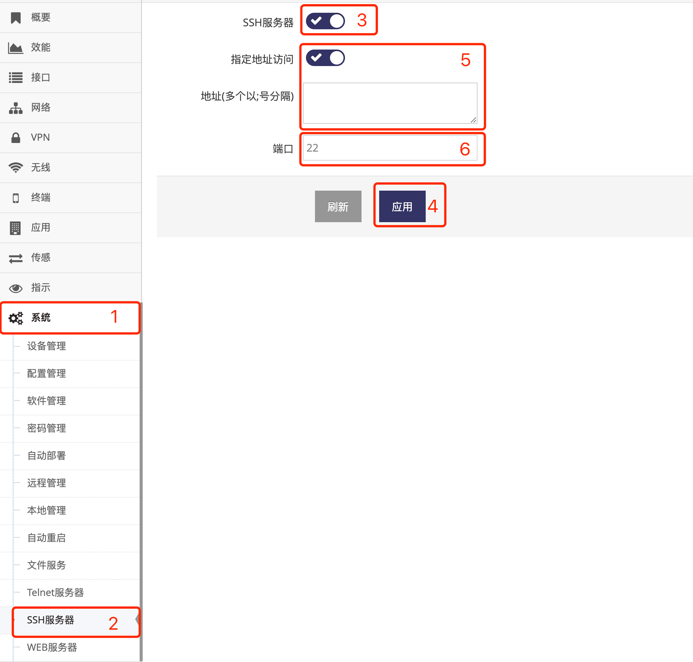
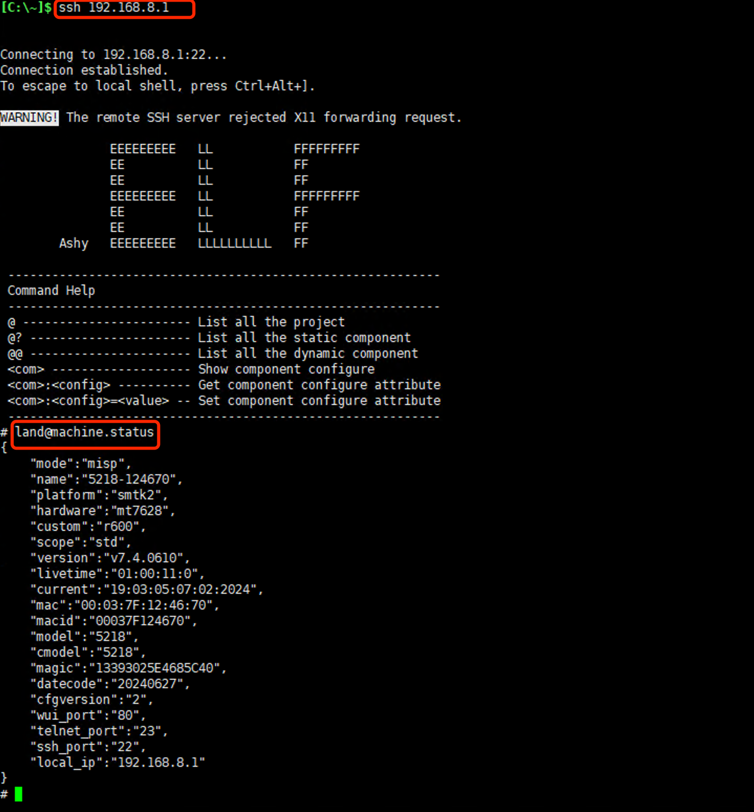

***

## SSH服务器

网关的SSH服务器默认处于关闭状态

- 点击 **红框1** **系统** 菜单下的 **红框2** **SSH服务器** 进入 **SSH服务器界面**

 

- 点击 **红框3** 用于打开或者关闭 **SSH服务器**

- **红框5** 中启用 **指定地址访问** 后可以在 **地址** 输入框中输入 **访问白名单**, 支持MAC地址或IP地址, 多个地址以分号(:)分隔

- **红框6** 用于设置SSH服务器的服务 **端口**, 默认为22

- 修改好后即可点击 **红框4** 应用即可

打开SSH服务器后即可通过电脑或设备的SSH客户端访问网关

 

**SSH服务器的用户名及密码与网页管理界面一致**

