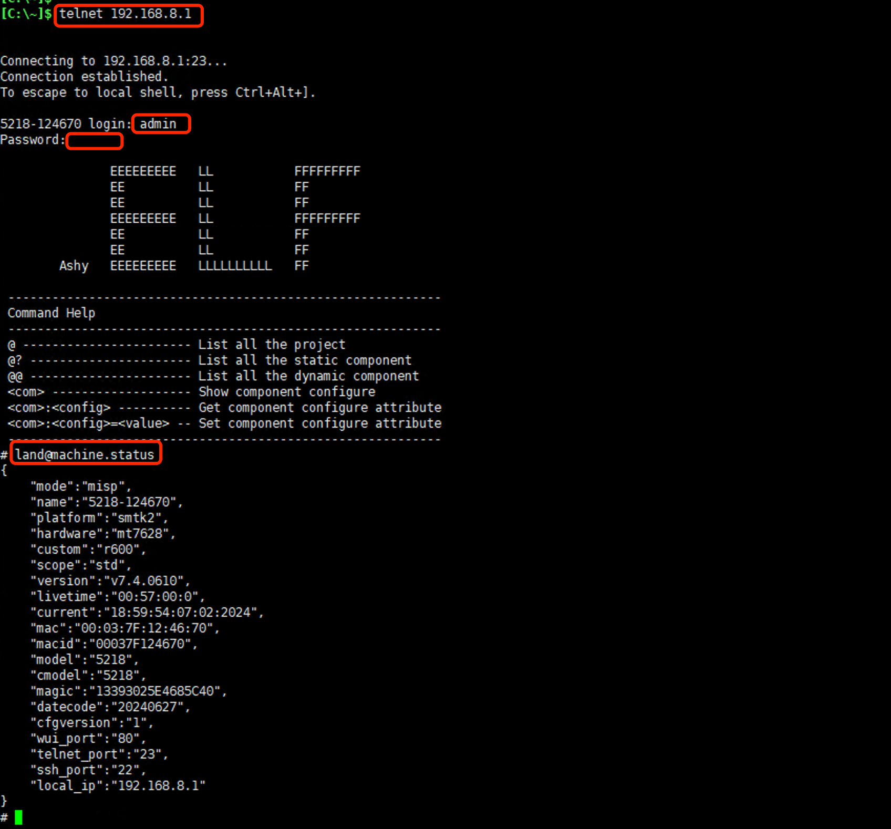

***

## Telnet服务器

网关默认会打开Telnet服务器

- 点击 **红框1** **系统** 菜单下的 **红框2** **Telnet服务器** 进入 **Telnet服务器界面**   

 

- 点击 **红框3** 用于打开或者关闭 **Telnet服务器**   

- **红框5** 中启用 **指定地址访问** 后可以在 **地址** 后的输入框中输入 **访问白名单**, 支持MAC地址或IP地址, 多个地址以分号(:)分隔   

- **红框6** 用于修改Telnet服务器的服务 **端口**, 默认为23   

- 修改好后即可点击 **红框4** 应用即可   

打开Telnet服务器后即可通过电脑或设备的Telnet客户端访问网关   

    

**Telnet服务器的用户名及密码与网页管理界面一致**
