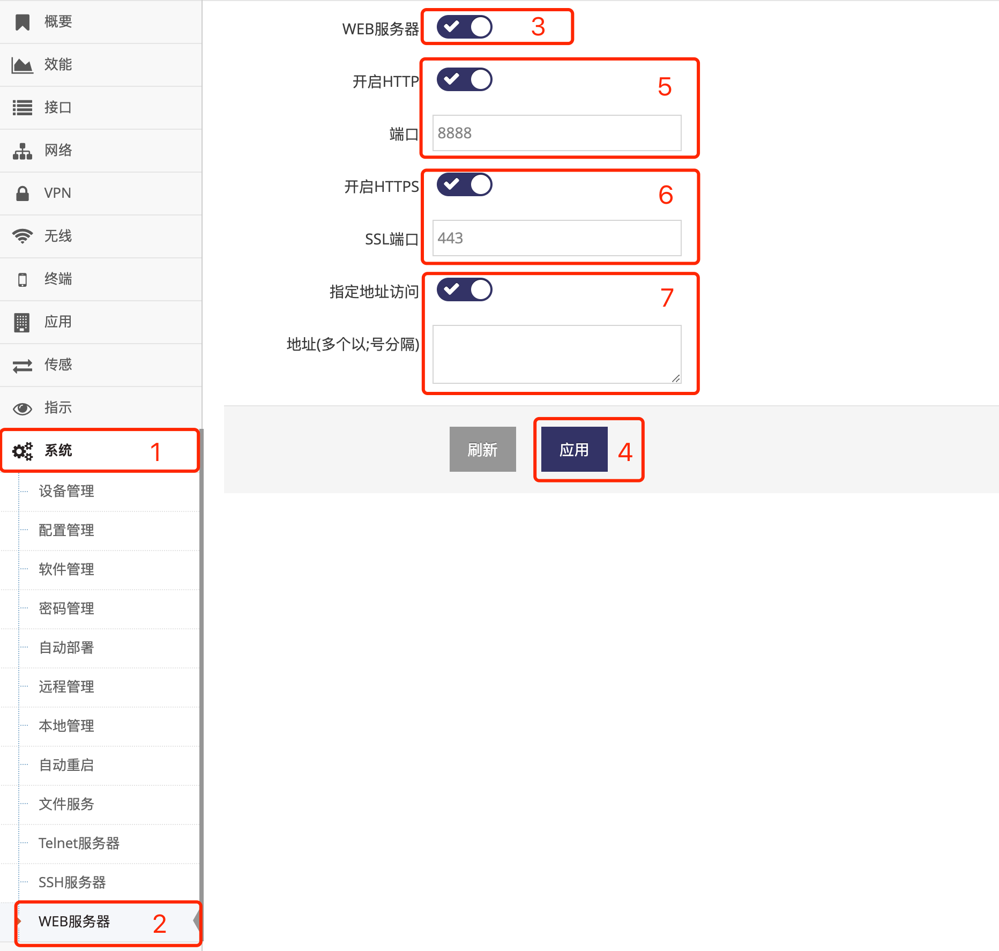

***

## WEB服务器(管理界面)

网关默认会打开WEB服务器(管理界面), 因此用户通过浏览器可以访问192.168.8.1的管理界面   

- 点击 **红框1** **系统** 菜单下的 **红框2** **WEB服务器** 进入 **WEB服务器界面**   

   

- 点击 **红框3** 用于打开或者关闭 **WEB服务器**   

- **红框5** 中用于启用或关闭 **HTTP服务**, 启用后可以设置 **端口**, 默认为80   

- **红框6** 中用于启用或关闭 **HTTPS服务**, 启用后可以设置 **端口**, 默认为443   

- **红框7** 中启用 **指定地址访问** 后可以在 **地址** 输入框中输入 **访问白名单**, 支持MAC地址或IP地址, 多个地址以分号(:)分隔   

- 修改好后即可点击 **红框4** 应用即可   

**关闭WEB服务器(管理界面)后将导致无法访问网关的管理界面, 请谨慎设置**

