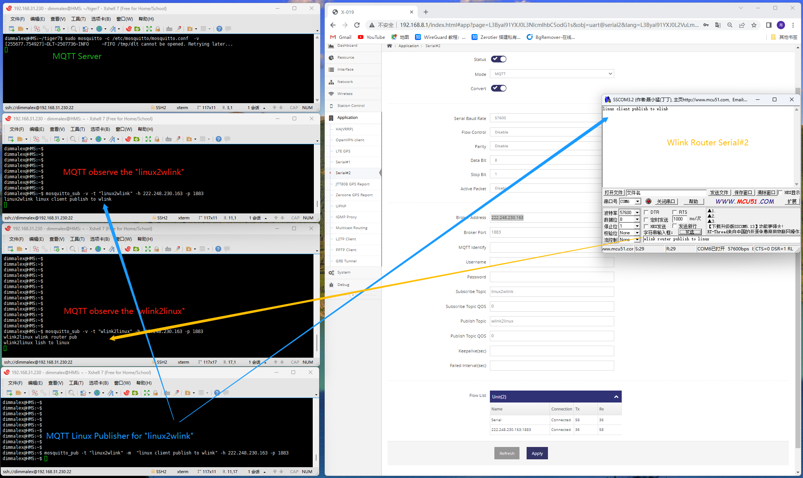

------
## 在Ubuntu中运行MQTT服务器

#### 1. 安装MQTT服务器
```
dimmalex@HMS:~/tiger7$ sudo apt-get install mosquitto
```

#### 2. 安装MQTT客户端工具用于模拟客户端
```
dimmalex@HMS:~/tiger7$ sudo apt-get install mosquitto-clients
```

#### 3. 查看并调整MQTT服务器设置, 默认不建议做修改
```
dimmalex@HMS:~/tiger7$ cat /etc/mosquitto/mosquitto.conf 
# Place your local configuration in /etc/mosquitto/conf.d/
#
# A full description of the configuration file is at
# /usr/share/doc/mosquitto/examples/mosquitto.conf.example

pid_file /var/run/mosquitto.pid

persistence true
persistence_location /var/lib/mosquitto/

log_dest file /var/log/mosquitto/mosquitto.log

include_dir /etc/mosquitto/conf.d
dimmalex@HMS:~/tiger7$ 

```

#### 4. 手动运行MQTT服务器

首先停止系统自动运行的MQTT服务器
```
dimmalex@HMS:~/tiger7$ sudo /etc/init.d/mosquitto stop
Stopping mosquitto (via systemctl): mosquitto.service
.
dimmalex@HMS:~/tiger7$ 
```

手动在前台以调试方式运行
```
dimmalex@HMS:~/tiger7$ sudo mosquitto -c /etc/mosquitto/mosquitto.conf -v
[253900.767672]~DLT~2507382~INFO     ~FIFO /tmp/dlt cannot be opened. Retrying later...

```

#### 5. 打开新终端运行订阅两种主题, 监控linux客户端与路由器之间的交互
订阅linux客户端向路由器发送的主题
```
dimmalex@HMS:~$ mosquitto_sub -v -t "linux2wlink" -h 222.248.230.163 -p 1883
```
订阅路由器向linux客户端发送的主题
```
dimmalex@HMS:~$ mosquitto_sub -v -t "wlink2linux" -h 222.248.230.163 -p 1883
```

#### 6. 使用mosquitto_pub模拟Linux客户端向路由器订阅的主题发送信息
```
dimmalex@HMS:~$ mosquitto_pub -t "linux2wlink" -m  "linux client publish to wlink" -h 222.248.230.163 -p 1883
```

#### 7. 示例的交互总图
