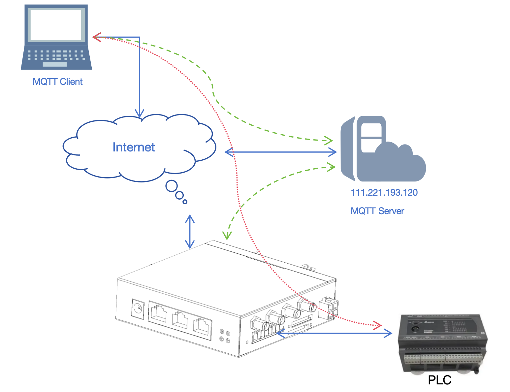
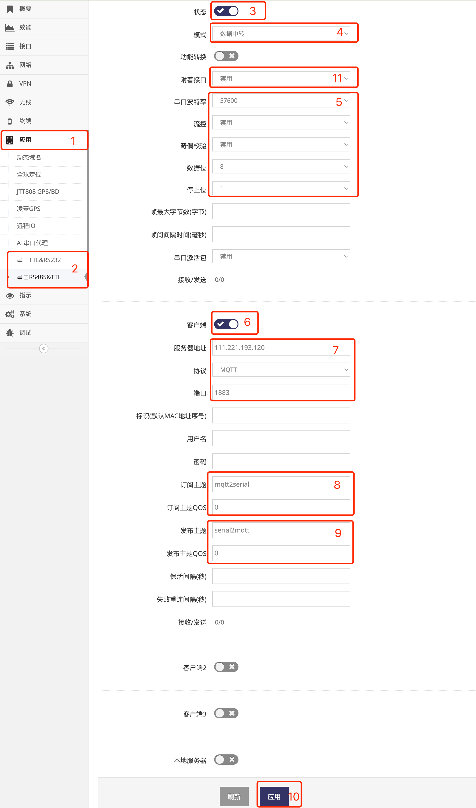
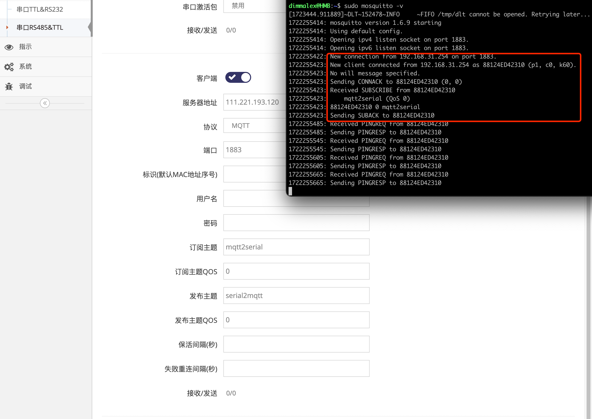
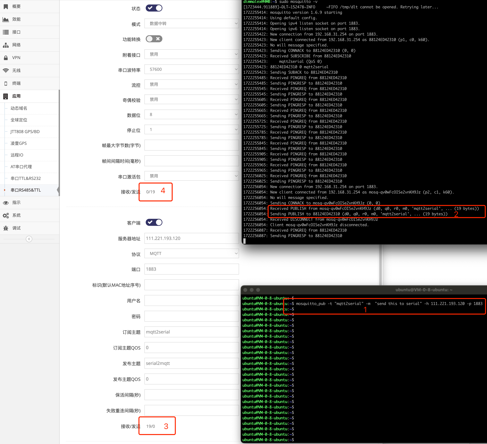

------
## 串口MQTT透传的使用

串口透传用于将串口的数据转换成MQTT协议发布, 并且订阅指定的MQTT主题, 当主题有数据发布时转发到串口   

 


### 首先在Ubuntu中运行MQTT服务器   

#### 1. 安装MQTT服务器   
```
dimmalex@HMB:~/tiger7$ sudo apt-get install mosquitto
```

#### 2. 查看并调整MQTT服务器设置, 默认不建议做修改   
```
dimmalex@HMB:~/tiger7$ cat /etc/mosquitto/mosquitto.conf 
# Place your local configuration in /etc/mosquitto/conf.d/
#
# A full description of the configuration file is at
# /usr/share/doc/mosquitto/examples/mosquitto.conf.example

pid_file /var/run/mosquitto.pid

persistence true
persistence_location /var/lib/mosquitto/

log_dest file /var/log/mosquitto/mosquitto.log

include_dir /etc/mosquitto/conf.d
dimmalex@HMB:~/tiger7$ 
```

#### 4. 手动运行MQTT服务器   
首先停止系统自动运行的MQTT服务器   
```
dimmalex@HMB:~/tiger7$ sudo /etc/init.d/mosquitto stop
Stopping mosquitto (via systemctl): mosquitto.service
.
dimmalex@HMB:~/tiger7$ 
```   
手动在前台以调试方式运行    
```
dimmalex@HMB:~/tiger7$ sudo mosquitto -v
[1723444.911889]~DLT~152478~INFO     ~FIFO /tmp/dlt cannot be opened. Retrying later...
1722255414: mosquitto version 1.6.9 starting
1722255414: Using default config.
1722255414: Opening ipv4 listen socket on port 1883.
1722255414: Opening ipv6 listen socket on port 1883.
```

### 其次设置网关串口MQTT客户端模式   
- 点击 **红框1** **应用** 菜单下的 **红框2** 对应的 **串口** 进入 对应 **串口设置界面**   

- 点击 **红框3** 启用   
- 点击 **红框4** 选择 **数据中转**   
- 在 **红框5** 中配置好对应串口的参数   
- 点击 **红框6** 启用客户端   
- 在 **红框7** 服务器地址中输入MQTT服务器的地址   
- 在 **红框7** 协议中选择MQTT   
- 在 **红框7** 端口中输入MQTT服务器的端口, 默认MQTT端口通常为1883   
- 在 **红框8** 中输入订阅的主题及QOS, 订阅的主题发布的数据都会被网关写入到串口      
- 在 **红框9** 中输入发布的主题及QOS, 网关收到的串口的数据都会以此主题发布出来   
- 点击 **红框10** 应用即完成了串口MQTT客户端的配置   
- **红框11** 可以指定一个接口, 此接口如果断线重连了会立即使串口MQTT客户端重连, 从而实现更快的掉线重连    

- 以上应用后在下图的 **红框** Ubuntu中运行MQTT服务器终端显示网关的MQTT客户端已连入   
   


### 再在另一台Ubuntu中模拟运行MQTT客户端与网关串口交互数据   

#### 1. 安装MQTT客户端工具用于模拟客户端   
```
ubuntu@VM-0-8-ubuntu:~$ sudo apt-get install mosquitto-clients
```

#### 2. 使用mosquitto_pub模拟MQTT客户端向网关订阅的主题发送信息
```
ubuntu@VM-0-8-ubuntu:~$ mosquitto_pub -t "mqtt2serial" -m  "send this to serial" -h 111.221.193.120 -p 1883
```   
   
- **红框1** 为使用mosquitto_pub模拟MQTT客户端向网关订阅的主题发送信息
- **红框2** 为Ubuntu中运行MQTT服务器终端显示有客户发布了mqtt2serial主题的信息   
- 在 **红框3** 中看到网关MQTT客户端收到了发过来的包   
- 并且在 **红框4** 也可以看到网关将此数据发给了串口   

#### 3. 也可以模拟MQTT客户端订阅发布的主题来接收网关上串口收到数据    
订阅网关发布的主题
```
ubuntu@VM-0-8-ubuntu:~$ mosquitto_sub -v -t "serial2mqtt" -h 111.221.193.120 -p 1883
```
订阅后当网关串口有收到数据后后此订阅也会收到对应的数据    

