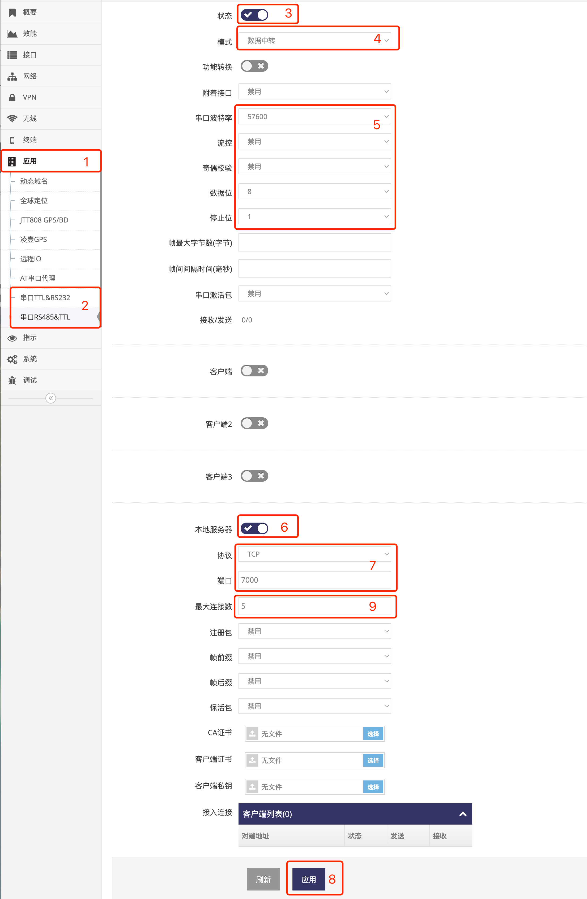
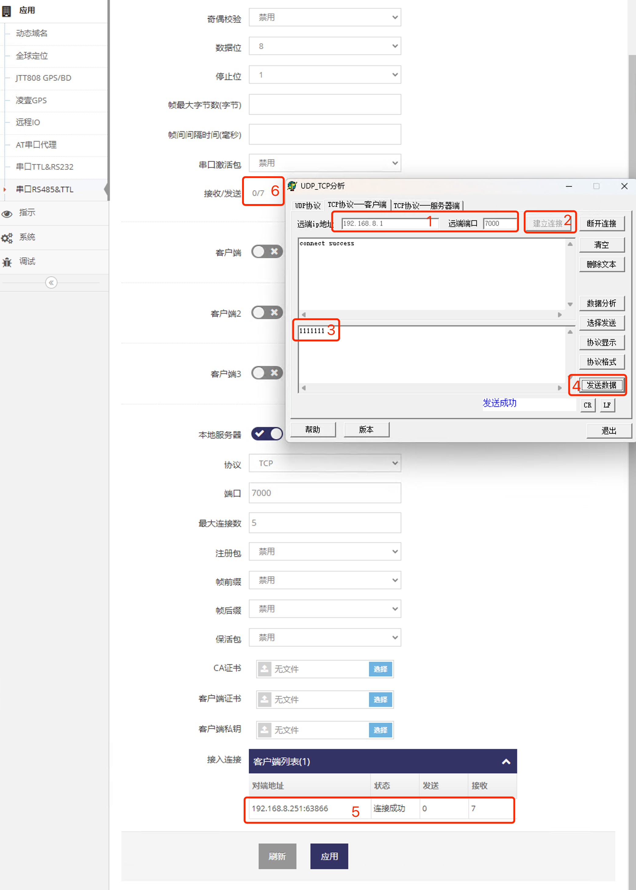
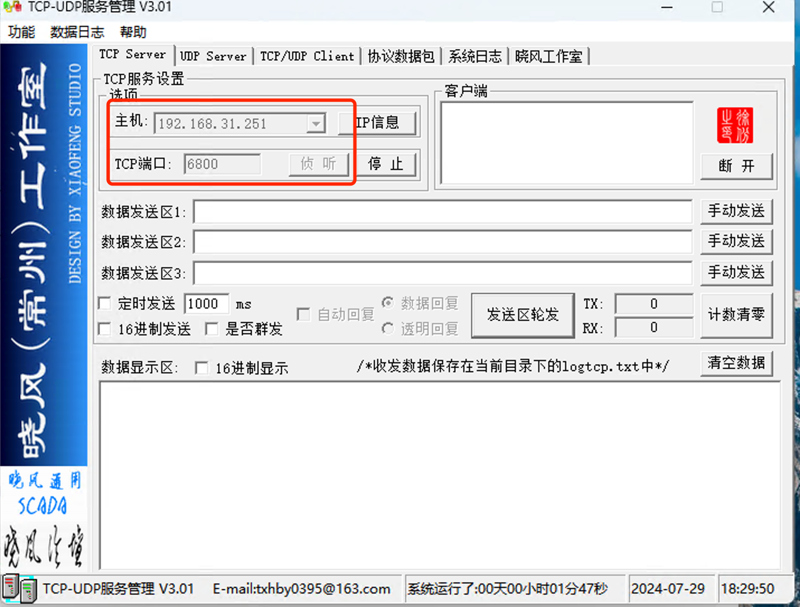
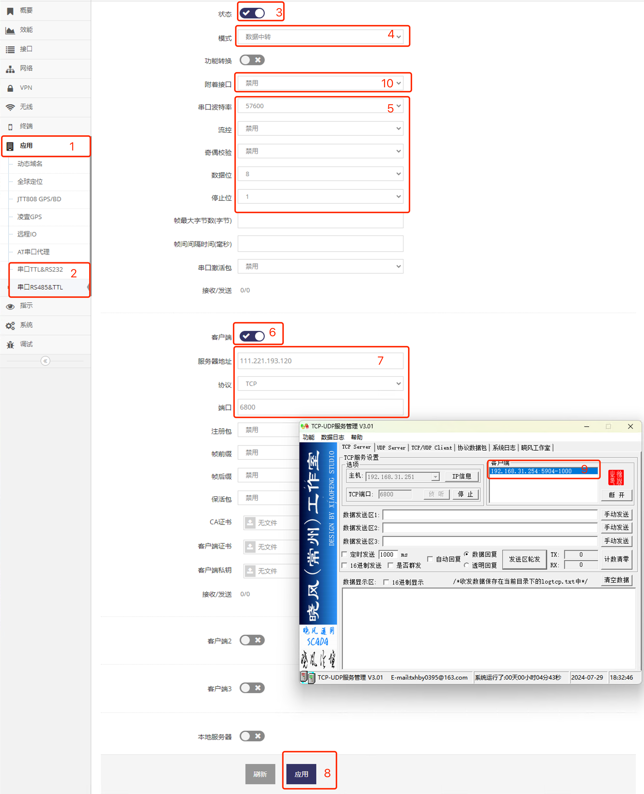
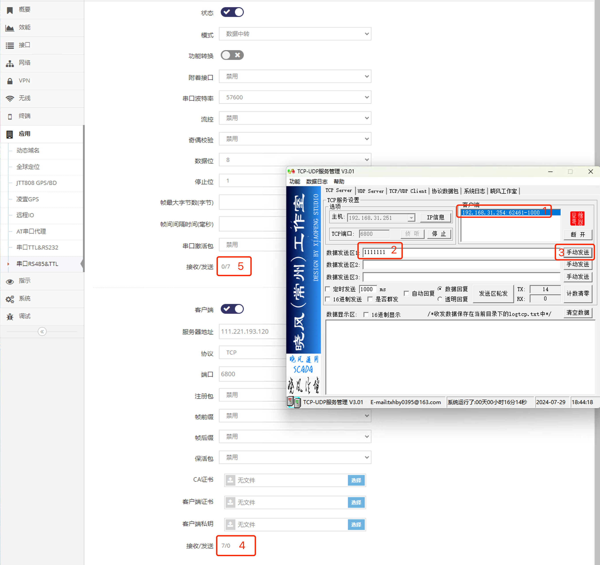

***
## 串口透传的使用   

串口透传用于将串口的数据转换成UDP或TCP端口数据   

 

### 将串口设备连接网关

通过串口线将设备与网关的串口(RS232/RS485/TTL)相连接   

### TCP服务器模式的串口透传   

#### 1. 配置网关的串口TCP服务器模式   
- 点击 **红框1** **应用** 菜单下的 **红框2** 对应的 **串口** 进入 对应 **串口设置界面**   
    
- 点击 **红框3** 启用   
- 点击 **红框4** 选择 **数据中转**   
- 在 **红框5** 中配置好对应串口的参数   
- 点击 **红框6** 启用本地服务器   
- 在 **红框7** 协议中选择 **TCP**   
- 在 **红框7** 端口中给出服务端口, 示列图中为 **7000**   
- 点击 **红框8** 应用即完成了串口TCP服务器模式的配置    
- **红框9** 指定同时允许连接此服务器的客户端数, 示例中为5, 表示同时只允许5个客户端连接, 如果再有新客户端连接会导致之前连接的客户端被关闭   

#### 2. 使用电脑模拟TCP客户端连接网关串口数据中转对应的端口   
- 打开TCP的客户端工具连接网关7000端口的TCP服务器   
- 然后发送数据   
    
- 即可在 **红框5** 中看到此客户端的接入, 并且可以在 **接收** 中看到此客户端的发包数
- 并且在 **红框6** 中也可以看到向串口发送了这些包数

因此通过 **客户端工具** 向网关串口的 **TCP服务器** 发包等于向 **串口** 发包, 反之网关在 **串口** 上收到的数据也会反过来发给连接和 **客户端工具**

### 设置网关实现TCP客户端模式的串口透传

#### 1. 使用电脑模拟TCP服务器, 等待网关的串口客户端连入   
- 打开TCP的服务器工具   
    

#### 2. 配置网关的串口TCP客户端模式   
- 点击 **红框1** **应用** 菜单下的 **红框2** 对应的 **串口** 进入 对应 **串口设置界面**   
    

- 点击 **红框3** 启用   
- 点击 **红框4** 选择 **数据中转**   
- 在 **红框5** 中配置好对应串口的参数   
- 点击 **红框6** 启用客户端   
- 在 **红框7** 服务器地址中输入TCP服务器的地址   
- 在 **红框7** 协议中选择协议, 示例为TCP   
- 在 **红框7** 端口中输入TCP服务器的端口   
- 点击 **红框8** 应用即完成了串口TCP客户端的配置   
- 之后 **红框9** 显示在电脑模拟TCP服务器工具上可以看到网关串口客户端已连入   
- **红框10** 可以指定一个接口, 此接口如果断线重连了会立即使串口TCP客户端重连, 从而实现更快的掉线重连    

#### 3. 使用电脑模拟TCP服务器发包给网关串口  
- 点击 **红框1**  选中连入的网关TCP客户端   
    
- 在 **红框2** 中输入要发送的包   
- 点击 **红框3** 即可向网关TCP客户端发包   
- 之后可以在 **红框4** 中看到网关TCP客户端收到了发过来的包   
- 并且在 **红框5** 也可以看到网关将此数据发给了串口   

## 串口中常见的问题    
- 网关串口接触不良, 这种情况下串口收发数据时在 **串口设置界面** 串口下的 **接收/发送** 后无计数变化, 这种情况可以重新检测与网关串口的连接   
- 网关读取串口数据会以流的方式读入, 并以流的方式转发, 所以如果数据是包的形式会出现半包或是粘包的情况, 这需要用户在串口或是在TCP端自行处理   

