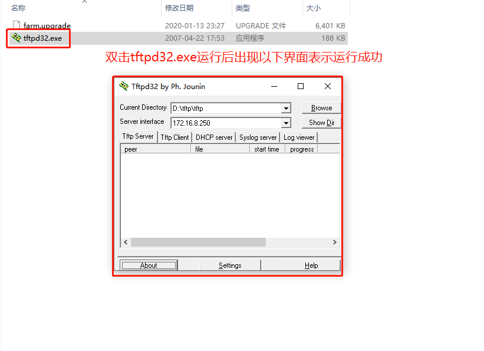

***
## 网关TFTP强制升级

此升级用于在升级过程中升错固件或是升级失败而导致系统无法启动时使用的升级方式, 需要以下方式进入 **TFTP强制升级** 模式    
是否可以进入 **TFTP强制升级** 模式取决于网关的BOOT是否还在正常工作, 如果BOOT工作不正常将无法进入 **TFTP强制升级** 模式   

### 第一步, 在电脑上开起TFTP服务器

1. 获取 **TFTP固件升级包(救授升级包)** 及 **TFTP服务器程序**, 此升级包及程序可向技术支持人员获取      
   

2. 用网线将电脑的有线网卡与网关的LAN网口相连    

3. 将电脑的有线网卡 **IP地址** 改为 **10.10.10.3** , **子网掩码** 改为 **255.255.255.0**     
   

4. 关闭电脑所有的管家软件及防火墙   
   

4. 将救援升级包改名为farm.upgrade， 并放与TFTP服务器程序相同的目录(即TFTP的运行根目录)     
   

5. 双击打开TFTP服务器程序    
   

### 第二步, 网关进入TFTP强制升级模式   

1. 首先给 **网关断电**   

2. 按住网关的 **复位(reset)** 按键不松开    

3. 给 **网关上电**   

4. 等待大概15秒钟后网关 **系统灯快闪** 提示进入了 **TFTP强制升级** 模式, 即可松开 **复位(reset)** 按键    

### 第三步, 等待网关升级

1. 等待3-10秒后即可在电脑上看到看到TFTP程序下载的进度条, 即表示网关正在下载固件

2. 下载固件完成后网关会升级此固件并重启, 此过程需要3-5分钟, 之后即可访问网关

