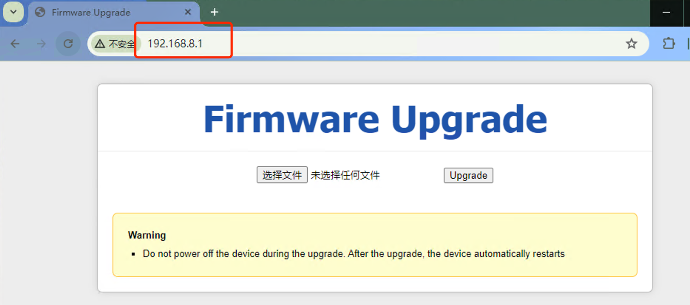
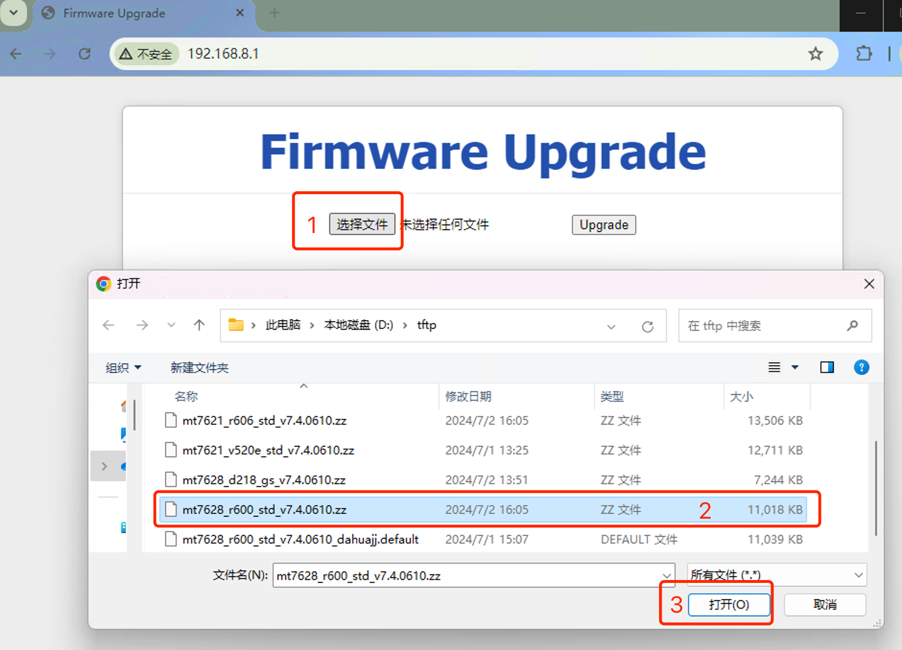
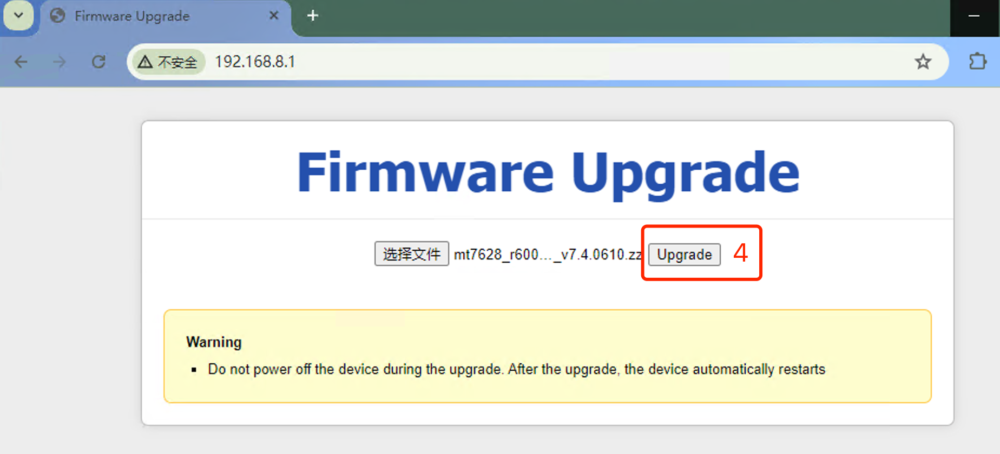
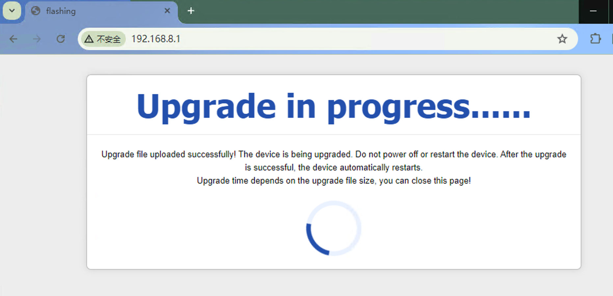
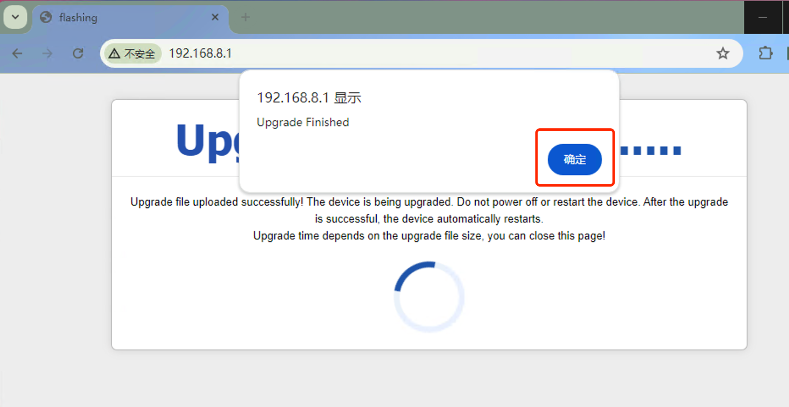

***

## 网关网页强制升级

此升级用于在普通升级失败后以救援方式的升级, 需要以下方式进入 **网页强制升级** 模式:

1. 首先给 **网关断电**
2. 按住网关的 **复位(reset)** 按键不松开
3. 给 **网关上电**
4. 等待5至6秒钟后松开 **复位(reset)** 按键, 此时网关进入了 **网页强制升级** 模式
5. 之后将 **电脑的IP地址** 设置为 **192.168.8.250** 并 **通过网线接入网关** 
6. 打开 **电脑的网页浏览器** 访问 **192.168.8.1** 即可进入强制升级的网页界面

- **网页强制升级** 的界面如下

 

- 点击 **红框1** 选择文件, 弹出对放框后 **红框2** 选择 **固件包**, 之后点击 **红框3** **打开** 

 

- 点击 **红框4** **Upload** 开始上传固件, 此时界面会卡在此处等待上传完成, 具体时长取决于固件的大小, 通常需要10-40秒之间 

 

- 上传完成后显示如下界面表示开始写入固件到网关中

 

- 写入固件完成后显示如下提示表示升级完成, 点击确定即可

 

