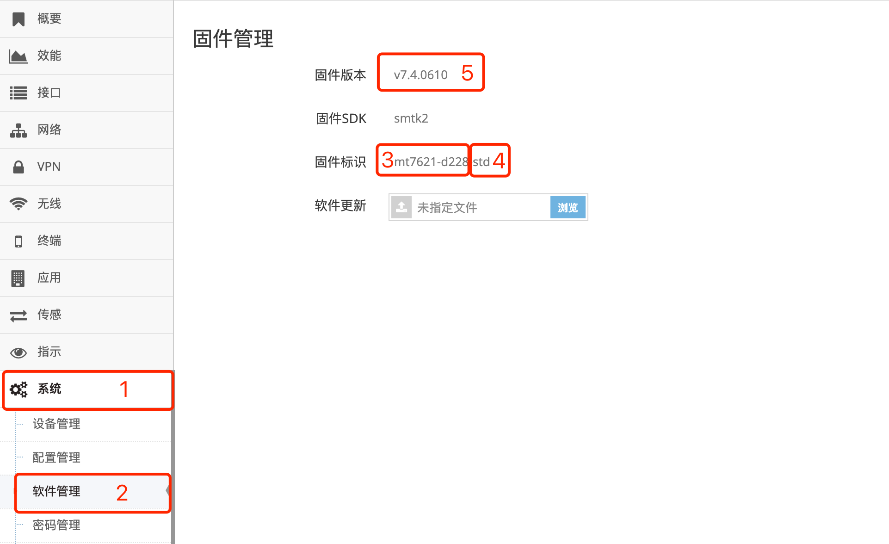
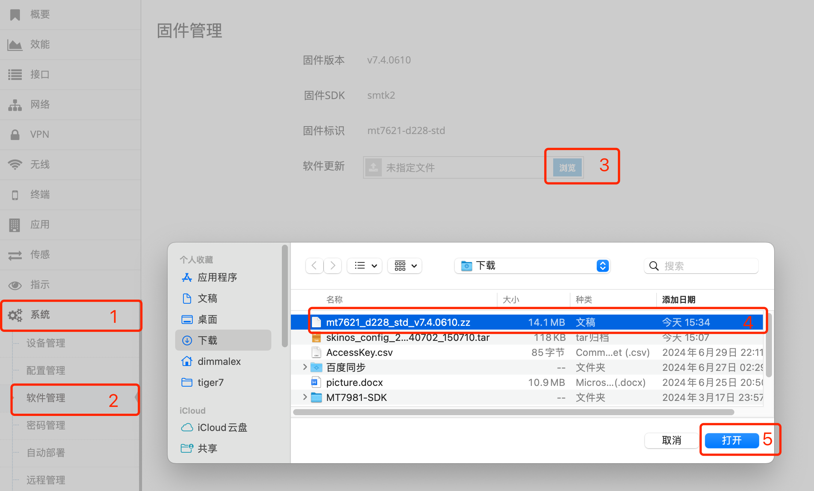

***

## 网关固件升级

- 点击 **红框1** **系统** 菜单下的 **红框2** **软件管理** 进入 **软件管理界面**

 

### 固件标识及固件版本

**红框3** 为SkinOS针对每个网关型号命名的 **型号标识**, 不同的型号标识间不允许相互升级

**红框4** 为SkinOS针对网关的客户定制命名的 **定制标识**, 定制标识不同也可以升级, 但升级后会自动恢复出厂设置

**型号标识** 与 **定制标识** 一起唯一的标识一个固件, 称为 **固件标识**, 升级时一定要确认固件标识是否正确

**红框5** 为网关上当前的 **固件版本**

### 升级固件

- 点击 **红框3** 的 **浏览** 后选择要升级的 **红框4** **固件包** 点击 **红框5** **打开** 即可

 

- 升级成功后会提示重启, 点击 **确定** 后网关重启即可

***如升级的固件不符合当前网关的要求或升级失败则会弹出对话框提示失败原因***

